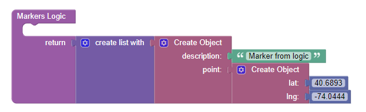
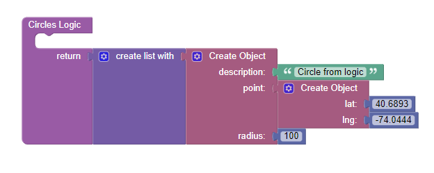
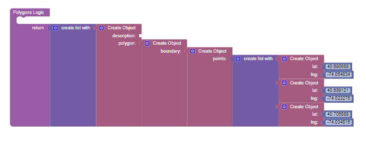
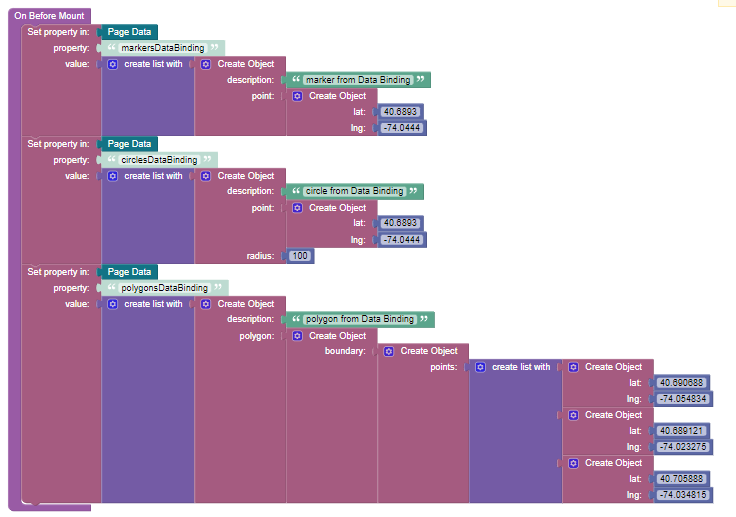
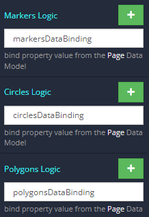
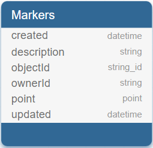
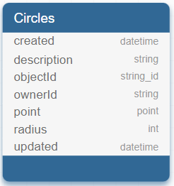
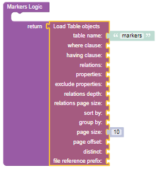

# Leaflet Map

This is a component for Backendless [UI-Builder](https://backendless.com/developers/#ui-builder) designer based on the [Leaflet](https://github.com/Leaflet/Leaflet) library.

The component covers all the main features of the library and allows you in a couple click render an interactive map in your UI-Builder application.


## Properties

| Property           | Type                                                                             | Default value          | Logic                     | Data Binding | UI Setting | Description                                                                                                                                                     |
|--------------------|----------------------------------------------------------------------------------|------------------------|---------------------------|--------------|------------|-----------------------------------------------------------------------------------------------------------------------------------------------------------------|
| mapType            | *Select* <br/>[`carto`, `cartoDark`, `openStreet`, `cyclosm`, `esriWorldStreet`] | openStreet             | Map Type Logic            | YES          | YES        | controls the map type.                                                                                                                                          |
| mapTypeControl     | *Checkbox*                                                                       | true                   | Map Type Control Logic    | YES          | YES        | enables switching the map type                                                                                                                                  |
| center             | *Text*                                                                           | 40.6893, <br/>-74.0444 | Center Logic              | YES          | YES        | controls the map center. `'lat, lng'`                                                                                                                           |
| zoom               | *Number*                                                                         | 10                     | Zoom Logic                | YES          | YES        | controls the map zoom.                                                                                                                                          |
| zoomControl        | *Checkbox*                                                                       | true                   | Zoom Control Logic        | YES          | YES        | enables zoom controls on the map                                                                                                                                |
| Fullscreen         | *Checkbox*                                                                       | false                  | Fullscreen Control Logic  | YES          | YES        | enables fullscreen mode for the map type                                                                                                                        |
| fullscreenControl  | *Checkbox*                                                                       | true                   | Fullscreen Control Logic  | YES          | YES        | enables toggling fullscreen for the map                                                                                                                         |
| draggingControl    | *Checkbox*                                                                       | true                   | Dragging Control Logic    | YES          | YES        | enables dragging on the map                                                                                                                                     |
| geopositionControl | *Checkbox*                                                                       | true                   | Geoposition Control Logic | YES          | YES        | enables geoposition controls on the map                                                                                                                         |
| markers            | *JSON*                                                                           |                        | Markers Logic             | YES          | YES        | Specifies an array of markers to display on the map. Signature of marker: `{description(string), point: {lat(number), lng(number)}}`.                             |
| circles            | *JSON*                                                                           |                        | Circles Logic             | YES          | YES        | Specifies an array of circles to display on the map. Signature of circle: `{description(string), point: {lat(number), lng(number)}, radius(number)}`.             |
| polygons           | *JSON*                                                                           |                        | Polygons Logic            | YES          | YES        | Specifies an array of polygons to display on the map. Signature of polygon: `{description(string), polygon: {boundary: {points: [{lat(number), lng(number)}]}}}`. |


## Events

| Name                       | Triggers                               | Context Blocks                                                                             |
|----------------------------|----------------------------------------|--------------------------------------------------------------------------------------------|
| On Click                   | when a user click on map               | `Coordinates` `[lat(number), lng(number)]`                                                 |
| On Marker Click            | when a user click on a marker          | `Coordinates` `[lat(number), lng(number)]`, `Description` `(string)`                       |
| On Circle Click            | when a user click on a circle          | `Coordinates` `[lat(number), lng(number)]` , `Radius` `(number)`, `Description` `(string)` |
| On Polygon Click           | when a user click on a polygon         | `Coordinates` `[lat(number), lng(number)]` , `Descriptions` `(string)`                     |
| On Map Type Change         | when a user changed the map type       | `Previous Type` `(string)`, `Current Type` `(string)`                                      |
| On Determining Geoposition | when a user determining geoposition    | `Coordinates` `[lat(number), lng(number)]`                                                 |
| On Fullscreen Button Click | when a user click on fullscreen button | `Fullscreen` `(boolean)`                                                                   |


## Actions

| Action           | Inputs                                | Returns                           |
|------------------|---------------------------------------|-----------------------------------|
| Set map center   | `latitude:Number`, `longitude:Number` |                                   |
| Set map zoom     | `value:Number`                        |                                   |
| Get map zoom     |                                       | `Number`: current map zoom        |
| Get map center   |                                       | `Number`: current map center      |
| Get all markers  |                                       | `List`: of all markers on the map |
| Get all circles  |                                       | `List`: of all circles on the map |
| Get all polygons |                                       | `List`: of all polygons on the map |

## Styles

**Theme**
````
@bl-customComponent-leafletMap-themeColor: @themePrimary;
````

**Dimensions**
````
@bl-customComponent-leafletMap-width: 500px;
@bl-customComponent-leafletMap-height: 400px;
@bl-customComponent-leafletMap-margin: 0;
````
## Examples

###UI Settings

Marker
```
[{
  "description": "Some Marker",
  "point": {
    "lat": 40.6893,
    "lng": -74.0444
  }
}]
```

Circle
```
[{
  "description": "Some Circle",
  "point": {
    "lat": 40.6893,
    "lng": -74.0444
  },
  "radius": 100
}]
```

Polygon
```
[{
  "description": "some polygon",
  "polygon": {
    "boundary": {
      "points": [{
        "lat": 40.690688,
        "lng": -74.054834
      },
      {
        "lat": 40.689121,
        "lng": -74.023275
      },
      {
        "lat": 40.705888,
        "lng": -74.034815
      }]
    }
  }
}]
```
### Data Binding and Logic Handlers

#### Logic Handlers

Markers



Circles



Polygons



#### Data Binding





#### Working with tables

Create a table with columns like in the following pictures

  

Load data from tables


