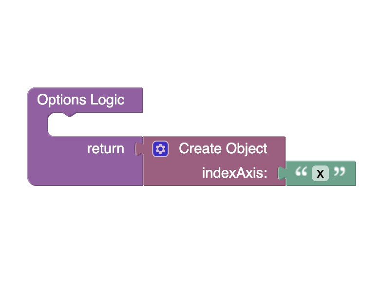

# Line Chart
The Line Chart component allows you to display data in the form of charts. You can also choose a chart type. Also, the [chart.js](https://www.chartjs.org/) library is used to create this component.

<p align="center">
  
</p>

## Properties

| Property                | Type                                                   | Default Value                                                                                                                                                                                                                                                                                                                                                          | Logic          | Data Binding | UI Setting | Description                                                                                                                                                                                                                                                                         |
|-------------------------|--------------------------------------------------------|------------------------------------------------------------------------------------------------------------------------------------------------------------------------------------------------------------------------------------------------------------------------------------------------------------------------------------------------------------------------|----------------|--------------|------------|-------------------------------------------------------------------------------------------------------------------------------------------------------------------------------------------------------------------------------------------------------------------------------------|
| Disabled<br/>`disabled` | Checkbox                                               | `false`                                                                                                                                                                                                                                                                                                                                                                | Disabled Logic | YES          | YES        | This handler allows you to disable a component.                                                                                                                                                                                                                                     |
| Height<br/>`height`     | Text                                                   | "400px"                                                                                                                                                                                                                                                                                                                                                                | Height Logic   | YES          | YES        | This handler allows you to specify the height of a component.                                                                                                                                                                                                                       |
| Width<br/>`width`       | Text                                                   | "500px"                                                                                                                                                                                                                                                                                                                                                                | Width Logic    | YES          | YES        | This handler allows you to specify the width of a component.                                                                                                                                                                                                                        |
| Type<br/>`type`         | Select <br/> [Bar:`bar`<br/>Line:`line`<br/>Pie:`pie`] | Bar:`bar`                                                                                                                                                                                                                                                                                                                                                              | Type Logic     | YES          | YES        | This handler allows you to specify the chart type.                                                                                                                                                                                                                                  |
| Labels<br/>`labels`     | JSON                                                   | `["A", "B", "C", "D"]`                                                                                                                                                                                                                                                                                                                                                 | Labels Logic   | YES          | YES        | This handler allows you to set chart elements. Watch [Codeless Examples](#Examples). Signature of labels: list of strings `[String, String]`                                                                                                                                        |
| Datasets<br/>`datasets` | JSON                                                   | `[`   <br/>`{`     <br/>`"label": "Results for 2021",`     <br/>`"data": [2, 2, 3, 4],`     <br/>`"borderColor": "#36A2EB",`     <br/>`"backgroundColor": "#9BD0F5"`   <br/>`},`   <br/>`{`     <br/>`"label": "Results for 2022",`     <br/>`"data": [6, 8, 7, 10],`     <br/>`"borderColor": "#FF6384",`     <br/>`"backgroundColor": "#FFB1C1"`   <br/>`}` <br/>`]` | Datasets Logic | YES          | YES        | This handler allows you to set datasets to the component. Watch [Codeless Examples](#Examples). Signature of datasets: list of objects `{label: String, data: Array, borderColor: String \| Array, backgroundColor: String \| Array}`                                               |
| Options<br/>`options`   | JSON                                                   | `{ "indexAxis": "x" }`                                                                                                                                                                                                                                                                                                                                                 | Options Logic  | YES          | YES        | This handler allows you to set options for a component. Watch [Codeless Examples](#Examples). Signature of options: object `{indexAxis: x \| y}`. Also, you can find more options in the [chart.js library documentation](https://www.chartjs.org/docs/3.3.0/general/options.html). |

## Styles

**Dimensions**
````
@bl-customComponent-lineChart-disabled-cursor: default;
@bl-customComponent-lineChart-disabled-opacity: 0.38;
````

## <a id="Examples" name="Examples"></a> Codeless Examples

Add labels to component:


Add datasets to component:


Add options to component:


