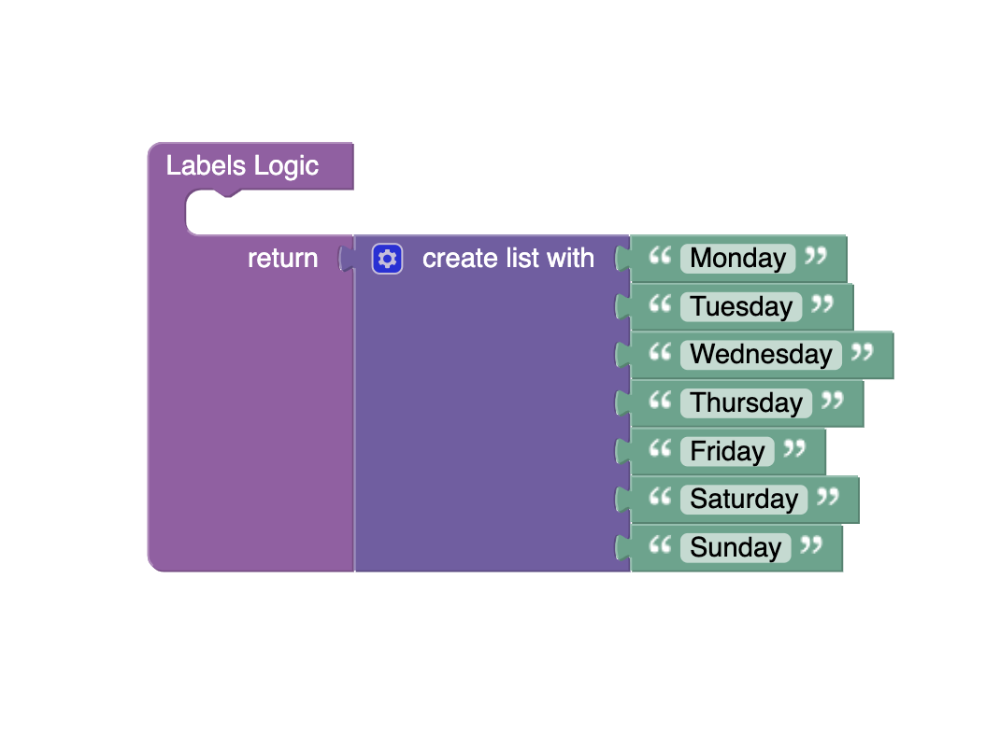

# Line Chart
The Line Chart component allows you to display data in the form of charts. You can also choose a chart type. Also, the [chart.js](https://www.chartjs.org/) library is used to create this component.

<p align="center">
  
</p>

## Properties

| Property                                          | Type                                                 | Default Value                                                                                                                                                                                                                                                                                                             | Logic                        | Data Binding | UI Setting | Description                                                                                                                                                                                                                                                                         |
|---------------------------------------------------|------------------------------------------------------|---------------------------------------------------------------------------------------------------------------------------------------------------------------------------------------------------------------------------------------------------------------------------------------------------------------------------|------------------------------|--------------|------------|-------------------------------------------------------------------------------------------------------------------------------------------------------------------------------------------------------------------------------------------------------------------------------------|
| Disabled<br/>`disabled`                           | Checkbox                                             | `false`                                                                                                                                                                                                                                                                                                                   | Disabled Logic               | YES          | YES        | This handler allows you to disable a component.                                                                                                                                                                                                                                     |
| Height<br/>`height`                               | Text                                                 | "400px"                                                                                                                                                                                                                                                                                                                   | Height Logic                 | YES          | YES        | This handler allows you to specify the height of a component.                                                                                                                                                                                                                       |
| Width<br/>`width`                                 | Text                                                 | "500px"                                                                                                                                                                                                                                                                                                                   | Width Logic                  | YES          | YES        | This handler allows you to specify the width of a component.                                                                                                                                                                                                                        |
| Type<br/>`type`                                   | Select<br/>[Bar:`bar`<br/>Line:`line`<br/>Pie:`pie`] | Bar:`bar`                                                                                                                                                                                                                                                                                                                 | Type Logic                   | YES          | YES        | This handler allows you to specify the chart type.                                                                                                                                                                                                                                  |
| Chart Title Visibility<br/>`chartTitleVisibility` | Checkbox                                             | `true`                                                                                                                                                                                                                                                                                                                    |                              | NO           | YES        | This handler allows you to control chart title visibility.                                                                                                                                                                                                                          |
| Chart Title Font Size<br/>`chartTitleFontSize`    | Number                                               | 20                                                                                                                                                                                                                                                                                                                        |                              | NO           | YES        | This handler allows you to specify the chart title font size.                                                                                                                                                                                                                       |
| Chart Title<br/>`chartTitle`                      | Text                                                 | "Fruit sale"                                                                                                                                                                                                                                                                                                              |                              | NO           | YES        | This handler allows you to specify the chart title.                                                                                                                                                                                                                                 |
| Chart Background Color<br/>`chartBackgroundColor` | Text                                                 | "rgba(163,182,218,0.13)"                                                                                                                                                                                                                                                                                                  | Chart Background Color Logic | YES          | YES        | This handler allows you to specify the background color for the chart.                                                                                                                                                                                                              |
| Y Grid Line Visibility<br/>`yGridLineVisibility`  | Checkbox                                             | `true`                                                                                                                                                                                                                                                                                                                    |                              | NO           | YES        | This handler allows you to control the vertical grid line visibility.                                                                                                                                                                                                               |
| X Grid Line Visibility<br/>`xGridLineVisibility`  | Checkbox                                             | `true`                                                                                                                                                                                                                                                                                                                    |                              | NO           | YES        | This handler allows you to control the horizontal grid line visibility.                                                                                                                                                                                                             |
| Grid Lines Color<br/>`gridLinesColor`             | Text                                                 | "#A5ADBA"                                                                                                                                                                                                                                                                                                                 |                              | NO           | YES        | This handler allows you to specify a color for the grid lines.                                                                                                                                                                                                                      |
| Grid Lines Width<br/>`gridLinesWidth`             | Number                                               | 2                                                                                                                                                                                                                                                                                                                         |                              | NO           | YES        | This handler allows you to specify the width of the grid lines.                                                                                                                                                                                                                     |
| Labels<br/>`labels`                               | JSON                                                 | `["Monday", "Tuesday", "Wednesday", "Thursday", "Friday", "Saturday", "Sunday"]`                                                                                                                                                                                                                                          | Labels Logic                 | YES          | YES        | This handler allows you to set chart elements. Watch [Codeless Examples](#examples). Signature of labels: list of strings `[String, String]`.                                                                                                                                       |
| Datasets<br/>`datasets`                           | JSON                                                 | `[`<br/>`{`<br/>`"label": "Apple",`<br/>`"data": [22, 25, 30, 24, 32, 35, 18],`<br/>`"borderColor": "#36A2EB",`<br/>`"backgroundColor": "#9BD0F5"`<br/>`},`<br/>`{`<br/>`"label": "Pear",`<br/>`"data": [25, 23, 28, 30, 37, 40, 21],`<br/>`"borderColor": "#FF6384",`<br/>`"backgroundColor": "#FFB1C1"`<br/>`}`<br/>`]` | Datasets Logic               | YES          | YES        | This handler allows you to set datasets to the component. Watch [Codeless Examples](#examples). Signature of datasets: list of objects `{label: String, data: Array, borderColor: String \| Array, backgroundColor: String \| Array}`.                                              |
| Options<br/>`options`                             | JSON                                                 | `{ "indexAxis": "x" }`                                                                                                                                                                                                                                                                                                    | Options Logic                | YES          | YES        | This handler allows you to set options for a component. Watch [Codeless Examples](#examples). Signature of options: object `{indexAxis: x \| y}`. Also, you can find more options in the [chart.js library documentation](https://www.chartjs.org/docs/3.3.0/general/options.html). |

## Styles

**Dimensions**
````
@bl-customComponent-lineChart-disabled-cursor: default;
@bl-customComponent-lineChart-disabled-opacity: 0.38;
````

## <a id="examples"></a> Codeless Examples

Add labels to component:



Add datasets to component:


Add options to component:


