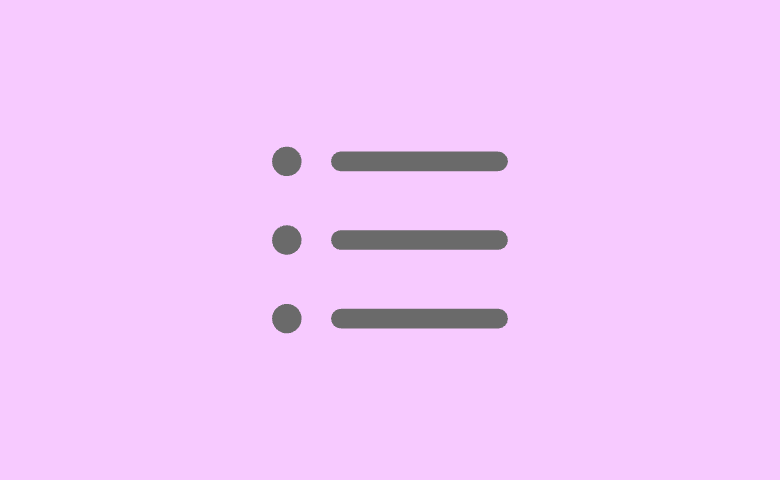
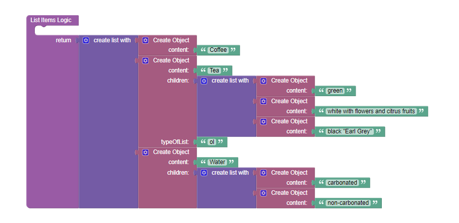
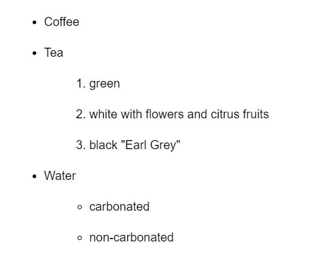

# List

List is the component that can be used in Backendless [UI-Builder](https://backendless.com/developers/#ui-builder). It allows you to add a standard list to your application. Select the type of list (ordered/unordered) and specify the data that will be displayed inside the list.
More information about list you can find [here](https://developer.mozilla.org/en-US/docs/Web/HTML/Element/li).

<p align="center">
  
</p>

## Properties

| Property                    | Type                                         | Default value  | Logic           | Data Binding | UI Setting | Description                                                                                                                                                                                                          |
|-----------------------------|----------------------------------------------|----------------|-----------------|--------------|------------|----------------------------------------------------------------------------------------------------------------------------------------------------------------------------------------------------------------------|
| Type <br> `type`            | *Select* <br> [Unordered:`ul`, Ordered:`ol`] | Unordered:`ul` | Type Logic      | NO           | YES        | Controls the type of list(ul/ol).                                                                                                                                                                                    |
| List Items <br> `listItems` | *JSON*                                       |                | ListItems Logic | YES          | YES        | Specifies a JSON array containing data of the list items. Watch [Codeless Examples](#Examples). Signature of items list: `[ <Item> ]`. Signature of item: `{ content: String, children: [ <Item> ], type: String }`. |

## Events

| Name                     | Triggers                                           | Context Blocks                  |
|--------------------------|----------------------------------------------------|---------------------------------|
| On Click List Item Event | Triggered when the user click any item of the list | `{event: Object, item: Object}` |

## Styles

**Theme**
````
@bl-customComponent-list-theme: @themePrimary;
@bl-customComponent-list-themeTextColor: @appTextColor;
````

**Dimensions**
```
@bl-customComponent-list-margin: 5px;
@bl-customComponent-list-item-fontSize: 1rem;
@bl-customComponent-list-item-line-height: 1.3;
@bl-customComponent-list-item-padding: 3px;
```

**Other**
```
@bl-customComponent-list-item-cursor: pointer;
```

## Examples

Below is a Codeless Example highlighting how to use the List component:




<details>
<summary>Try yourself</summary>

```
<block xmlns="http://www.w3.org/1999/xhtml" type="lists_create_with" id="l,E8eVLhb*x63^hP*la/" x="150.875" y="100"><mutation items="3"></mutation><value name="ADD0"><block type="create_object" id="lK@[V],7)GKBht*H9}5w"><mutation><properties><item id="property" prop-name="content"></item></properties></mutation><value name="create_object_mutator_container_properties_stack_property0"><block type="text" id="1-WlSJq.:K|!ZBS/pmRU"><field name="TEXT">Coffee</field></block></value></block></value><value name="ADD1"><block type="create_object" id="y-p_EQMEqsM+)qQ0|QT3"><mutation><properties><item id="property" prop-name="content"></item><item id="property" prop-name="children"></item><item id="property" prop-name="type"></item></properties></mutation><value name="create_object_mutator_container_properties_stack_property0"><block type="text" id="Cs~vab~EVSM?x[2C%evw"><field name="TEXT">Tea</field></block></value><value name="create_object_mutator_container_properties_stack_property1"><block type="lists_create_with" id="xg)hALvr^^o:(hzS^%oD"><mutation items="3"></mutation><value name="ADD0"><block type="create_object" id="t?!{!$)nn)v=p5n2BM-/"><mutation><properties><item id="property" prop-name="content"></item></properties></mutation><value name="create_object_mutator_container_properties_stack_property0"><block type="text" id="1gH0_`thfD#3|zQ3F-q3"><field name="TEXT">green</field></block></value></block></value><value name="ADD1"><block type="create_object" id="3]xTn`sDru3C^Ix#9!u+"><mutation><properties><item id="property" prop-name="content"></item></properties></mutation><value name="create_object_mutator_container_properties_stack_property0"><block type="text" id="mtU^H#1TZn19{8.$CF5("><field name="TEXT">white with flowers and citrus fruits</field></block></value></block></value><value name="ADD2"><block type="create_object" id="zJkLto=ydf4}`yWT5IRo"><mutation><properties><item id="property" prop-name="content"></item></properties></mutation><value name="create_object_mutator_container_properties_stack_property0"><block type="text" id="IVv6P;g~nB;KB0ppY!tu"><field name="TEXT">black "Earl Grey"</field></block></value></block></value></block></value><value name="create_object_mutator_container_properties_stack_property2"><block type="text" id="hppU.V;[zPM:/vUmpre{"><field name="TEXT">ol</field></block></value></block></value><value name="ADD2"><block type="create_object" id="RtqLQ-Q,S[MV9Tnr}J@`"><mutation><properties><item id="property" prop-name="content"></item><item id="property" prop-name="children"></item></properties></mutation><value name="create_object_mutator_container_properties_stack_property0"><block type="text" id="T$uN$kz~Z+VP)Jv9{A+T"><field name="TEXT">Water</field></block></value><value name="create_object_mutator_container_properties_stack_property1"><block type="lists_create_with" id="6?cxDbZMXN]KlK3,gi#!"><mutation items="2"></mutation><value name="ADD0"><block type="create_object" id=";4m+8p2KZDW*C}?)I?/L"><mutation><properties><item id="property" prop-name="content"></item></properties></mutation><value name="create_object_mutator_container_properties_stack_property0"><block type="text" id="2%dgUD%M7a,d}Nw^@2n}"><field name="TEXT">carbonated</field></block></value></block></value><value name="ADD1"><block type="create_object" id="RRFGu:]1TnWNGg`+b{QM"><mutation><properties><item id="property" prop-name="content"></item></properties></mutation><value name="create_object_mutator_container_properties_stack_property0"><block type="text" id=";[J=F_W,G[#43Ah/v./l"><field name="TEXT">non-carbonated</field></block></value></block></value></block></value></block></value></block>
```
</details>
