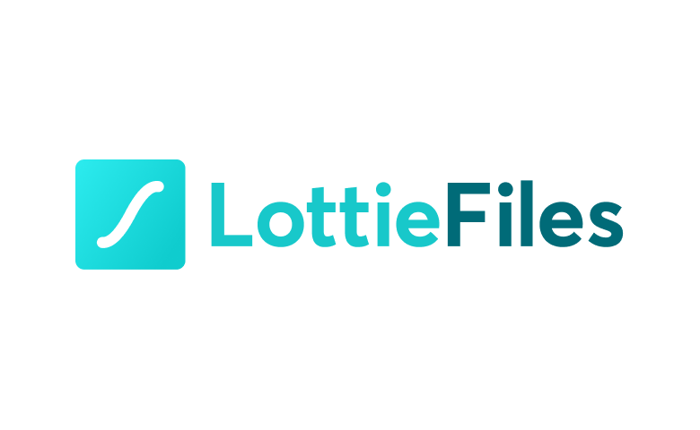

# Lottie Animation

Lottie Animation is a component of Backendless UI-Builder designer. This allows you to upload and add animation in your page.

The component based on external [Lottie Animation](https://github.com/airbnb/lottie-web).

  

## Properties

| Property  | Type                             | Default Value | Logic         | Data Binding | UI Setting | Description                                                                                                                                                                                                                                                          |
|-----------|----------------------------------|---------------|---------------|--------------|------------|----------------------------------------------------------------------------------------------------------------------------------------------------------------------------------------------------------------------------------------------------------------------|
| data      | JSON                             |               | Data Logic    | YES          | YES        | Allows writing JSON for animation. You can get JSON with animation by creating animation in After Effects with the plugin [Lottie](https://airbnb.io/lottie/#/after-effects)  or you can get completed animation in [Lottie Files](https://lottiefiles.com/featured) |
| type      | Select [`svg`, `canvas`, `html`] | svg           | Type logic    | NO           | YES        | Allows select type of animation (svg, canvas, html)                                                                                                                                                                                                                  |
| isLoop    | Checkbox                         | `false`       | Loop Logic    | NO           | YES        | Allows to specify looping or non-looping animation                                                                                                                                                                                                                   |
| isStopped | Checkbox                         | `false`       | Stopped Logic | NO           | YES        | Allows to specify stopped or not stopped animation                                                                                                                                                                                                                   |

## Events

| Name       | Triggered                                              | Context Block |
|------------|--------------------------------------------------------|---------------|
| On Hover   | when the user hovers on the animation                  |               |
| On Unhover | when the user moves the cursor away from the animation |               |
| On Click   | when the user clicks on the animation                  |               |

## Action

| Action         | Inputs                                                  | Return |
|----------------|---------------------------------------------------------|--------|
| Stop Animation |                                                         |        |
| Play Animation |                                                         |        |
| Set Animation  | Data: `Object` Is Stopped: `Boolean` Is Loop: `Boolean` |        |

