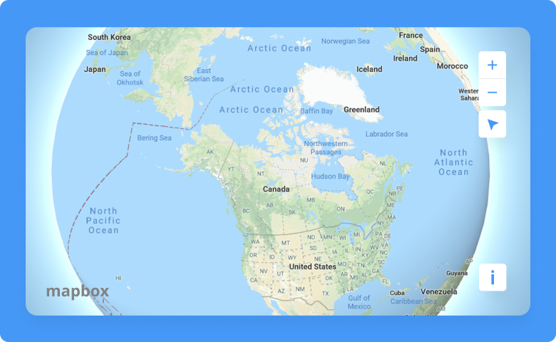
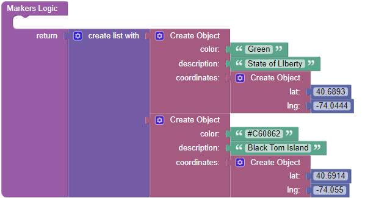
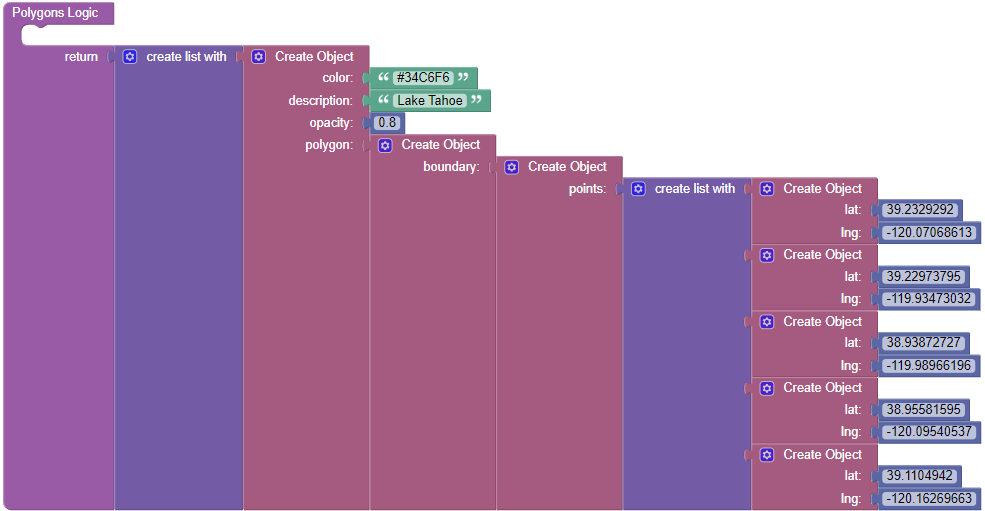

# Mapbox

This is a component for Backendless [UI-Builder](https://backendless.com/developers/#ui-builder) designer based on the [Mapbox](https://www.mapbox.com/) library.

The component covers basic features of the library and allows you in a couple click render an interactive map in your UI-Builder application.

<p align="center">
  
</p>

## Properties

| Property             | Type                                                                                                                            | Default value                        | Logic          | Data Binding | UI Setting | Description                                                                                                                                                                                    |
|----------------------|---------------------------------------------------------------------------------------------------------------------------------|--------------------------------------|----------------|--------------|------------|------------------------------------------------------------------------------------------------------------------------------------------------------------------------------------------------|
| Markers              | *JSON*                                                                                                                          |                                      | Markers Logic  | YES          | YES        | Specifies an array of markers to display on the map. Watch [Codeless Examples](#Examples). Signature of marker: `{color, description, coordinates: {lat, lng}}`.                               |
| Polygons             | *JSON*                                                                                                                          |                                      | Polygons Logic | YES          | YES        | Specifies an array of polygons to display on the map. Watch [Codeless Examples](#Examples). Signature of polygon: `{color, description, opacity, polygon: {boundary: points: [ {lat, lng}]}}`. |
| Center               | *JSON*                                                                                                                          | { "lat: 0, <br>"lng": 0 }            | Center Logic   | YES          | YES        | Used to set center on the map.                                                                                                                                                                 |
| Zoom                 | *Number*                                                                                                                        | 10                                   |                | NO           | YES        | Controls the map zoom.                                                                                                                                                                         |
| Directions           | *Checkbox*                                                                                                                      | `false`                              |                | NO           | YES        | Adds directions to the map.                                                                                                                                                                    |
| Full Screen Button   | *Checkbox*                                                                                                                      | `false`                              |                | NO           | YES        | Adds fullscreen button to the map.                                                                                                                                                             |
| Navigation Button    | *Checkbox*                                                                                                                      | `true`                               |                | NO           | YES        | Adds navigation button to the map.                                                                                                                                                             |
| Search Bar           | *Checkbox*                                                                                                                      | `false`                              |                | NO           | YES        | Adds search bar to the map.                                                                                                                                                                    |
| Geolocation Button   | *Checkbox*                                                                                                                      | `false`                              |                | NO           | YES        | Adds geolocation button to the map.                                                                                                                                                            |
| Projection           | *Select* <br/>[`mercator`, `globe`, `equalEarth`, `naturalEarth`, `winkelTripel`, `lambertConformalConic`, `equirectangular`]   | 'mercator'                           |                | NO           | YES        | Controls the map type.                                                                                                                                                                         |
| Lower Atmosphere     | *Color*                                                                                                                         | '#BAD2EB'                            |                | NO           | YES        | Sets lower atmosphere color.                                                                                                                                                                   |
| Upper Atmosphere     | *Color*                                                                                                                         | '#245CDF'                            |                | NO           | YES        | Sets upper atmosphere color.                                                                                                                                                                   |
| Atmosphere Thickness | *Number*                                                                                                                        | 0,2                                  |                | NO           | YES        | Sets atmosphere thickness.                                                                                                                                                                     |
| Space Color          | *Color*                                                                                                                         | '#0B0B19'                            |                | NO           | YES        | Sets space color.                                                                                                                                                                              |
| Star Intensity       | *Number*                                                                                                                        | 0,2                                  |                | NO           | YES        | Sets star intensity.                                                                                                                                                                           |
| Map Style URL        | *Text*                                                                                                                          | 'mapbox://styles/mapbox/streets-v11' |                | NO           | YES        | Sets map style.                                                                                                                                                                                |

## Events

| Name                       | Triggers                               | Context Blocks                                                                                                                     |
|----------------------------|----------------------------------------|------------------------------------------------------------------------------------------------------------------------------------|
| On Click                   | when a user click on map               | Coordinates: `{lat: Number, lng: Number}`                                                                                          |
| On Marker Click            | when a user click on a marker          | Coordinates: `{lat: Number, lng: Number}` <br/> Description: `String`                                                              |
| On Polygon Click           | when a user click on a polygon         | Coordinates: `{lat: Number, lng: Number}` <br/> Description: `String`                                                              |
| On Determining Geoposition | when a user determining geoposition    | Coordinates: `{lat: Number, lng: Number}`                                                                                          |
| On Pan Event               | when a user moves the map around       | Center: `{lat: Number, lng: Number}` <br/> North East: `{lat: Number, lng: Number}` <br/> South West: `{lat: Number, lng: Number}` |

## Actions

| Action        | Inputs                                                                      | Returns                                |
|---------------|-----------------------------------------------------------------------------|----------------------------------------|
| Is Moving     |                                                                             | `Boolean`: map is moving               |
| Is Zooming    |                                                                             | `Boolean`: map is zooming              |
| Is Rotating   |                                                                             | `Boolean`: map is rotating             |
| Set Style     | Style: `Object`, `String` or `Null ` <br/> Options: `Object`                |                                        |
| Get Style     |                                                                             | `Object`: the map's style JSON object  |
| Set Fog       | Fog: `Object`                                                               |                                        |
| Get Fog       |                                                                             | `Object`: Fog object                   |
| Is Map Loaded |                                                                             | `Boolean`: map is loaded               |
| Get Center    |                                                                             | `Object`: `{lng: Number, lat: Number}` |
| Set Center    | Center: `Object` <br/> Event Data: `Object`                                 |                                        |
| Pan By        | Offset: `Point`, `Array` <br/> Options: `Object` <br/> Event Data: `Object` |                                        |
| Pan To        | LngLat: `Object` <br/> Options: `Object` <br/> Event Data: `Object`         |                                        |
| Get Zoom      |                                                                             | `Number`: current map zoom             |
| Set Zoom      | Zoom: `Number` <br/> Event Data: `Object`                                   |                                        |
| Fly To        | Options: `Object` <br/> Event Data: `Object`                                |                                        |
| Rotate To     | Bearing: `Number` <br/> Options: `Object` <br/> Event Data: `Object`        |                                        |

## Settings

| Name         | Type   | Default Value | Required | Description                                                                             |
|--------------|--------|---------------|----------|-----------------------------------------------------------------------------------------|
| Access Token | *Text* |               | YES      | Access Token needed to use Mapbox. You can get it on [Mapbox](https://www.mapbox.com/). |

## Styles

**Dimensions**
````
@bl-customComponent-mapbox-height: 400px;
@bl-customComponent-mapbox-width: 600px;
````
## <a name="Examples"></a> Codeless Examples

Addition of markers on map:



Addition of polygons on map:


