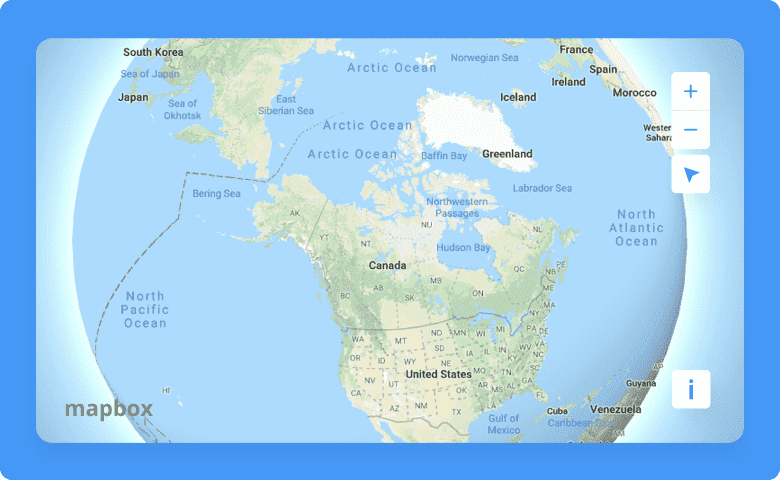
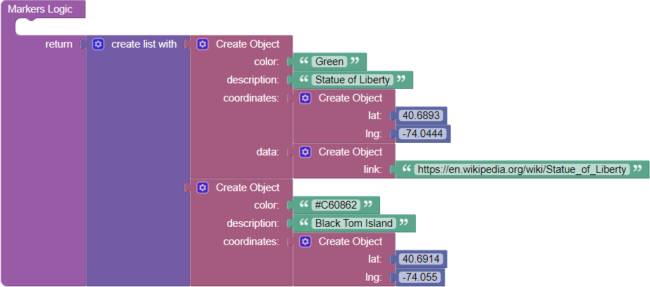
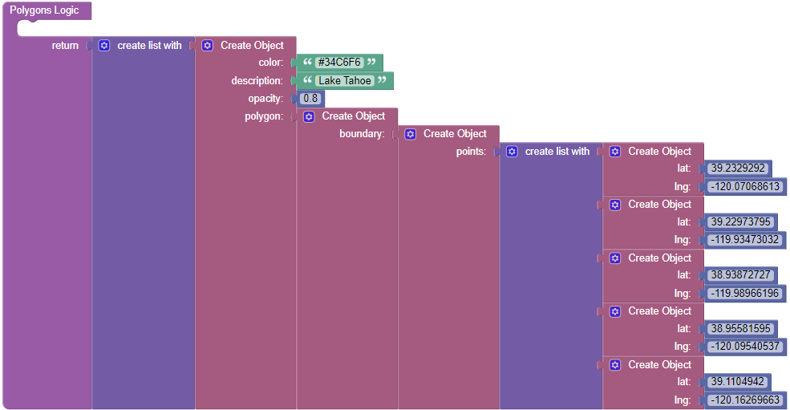

# Mapbox

This is a component for Backendless [UI-Builder](https://backendless.com/developers/#ui-builder) designer based on the [Mapbox](https://www.mapbox.com/) library.

The component covers basic features of the library and allows you in a couple click render an interactive map in your UI-Builder application.

<p align="center">
  
</p>

## Properties

| Property              | Type                                                                                                                            | Default value                        | Logic          | Data Binding | UI Setting | Description                                                                                                                                                                                                                         |
|-----------------------|---------------------------------------------------------------------------------------------------------------------------------|--------------------------------------|----------------|--------------|------------|-------------------------------------------------------------------------------------------------------------------------------------------------------------------------------------------------------------------------------------|
| Markers               | *JSON*                                                                                                                          |                                      | Markers Logic  | YES          | YES        | Specifies an array of markers to display on the map. Watch [Codeless Examples](#codeless-examples). Signature of marker: `{color, description, coordinates: {lat, lng}}`.                                                           |
| Polygons              | *JSON*                                                                                                                          |                                      | Polygons Logic | YES          | YES        | Specifies an array of polygons to display on the map. Watch [Codeless Examples](#codeless-examples). Signature of polygon: `{color, description, opacity, polygon: {boundary: points: [ {lat, lng} ]}, outlineWidth, outlineColor}`. |
| Center                | *JSON*                                                                                                                          | { "lat: 0, <br>"lng": 0 }            | Center Logic   | YES          | YES        | Used to set center on the map.                                                                                                                                                                                                      |
| Zoom                  | *Number*                                                                                                                        | 10                                   |                | NO           | YES        | Controls the map zoom.                                                                                                                                                                                                              |
| Directions            | *Checkbox*                                                                                                                      | `false`                              |                | NO           | YES        | Adds directions to the map.                                                                                                                                                                                                         |
| Full Screen Button    | *Checkbox*                                                                                                                      | `false`                              |                | NO           | YES        | Adds fullscreen button to the map.                                                                                                                                                                                                  |
| Navigation Button     | *Checkbox*                                                                                                                      | `true`                               |                | NO           | YES        | Adds navigation button to the map.                                                                                                                                                                                                  |
| Search Bar            | *Checkbox*                                                                                                                      | `false`                              |                | NO           | YES        | Adds search bar to the map.                                                                                                                                                                                                         |
| Geolocation Button    | *Checkbox*                                                                                                                      | `false`                              |                | NO           | YES        | Adds geolocation button to the map.                                                                                                                                                                                                 |
| Projection            | *Select* <br/>[`mercator`, `globe`, `equalEarth`, `naturalEarth`, `winkelTripel`, `lambertConformalConic`, `equirectangular`]   | 'mercator'                           |                | NO           | YES        | Controls the map type.                                                                                                                                                                                                              |
| Lower Atmosphere      | *Color*                                                                                                                         | '#BAD2EB'                            |                | NO           | YES        | Sets lower atmosphere color.                                                                                                                                                                                                        |
| Upper Atmosphere      | *Color*                                                                                                                         | '#245CDF'                            |                | NO           | YES        | Sets upper atmosphere color.                                                                                                                                                                                                        |
| Atmosphere Thickness  | *Number*                                                                                                                        | 0,2                                  |                | NO           | YES        | Sets atmosphere thickness.                                                                                                                                                                                                          |
| Space Color           | *Color*                                                                                                                         | '#0B0B19'                            |                | NO           | YES        | Sets space color.                                                                                                                                                                                                                   |
| Star Intensity        | *Number*                                                                                                                        | 0,2                                  |                | NO           | YES        | Sets star intensity.                                                                                                                                                                                                                |
| Map Style URL         | *Text*                                                                                                                          | 'mapbox://styles/mapbox/streets-v11' |                | NO           | YES        | Sets map style.                                                                                                                                                                                                                     |

## Events

| Name                       | Triggers                               | Context Blocks                                                                                                                     |
|----------------------------|----------------------------------------|------------------------------------------------------------------------------------------------------------------------------------|
| On Click                   | when a user click on map               | Coordinates: `{lat: Number, lng: Number}`                                                                                          |
| On Marker Click            | when a user click on a marker          | Coordinates: `{lat: Number, lng: Number}` <br/> Description: `String`                                                              |
| On Polygon Click           | when a user click on a polygon         | Coordinates: `{lat: Number, lng: Number}` <br/> Description: `String`                                                              |
| On Determining Geoposition | when a user determining geoposition    | Coordinates: `{lat: Number, lng: Number}`                                                                                          |
| On Pan Event               | when a user moves the map around       | Center: `{lat: Number, lng: Number}` <br/> North East: `{lat: Number, lng: Number}` <br/> South West: `{lat: Number, lng: Number}` |

## Actions

| Action                 | Inputs                                                                      | Returns                                |
|------------------------|-----------------------------------------------------------------------------|----------------------------------------|
| Is Moving Mapbox       |                                                                             | `Boolean`: map is moving               |
| Is Zooming Mapbox      |                                                                             | `Boolean`: map is zooming              |
| Is Rotating Mapbox     |                                                                             | `Boolean`: map is rotating             |
| Set Style to Mapbox    | Style: `Object`, `String` or `Null ` <br/> Options: `Object`                |                                        |
| Get Style from Mapbox  |                                                                             | `Object`: the map's style JSON object  |
| Set Fog to Mapbox      | Fog: `Object`                                                               |                                        |
| Get Fog from Mapbox    |                                                                             | `Object`: Fog object                   |
| Is Map Loaded          |                                                                             | `Boolean`: map is loaded               |
| Get Center from Mapbox |                                                                             | `Object`: `{lng: Number, lat: Number}` |
| Set Center to Mapbox   | Center: `Object` <br/> Event Data: `Object`                                 |                                        |
| Pan By Mapbox          | Offset: `Point`, `Array` <br/> Options: `Object` <br/> Event Data: `Object` |                                        |
| Pan To Mapbox          | LngLat: `Object` <br/> Options: `Object` <br/> Event Data: `Object`         |                                        |
| Get Zoom from Mapbox   |                                                                             | `Number`: current map zoom             |
| Set Zoom to Mapbox     | Zoom: `Number` <br/> Event Data: `Object`                                   |                                        |
| Fly To Mapbox          | Options: `Object` <br/> Event Data: `Object`                                |                                        |
| Rotate To Mapbox       | Bearing: `Number` <br/> Options: `Object` <br/> Event Data: `Object`        |                                        |

## Settings

| Name         | Type   | Default Value | Required | Description                                                                             |
|--------------|--------|---------------|----------|-----------------------------------------------------------------------------------------|
| Access Token | *Text* |               | YES      | Access Token needed to use Mapbox. You can get it on [Mapbox](https://www.mapbox.com/). |

## Styles

**Dimensions**
````
@bl-customComponent-mapbox-height: 400px;
@bl-customComponent-mapbox-width: 600px;
````
## Codeless Examples

Addition of markers on map:



<details><summary>Codeless example</summary>

````javascript
<block xmlns="http://www.w3.org/1999/xhtml" type="lists_create_with" id="b9}sV8~B5PS`k8ea/EOw" x="174.1469478737997" y="6.697959533607681"><mutation items="2"></mutation><value name="ADD0"><block type="create_object" id="A^B)*]OAuv{{C`=@?L!D"><mutation><properties><item id="property" prop-name="color"></item><item id="property" prop-name="description"></item><item id="property" prop-name="coordinates"></item></properties></mutation><value name="create_object_mutator_container_properties_stack_property0"><block type="text" id="ZzsB]]YMbZ0@`0q#T#:v"><field name="TEXT">Green</field></block></value><value name="create_object_mutator_container_properties_stack_property1"><block type="text" id="Ba-|,vgYU55y2:~J0`RM"><field name="TEXT">State of Liberty</field></block></value><value name="create_object_mutator_container_properties_stack_property2"><block type="create_object" id="n3a[eKH}TuU~`9f/K38}"><mutation><properties><item id="property" prop-name="lat"></item><item id="property" prop-name="lng"></item></properties></mutation><value name="create_object_mutator_container_properties_stack_property0"><block type="math_number" id="2*_74uBe=KEcK~v1j5w2"><field name="NUM">40.6893</field></block></value><value name="create_object_mutator_container_properties_stack_property1"><block type="math_number" id="ANaxn3f:F]XFk!.BdXcy"><field name="NUM">-74.0444</field></block></value></block></value></block></value><value name="ADD1"><block type="create_object" id="ba%YP^@v-Tsl4Us1EB.Q"><mutation><properties><item id="property" prop-name="color"></item><item id="property" prop-name="description"></item><item id="property" prop-name="coordinates"></item></properties></mutation><value name="create_object_mutator_container_properties_stack_property0"><block type="text" id="Taj=phS?A9GB:PWuDI^W"><field name="TEXT">#C60862</field></block></value><value name="create_object_mutator_container_properties_stack_property1"><block type="text" id="1v8tK(v-rQxdg~@O/MP^"><field name="TEXT">Black Tom Island</field></block></value><value name="create_object_mutator_container_properties_stack_property2"><block type="create_object" id="drq=/#Xy]Am[zeGsA2+f"><mutation><properties><item id="property" prop-name="lat"></item><item id="property" prop-name="lng"></item></properties></mutation><value name="create_object_mutator_container_properties_stack_property0"><block type="math_number" id=";myw^3,HdazifF^AC@r2"><field name="NUM">40.6914</field></block></value><value name="create_object_mutator_container_properties_stack_property1"><block type="math_number" id="C@;VLOP^YfU1w+7#H?N("><field name="NUM">-74.055</field></block></value></block></value></block></value></block>
````

</details>

Addition of polygons on map:



<details><summary>Codeless example</summary>

````javascript
<block xmlns="http://www.w3.org/1999/xhtml" type="lists_create_with" id="RYbNMu8DquqgA2Isai@1" x="148.4375" y="100"><mutation items="1"></mutation><value name="ADD0"><block type="create_object" id="acl#P]H(wKylyZHvf({n"><mutation><properties><item id="property" prop-name="color"></item><item id="property" prop-name="description"></item><item id="property" prop-name="opacity"></item><item id="property" prop-name="polygon"></item><item id="property" prop-name="outlineWidth"></item><item id="property" prop-name="outlineColor"></item></properties></mutation><value name="create_object_mutator_container_properties_stack_property0"><block type="text" id="PEyl.oO@#Y~R]mN;oD(h"><field name="TEXT">#34C6F6</field></block></value><value name="create_object_mutator_container_properties_stack_property1"><block type="text" id="avy--I^88Iq?lK3Lo2gZ"><field name="TEXT">Lake Tahoe</field></block></value><value name="create_object_mutator_container_properties_stack_property2"><block type="math_number" id="pWydsvGcw3@nqK@aI9r2"><field name="NUM">0.8</field></block></value><value name="create_object_mutator_container_properties_stack_property3"><block type="create_object" id="[Jrb_(yY9YF?^M@XK{}$"><mutation><properties><item id="property" prop-name="boundary"></item></properties></mutation><value name="create_object_mutator_container_properties_stack_property0"><block type="create_object" id="iQS6VdV;C*yN=uI$qKs4"><mutation><properties><item id="property" prop-name="points"></item></properties></mutation><value name="create_object_mutator_container_properties_stack_property0"><block type="lists_create_with" id="S|=8o:IE^13zyhR!j^Hv"><mutation items="5"></mutation><value name="ADD0"><block type="create_object" id="MtXx%fwDy:46l;cr[c~5"><mutation><properties><item id="property" prop-name="lat"></item><item id="property" prop-name="lng"></item></properties></mutation><value name="create_object_mutator_container_properties_stack_property0"><block type="math_number" id="RK6,UcnBnkL$1+FCmW*x"><field name="NUM">39.2329292</field></block></value><value name="create_object_mutator_container_properties_stack_property1"><block type="math_number" id="5m^c/S]h+_%7UOmHw811"><field name="NUM">-120.07068613</field></block></value></block></value><value name="ADD1"><block type="create_object" id="/dDcaI2R}aK+$R;#hNGf"><mutation><properties><item id="property" prop-name="lat"></item><item id="property" prop-name="lng"></item></properties></mutation><value name="create_object_mutator_container_properties_stack_property0"><block type="math_number" id="uMCb}[PN6P)|xe:ea,TR"><field name="NUM">39.22973795</field></block></value><value name="create_object_mutator_container_properties_stack_property1"><block type="math_number" id="A+db6[O!L|lYm5jkLP|u"><field name="NUM">-119.93473032</field></block></value></block></value><value name="ADD2"><block type="create_object" id="x5V9bh8awg0q_V;!Ha@2"><mutation><properties><item id="property" prop-name="lat"></item><item id="property" prop-name="lng"></item></properties></mutation><value name="create_object_mutator_container_properties_stack_property0"><block type="math_number" id="oC(izn*#])74wLxopTKr"><field name="NUM">38.93872727</field></block></value><value name="create_object_mutator_container_properties_stack_property1"><block type="math_number" id="d8Y{xk!^TCiKBOqZZPPz"><field name="NUM">-119.98966196</field></block></value></block></value><value name="ADD3"><block type="create_object" id="YV_T^$Fq%}eZG=9y$0NW"><mutation><properties><item id="property" prop-name="lat"></item><item id="property" prop-name="lng"></item></properties></mutation><value name="create_object_mutator_container_properties_stack_property0"><block type="math_number" id="lfvpFuQZK(4[|Tj@+w!e"><field name="NUM">38.95581595</field></block></value><value name="create_object_mutator_container_properties_stack_property1"><block type="math_number" id="%@0.[X,k5}-wx?qF^ybh"><field name="NUM">-120.09540537</field></block></value></block></value><value name="ADD4"><block type="create_object" id="Rx;WapS(O]1SQ41UL?JW"><mutation><properties><item id="property" prop-name="lat"></item><item id="property" prop-name="lng"></item></properties></mutation><value name="create_object_mutator_container_properties_stack_property0"><block type="math_number" id="~sA-b@N]W3Xyd;u,Rp;v"><field name="NUM">39.1104942</field></block></value><value name="create_object_mutator_container_properties_stack_property1"><block type="math_number" id="QD.%7;G0p_W=`IBhtb^]"><field name="NUM">-120.16269663</field></block></value></block></value></block></value></block></value></block></value><value name="create_object_mutator_container_properties_stack_property4"><block type="math_number" id=",(g24_D6(_zF#To)cbGM"><field name="NUM">3</field></block></value><value name="create_object_mutator_container_properties_stack_property5"><block type="text" id="u%{Hc)E]l!S[Y{zGML#["><field name="TEXT">#00f</field></block></value></block></value></block>
````
</details>
