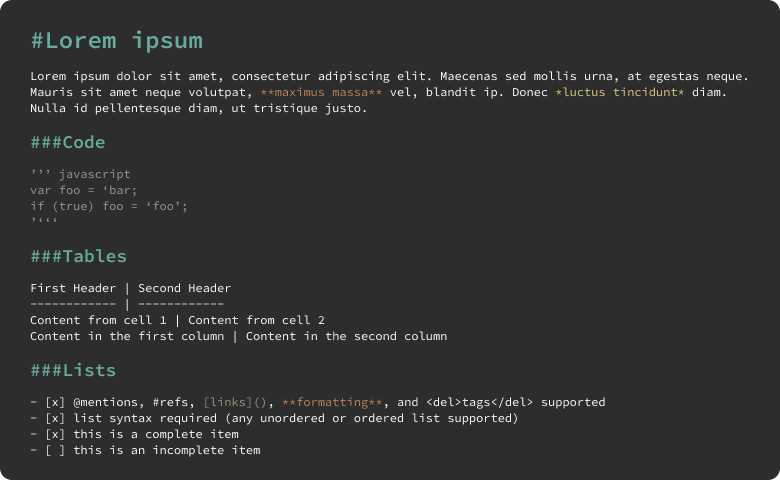

# Markdown

Markdown is a component of Backendless UI-Builder designer. This component allows you displaying markdown file or text in your page.


The component based on external [markdown-it](https://github.com/markdown-it/markdown-it) library.

<p align="center">
  
</p>

## Properties

| Property | Type | Default Value                                                                                          | Logic        | Data Binding | UI Setting | Description                                         |
|----------|------|--------------------------------------------------------------------------------------------------------|--------------|--------------|------------|-----------------------------------------------------|
| url      | Text | https://raw.githubusercontent.com/Backendless/ui-builder-library/main/components/bl-markdown/README.md | URL Logic    | YES          | YES        | Allows determining the url of markdown file         |
| text     | Text |                                                                                                        | Text Logic   | YES          | YES        | Allows determining the text of markdown             |
| height   | Text | "0px"                                                                                                  | Height Logic | YES          | YES        | Allows determining the height of markdown component |
| width    | Text | "0px"                                                                                                  | Width Logic  | YES          | YES        | Allows determining the width of markdown component  |

## Actions

| Action                  | Inputs         | Returns |
|-------------------------|----------------|---------|
| Set Content in Markdown | text: `String` |         |
| Set URL for Markdown    | url: `String`  |         |

## Styles

**Dimensions**
```
@bl-customComponent-markdown-padding: 20px;
@bl-customComponent-markdown-border-radius: 10px;
@bl-customComponent-markdown-error-message-font-size: 24px;
```

**Colors**
```
@bl-customComponent-markdown-error-message-color: #bd0e0e;
@bl-customComponent-markdown-color-prettylights-syntax-comment: if(@isLightTheme, #6e7781, #8b949e);
@bl-customComponent-markdown-color-prettylights-syntax-constant: if(@isLightTheme, #0550ae, #79c0ff);
@bl-customComponent-markdown-color-prettylights-syntax-entity: if(@isLightTheme, #8250df, #d2a8ff);
@bl-customComponent-markdown-color-prettylights-syntax-storage-modifier-import: if(@isLightTheme, #24292f, #c9d1d9);
@bl-customComponent-markdown-color-prettylights-syntax-entity-tag: if(@isLightTheme, #116329, #7ee787);
@bl-customComponent-markdown-color-prettylights-syntax-keyword: if(@isLightTheme, #cf222e, #ff7b72);
@bl-customComponent-markdown-color-prettylights-syntax-string: if(@isLightTheme, #0a3069, #a5d6ff);
@bl-customComponent-markdown-color-prettylights-syntax-variable: if(@isLightTheme, #953800, #ffa657);
@bl-customComponent-markdown-color-prettylights-syntax-brackethighlighter-unmatched: if(@isLightTheme, #82071e, #f85149);
@bl-customComponent-markdown-color-prettylights-syntax-invalid-illegal-text: if(@isLightTheme, #f6f8fa, #f0f6fc);
@bl-customComponent-markdown-color-prettylights-syntax-invalid-illegal-bg: if(@isLightTheme, #82071e, #8e1519);
@bl-customComponent-markdown-color-prettylights-syntax-carriage-return-text: if(@isLightTheme, #f6f8fa, #f0f6fc);
@bl-customComponent-markdown-color-prettylights-syntax-carriage-return-bg: if(@isLightTheme, #cf222e, #b62324);
@bl-customComponent-markdown-color-prettylights-syntax-string-regexp: if(@isLightTheme, #116329, #7ee787);
@bl-customComponent-markdown-color-prettylights-syntax-markup-list: if(@isLightTheme, #3b2300, #f2cc60);
@bl-customComponent-markdown-color-prettylights-syntax-markup-heading: if(@isLightTheme, #0550ae, #1f6feb);
@bl-customComponent-markdown-color-prettylights-syntax-markup-italic: if(@isLightTheme, #24292f, #c9d1d9);
@bl-customComponent-markdown-color-prettylights-syntax-markup-bold: if(@isLightTheme, #24292f, #c9d1d9);
@bl-customComponent-markdown-color-prettylights-syntax-markup-deleted-text: if(@isLightTheme, #82071e, #ffdcd7);
@bl-customComponent-markdown-color-prettylights-syntax-markup-deleted-bg: if(@isLightTheme, #FFEBE9, #67060c);
@bl-customComponent-markdown-color-prettylights-syntax-markup-inserted-text: if(@isLightTheme, #116329, #aff5b4);
@bl-customComponent-markdown-color-prettylights-syntax-markup-inserted-bg: if(@isLightTheme, #dafbe1, #033a16);
@bl-customComponent-markdown-color-prettylights-syntax-markup-changed-text: if(@isLightTheme, #953800, #ffdfb6);
@bl-customComponent-markdown-color-prettylights-syntax-markup-changed-bg: if(@isLightTheme, #ffd8b5, #5a1e02);
@bl-customComponent-markdown-color-prettylights-syntax-markup-ignored-text: if(@isLightTheme, #eaeef2, #c9d1d9);
@bl-customComponent-markdown-color-prettylights-syntax-markup-ignored-bg: if(@isLightTheme, #0550ae, #1158c7);
@bl-customComponent-markdown-color-prettylights-syntax-meta-diff-range: if(@isLightTheme, #8250df, #d2a8ff);
@bl-customComponent-markdown-color-prettylights-syntax-brackethighlighter-angle: if(@isLightTheme, #57606a, #8b949e);
@bl-customComponent-markdown-color-prettylights-syntax-sublimelinter-gutter-mark: if(@isLightTheme, #8c959f, #484f58);
@bl-customComponent-markdown-color-prettylights-syntax-constant-other-reference-link: if(@isLightTheme, #0a3069, #a5d6ff);
@bl-customComponent-markdown-color-fg-default: if(@isLightTheme, #24292f, #c9d1d9);
@bl-customComponent-markdown-color-fg-muted: if(@isLightTheme, #57606a, #8b949e);
@bl-customComponent-markdown-color-fg-subtle: if(@isLightTheme, #6e7781, #484f58);
@bl-customComponent-markdown-color-canvas-default: if(@isLightTheme, #ffffff, #0d1117);
@bl-customComponent-markdown-color-canvas-subtle: if(@isLightTheme, #f6f8fa, #161b22);
@bl-customComponent-markdown-color-border-default: if(@isLightTheme, #d0d7de, #30363d);
@bl-customComponent-markdown-color-border-muted: if(@isLightTheme, hsla(210, 18%, 87%, 1), #21262d);
@bl-customComponent-markdown-color-neutral-muted: if(@isLightTheme, rgba(175, 184, 193, 0.2), rgba(110, 118, 129, 0.4));
@bl-customComponent-markdown-color-accent-fg: if(@isLightTheme, #0969da, #58a6ff);
@bl-customComponent-markdown-color-accent-emphasis: if(@isLightTheme, #0969da, #1f6feb);
@bl-customComponent-markdown-color-attention-subtle: if(@isLightTheme, #fff8c5, rgba(187, 128, 9, 0.15));
@bl-customComponent-markdown-color-danger-fg: if(@isLightTheme, #cf222e, #f85149);
```
