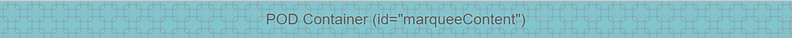

# Marquee

Marquee is the component that can be used in Backendless [UI-Builder](https://backendless.com/developers/#ui-builder). It allows the user to apply a lightweight React component that utilizes the power of CSS animations to create silky smooth marquees in the application.

<p align="center">
  
</p>

## Configuration

Configuration can be done in the UI Builder. You have to specify the content that will be displayed in the component and to which the effect will be applied.

## Properties

| Property                           | Type                                             | Default value    | Logic | Data Binding | UI Setting | Description                                                                        |
|------------------------------------|--------------------------------------------------|------------------|-------|--------------|------------|------------------------------------------------------------------------------------|
| Start Play <br> `start`            | *Checkbox*                                       | `true`           |       | NO           | YES        | Controls the playback or stop of the marquee.                                      |
| Pause On Hover <br> `pauseOnHover` | *Checkbox*                                       | `false`          |       | NO           | YES        | Controls the pause of the marquee when hovered.                                    |
| Pause On Click <br> `pauseOnClick` | *Checkbox*                                       | `false`          |       | NO           | YES        | Controls the pause of the marquee when clicked.                                    |
| Direction <br> `direction`         | *Select* <br> [`Right to left`, `Left to right`] | `Right to left`  |       | NO           | YES        | Controls the direction the marquee is sliding.                                     |
| Speed <br> `speed`                 | *Number*                                         | 20               |       | NO           | YES        | Controls the speed calculated as pixels/second.                                    |
| Delay <br> `delay`                 | *Number*                                         | 0                |       | NO           | YES        | Controls the duration to delay the animation after render, in seconds.             |
| Loop <br> `loop`                   | *Number*                                         | 0                |       | NO           | YES        | Controls the number of times the marquee should loop, 0 is equivalent to infinite. |
| Enable Gradient <br> `gradient`    | *Checkbox*                                       | `true`           |       | NO           | YES        | Controls the display of the gradient overlay.                                      |

## Events

| Name                    | Triggers                                                                                            | Context Blocks |
|-------------------------|-----------------------------------------------------------------------------------------------------|----------------|
| On Animation End Event  | when the marquee finishes scrolling and stops, only calls if loop is non-zero                       |                |
| On Cycle Complete Event | when the marquee finishes a loop, does not call if maximum loops are reached (use onFinish instead) |                |

## Actions

| Action | Inputs | Returns |
|--------|--------|---------|
| Play   |        |         |
| Pause  |        |         |

## Styles

**General**

````
@bl-customComponent-marquee-overlay-background: linear-gradient(to right, rgba(255, 255, 255, 1), rgba(255, 255, 255, 0));
@bl-customComponent-marquee-overlay-z-index: 2;
````

**Dimensions**

````
@bl-customComponent-marquee-width: 100%;
@bl-customComponent-marquee-content-width: 100%;
@bl-customComponent-marquee-overlay-width: 100%;
@bl-customComponent-marquee-overlay-height: 100%;
@bl-customComponent-marquee-overlay-pseudo-width: 200px;
````

**Other**

````
@bl-customComponent-marquee-animation-name: scroll;
@bl-customComponent-marquee-animation-timing-function: linear;
@bl-customComponent-marquee-animation-delay: 0s;
@bl-customComponent-marquee-animation-direction: normal;
@bl-customComponent-marquee-animation-duration: 10s;
@bl-customComponent-marquee-animation-iteration-count: infinite;
````
