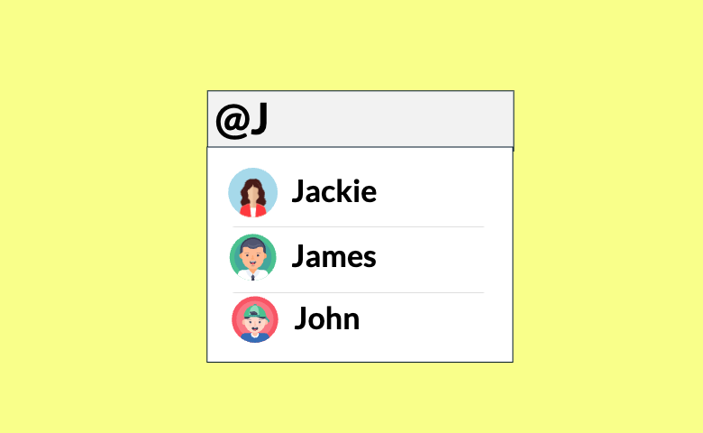

# Mention

Knob is a component of Backendless UI-Builder designer. This allows you to define number inputs with a dial.

The component based on external [Mention](https://www.primefaces.org/primereact/mention/).

<p align="center">
  
</p>

## Properties

| Property       | Type       | Default Value               | Logic               | Data Binding | UI Setting | Description                                                                                                                                                                              |
|----------------|------------|-----------------------------|---------------------|--------------|------------|------------------------------------------------------------------------------------------------------------------------------------------------------------------------------------------|
| Trigger        | *Text*     | '@'                         | Trigger Logic       | YES          | YES        | It is a handler to set trigger keywords.                                                                                                                                                 |
| Suggestions    | *JSON*     |                             | Suggestions Logic   | YES          | YES        | It is a handler to set an array of suggestion objects to display. Watch [Codeless Examples](#Examples). Signature of suggestion object: `{trigger, suggestions: [name, nickname, img]}`. |
| Field          | *Text*     |                             | Field Logic         | YES          | YES        | It is a handler to set a field of a suggested object to resolve and display.                                                                                                             |
| Scroll Height  | *Text*     | '200px'                     | Scroll Height Logic | NO           | YES        | It is a handler to set the maximum height of the suggestions panel.                                                                                                                      |
| Auto Highlight | *Checkbox* | `true`                      |                     | NO           | YES        | It is a handler to set auto-highlighting. When enabled, it highlights the first item in the list by default.                                                                             |
| Placeholder    | *Text*     | 'Please enter @ to mention' |                     | NO           | YES        | It is a handler to set a placeholder of the component.                                                                                                                                   |
| Delay          | *Number*   | 0                           |                     | NO           | YES        | It is a handler to set a delay between keystrokes to wait before sending a query.                                                                                                        |
| Autoresize     | *Checkbox* | `false`                     |                     | NO           | YES        | It is a handler to allow autoresizing.                                                                                                                                                   |
| Rows           | *Number*   | 5                           |                     | NO           | YES        | It is a handler to set number of rows of the component.                                                                                                                                  |
| Cols           | *Number*   | 40                          |                     | NO           | YES        | It is a handler to set number of columns of the component.                                                                                                                               |
| Hide Filed     | *Text*     |                             | Hide Field Logic    | YES          | YES        | It is a handler to determine which fields will not showed in suggestions.                                                                                                                |

## Events

| Name            | Triggers                           | Context Blocks                     |
|-----------------|------------------------------------|------------------------------------|
| On Change Event | When the value changes             | Value: `String`                    |
| On Focus Event  | When the element receives focus    |                                    |
| On Blur Event   | When the element loses focus       |                                    |
| On Show Event   | When overlay panel becomes visible | Suggestions: `[{suggestion}, ...]` |
| On Hide Event   | When overlay panel becomes hidden  |                                    |

## Styles

**Theme**
````
@bl-customComponent-Mention-color: @appTextColor;
@bl-customComponent-Mention-background: @appBackgroundColor;
@bl-customComponent-Mention-border: 1px solid @themePrimary;
@bl-customComponent-Mention-inputText-enabled-hover-borderColor: fadeout(@themePrimary, 50%);
@bl-customComponent-Mention-inputText-enabled-focus-boxShadow: 0 0 0 0.2rem lighten(@themePrimary, 35%);
@bl-customComponent-Mention-inputText-enabled-focus-borderColor: fadeout(@themePrimary, 50%);
@bl-customComponent-Mention-inputText-borderColor: @themePrimary;
@bl-customComponent-Mention-panel-background: @appBackgroundColor;
@bl-customComponent-Mention-panel-color: @appTextColor;
@bl-customComponent-Mention-item-color: @appTextColor;
@bl-customComponent-Mention-item-color-hover: #appTextColor;
@bl-customComponent-Mention-item-background-hover: average(@appBackgroundColor, @themePrimary);
@bl-customComponent-Mention-item-highlight-color: #appTextColor;
@bl-customComponent-Mention-item-highlight-background: darken(average(@appBackgroundColor, @themePrimary), 40%);
````

**Dimensions**
````
@bl-customComponent-Mention-borderRadius: 6px;
@bl-customComponent-Mention-panel-border: 0 none;
@bl-customComponent-Mention-panel-borderRadius: 6px;
@bl-customComponent-Mention-panel-boxShadow: 0 2px 12px 0 rgba(0, 0, 0, 0.1);
@bl-customComponent-Mention-item-border: 0 none;
@bl-customComponent-Mention-item-img-width: 32px;
````

**Color**
````
@bl-customComponent-Mention-item-background: transparent;
````

## <a name="Examples"></a> Codeless Examples

Adding suggestions:


<details><summary>Codeless example</summary>

````javascript
  return [({ 'trigger': '@','suggestions': [({ 'field': 'jamesButt','name': 'James Butt','img': 'https://i.pravatar.cc/50?img=3' }), ({ 'field': 'krisMarrier','name': 'Kris Marrier','img': 'https://i.pravatar.cc/50?img=2' }), ({ 'field': 'josephineDarakjy','name': 'Josephine Darakjy','img': 'https://i.pravatar.cc/50?img=1' })] }), ({ 'trigger': '#','suggestions': [({ 'field': 'primereact' }), ({ 'field': 'primefaces' }), ({ 'field': 'primeng' })] })]
````
</details>
