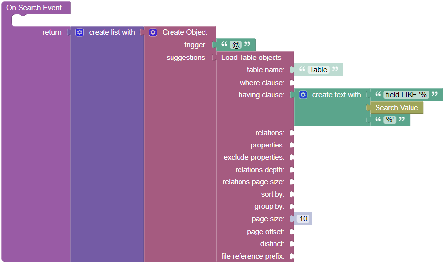

# Mention

Mention is a component of Backendless UI-Builder designer. This allows referring someone or something.

The component based on external [Mention](https://www.primefaces.org/primereact/mention/).

<p align="center">
  
</p>

## Properties

| Property       | Type       | Default Value               | Logic             | Data Binding | UI Setting | Description                                                                                                                                                                              |
|----------------|------------|-----------------------------|-------------------|--------------|------------|------------------------------------------------------------------------------------------------------------------------------------------------------------------------------------------|
| Trigger        | *Text*     | '@'                         | Trigger Logic     | YES          | YES        | It is a handler to set trigger keywords.                                                                                                                                                 |
| Suggestions    | *JSON*     |                             | Suggestions Logic | YES          | YES        | It is a handler to set an array of suggestion objects to display. Watch [Codeless Examples](#codeless-examples). Signature of suggestion object: `{trigger, suggestions: [name, nickname, img]}`. |
| Field          | *Text*     |                             | Field Logic       | YES          | YES        | It is a handler to set a field of a suggested object to resolve and display.                                                                                                             |
| Scroll Height  | *Text*     | '200px'                     |                   | NO           | YES        | It is a handler to set the maximum height of the suggestions panel.                                                                                                                      |
| Auto Highlight | *Checkbox* | `true`                      |                   | NO           | YES        | It is a handler to set auto-highlighting. When enabled, it highlights the first item in the list by default.                                                                             |
| Placeholder    | *Text*     | 'Please enter @ to mention' |                   | NO           | YES        | It is a handler to set a placeholder of the component.                                                                                                                                   |
| Delay          | *Number*   | 0                           |                   | NO           | YES        | It is a handler to set a delay between keystrokes to wait before sending a query.                                                                                                        |
| Autoresize     | *Checkbox* | `false`                     |                   | NO           | YES        | It is a handler to allow autoresizing.                                                                                                                                                   |
| Rows           | *Number*   | 5                           |                   | NO           | YES        | It is a handler to set number of rows of the component.                                                                                                                                  |
| Cols           | *Number*   | 40                          |                   | NO           | YES        | It is a handler to set number of columns of the component.                                                                                                                               |
| Hide Filed     | *Text*     |                             | Hide Field Logic  | YES          | YES        | It is a handler to determine which fields will not showed in suggestions.                                                                                                                |

## Events

| Name            | Triggers                           | Context Blocks                     |
|-----------------|------------------------------------|------------------------------------|
| On Change Event | When the value changes             | Value: `String`                    |
| On Focus Event  | When the element receives focus    |                                    |
| On Blur Event   | When the element loses focus       |                                    |
| On Show Event   | When overlay panel becomes visible | Suggestions: `[{suggestion}, ...]` |
| On Hide Event   | When overlay panel becomes hidden  |                                    |
| On Search Event | When started suggestions search    |                                    |

## Styles

**Theme**
````
@bl-customComponent-Mention-color: @appTextColor;
@bl-customComponent-Mention-background: @appBackgroundColor;
@bl-customComponent-Mention-border: 1px solid @themePrimary;
@bl-customComponent-Mention-inputText-enabled-hover-borderColor: fadeout(@themePrimary, 50%);
@bl-customComponent-Mention-inputText-enabled-focus-boxShadow: 0 0 0 0.2rem lighten(@themePrimary, 35%);
@bl-customComponent-Mention-inputText-enabled-focus-borderColor: fadeout(@themePrimary, 50%);
@bl-customComponent-Mention-inputText-borderColor: @themePrimary;
@bl-customComponent-Mention-panel-background: @appBackgroundColor;
@bl-customComponent-Mention-panel-color: @appTextColor;
@bl-customComponent-Mention-item-color: @appTextColor;
@bl-customComponent-Mention-item-color-hover: #appTextColor;
@bl-customComponent-Mention-item-background-hover: average(@appBackgroundColor, @themePrimary);
@bl-customComponent-Mention-item-highlight-color: #appTextColor;
@bl-customComponent-Mention-item-highlight-background: darken(average(@appBackgroundColor, @themePrimary), 40%);
````

**Dimensions**
````
@bl-customComponent-Mention-borderRadius: 6px;
@bl-customComponent-Mention-panel-border: 0 none;
@bl-customComponent-Mention-panel-borderRadius: 6px;
@bl-customComponent-Mention-panel-boxShadow: 0 2px 12px 0 rgba(0, 0, 0, 0.1);
@bl-customComponent-Mention-item-border: 0 none;
@bl-customComponent-Mention-item-img-width: 32px;
````

**Color**
````
@bl-customComponent-Mention-item-background: transparent;
````

## Codeless Examples

###Adding suggestions:


<details><summary>Codeless example</summary>

````javascript
  <block xmlns="http://www.w3.org/1999/xhtml" type="lists_create_with" id="wb+rwP@SP7S%t1|;93ZI" x="250.90559999999994" y="62.207999999999984"><mutation items="2"></mutation><value name="ADD0"><block type="create_object" id="BPwxnc^A$Fv+s(cGx*=H"><mutation><properties><item id="property" prop-name="trigger"></item><item id="property" prop-name="suggestions"></item></properties></mutation><value name="create_object_mutator_container_properties_stack_property0"><block type="text" id="uaZH:w25Z0-M[b`Zp9(4"><field name="TEXT">@</field></block></value><value name="create_object_mutator_container_properties_stack_property1"><block type="lists_create_with" id="(2;HPr1QP5{]@F(`ve~Y"><mutation items="3"></mutation><value name="ADD0"><block type="create_object" id="`gC(2|4A2zt:rcJCxrqJ"><mutation><properties><item id="property" prop-name="field"></item><item id="property" prop-name="name"></item><item id="property" prop-name="img"></item></properties></mutation><value name="create_object_mutator_container_properties_stack_property0"><block type="text" id="1U2_eDtk6iv,lFHE*@6_"><field name="TEXT">jamesButt</field></block></value><value name="create_object_mutator_container_properties_stack_property1"><block type="text" id="]0smtJY(a!K@*rE79fOL"><field name="TEXT">James Butt</field></block></value><value name="create_object_mutator_container_properties_stack_property2"><block type="text" id="f@AhW~mECeIDh3raEB/Q"><field name="TEXT">https://i.pravatar.cc/50?img=3</field></block></value></block></value><value name="ADD1"><block type="create_object" id="$vcva;63={Z}qPl}WXE0"><mutation><properties><item id="property" prop-name="field"></item><item id="property" prop-name="name"></item><item id="property" prop-name="img"></item></properties></mutation><value name="create_object_mutator_container_properties_stack_property0"><block type="text" id="o2_;fZuMSPWN]%GN9#NA"><field name="TEXT">krisMarrier</field></block></value><value name="create_object_mutator_container_properties_stack_property1"><block type="text" id=".-H}];KoZ.zSxEi1El|P"><field name="TEXT">Kris Marrier</field></block></value><value name="create_object_mutator_container_properties_stack_property2"><block type="text" id="]pC6Ttq-,d,U[3Z9bT[m"><field name="TEXT">https://i.pravatar.cc/50?img=2</field></block></value></block></value><value name="ADD2"><block type="create_object" id="q%xT]3UAjpfwS4SRyMA]"><mutation><properties><item id="property" prop-name="field"></item><item id="property" prop-name="name"></item><item id="property" prop-name="img"></item></properties></mutation><value name="create_object_mutator_container_properties_stack_property0"><block type="text" id="Kl(b1;qi~*@kl*ikS/q2"><field name="TEXT">josephineDarakjy</field></block></value><value name="create_object_mutator_container_properties_stack_property1"><block type="text" id="O:-UV3`*1f~v:rOwwHL`"><field name="TEXT">Josephine Darakjy</field></block></value><value name="create_object_mutator_container_properties_stack_property2"><block type="text" id="37Sl:yOLw)TpnTopHmr]"><field name="TEXT">https://i.pravatar.cc/50?img=1</field></block></value></block></value></block></value></block></value><value name="ADD1"><block type="create_object" id="b~7{n-:#ay=B;}Cg5{cC"><mutation><properties><item id="property" prop-name="trigger"></item><item id="property" prop-name="suggestions"></item></properties></mutation><value name="create_object_mutator_container_properties_stack_property0"><block type="text" id="Cj_hR#r`_KO5[%HtLg@i"><field name="TEXT">#</field></block></value><value name="create_object_mutator_container_properties_stack_property1"><block type="lists_create_with" id="8#,G+mn9F)y$.nJ`V3hJ"><mutation items="3"></mutation><value name="ADD0"><block type="create_object" id="F|Q-^+C#apJmznn0pEFz"><mutation><properties><item id="property" prop-name="field"></item></properties></mutation><value name="create_object_mutator_container_properties_stack_property0"><block type="text" id="K%qX6^8*)WRuMsSO8u!Z"><field name="TEXT">primereact</field></block></value></block></value><value name="ADD1"><block type="create_object" id="z^Tk!LY%v^x1P$*u4fzf"><mutation><properties><item id="property" prop-name="field"></item></properties></mutation><value name="create_object_mutator_container_properties_stack_property0"><block type="text" id="57w97MI(lJFUjJDU%~Pv"><field name="TEXT">primefaces</field></block></value></block></value><value name="ADD2"><block type="create_object" id="(Y)e,qCc=#[%ApW=o5P%"><mutation><properties><item id="property" prop-name="field"></item></properties></mutation><value name="create_object_mutator_container_properties_stack_property0"><block type="text" id="91-A~*z67Mw8/b(--a`z"><field name="TEXT">primeng</field></block></value></block></value></block></value></block></value></block>
````
</details>

###Adding suggestions using backend Data Tables with big data:

For big data tables to optimize searching can be used search with On Search event.
Create a list of objects `[{trigger, table, items}]`.
Where `trigger` is a symbol to call `table` objects from the backend, `items` is optional, it is a number of suggestions that be shown(defaults 10).



<details><summary>Codeless example</summary>

````javascript
<block xmlns="http://www.w3.org/1999/xhtml" type="lists_create_with" id="kCx{UJ_Iv$Y#t3vE+mT!" x="242" y="68"><mutation items="2"></mutation><value name="ADD0"><block type="create_object" id="4c2#c//5[%6JX^D,UtVl"><mutation><properties><item id="property" prop-name="table"></item><item id="property" prop-name="trigger"></item><item id="property" prop-name="items"></item></properties></mutation><value name="create_object_mutator_container_properties_stack_property0"><block type="text" id="BGKEWij?R)VM13n;:S(p"><field name="TEXT">Table1</field></block></value><value name="create_object_mutator_container_properties_stack_property1"><block type="text" id="WM@1c8n4-B.nyD9-Sa~|"><field name="TEXT">@</field></block></value><value name="create_object_mutator_container_properties_stack_property2"><block type="text" id="W.g)P[3M`DL!ZA3W[hUO"><field name="TEXT">5</field></block></value></block></value><value name="ADD1"><block type="create_object" id="L#qGcXzf3;(HlYn@NpG^"><mutation><properties><item id="property" prop-name="table"></item><item id="property" prop-name="trigger"></item><item id="property" prop-name="items"></item></properties></mutation><value name="create_object_mutator_container_properties_stack_property0"><block type="text" id="ddyZ4^-gxs2%=u^`n|oN"><field name="TEXT">Table2</field></block></value><value name="create_object_mutator_container_properties_stack_property1"><block type="text" id="cQ3xO8@$f7@vN^/|INe@"><field name="TEXT">#</field></block></value><value name="create_object_mutator_container_properties_stack_property2"><block type="text" id=";Y?_z@rbNrs|H)4fdIP/"><field name="TEXT">2</field></block></value></block></value></block>
````
</details>
