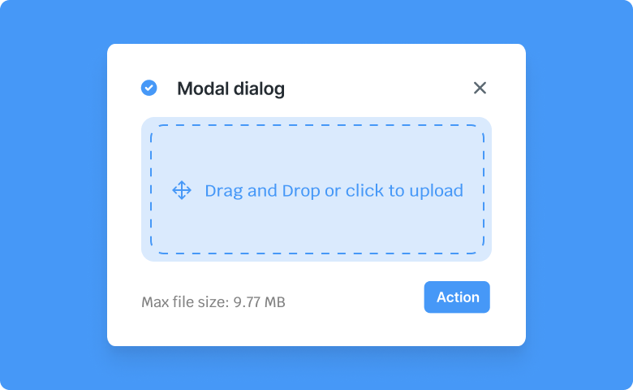

# Modal
Modal is a component of Backendless UI-Builder designer. This component allows you to add content by dragging components to this component, and it is displayed in the center.

<p align="center">
  
</p>

## Properties

| Property                               | Type     | Default Value | Logic                  | Data Binding | UI Setting | Description                                                                                         |
|----------------------------------------|----------|---------------|------------------------|--------------|------------|-----------------------------------------------------------------------------------------------------|
| Modal Visibility<br/>`modalVisibility` | Checkbox | `false`       | Modal Visibility Logic | YES          | YES        | This handler allows you to control the visibility of the modal.                                     |
| Close On Escape<br/>`closeOnEscape`    | Checkbox | `true`        | Close On Escape Logic  | YES          | YES        | This handler allows you to add the close of the modal window by pressing Escape button or backdrop. |
| Allow Scrolling<br/>`allowScrolling`   | Checkbox | `false`       | Allow Scrolling Logic  | YES          | YES        | This handler allows you to control the page scroll ability when a modal is open.                    |
| Backdrop Width<br/>`backdropWidth`     | Text     | "100%"        | Backdrop Width Logic   | YES          | YES        | This handler allows you to specify the width of a component backdrop.                               |
| Backdrop Height<br/>`backdropHeight`   | Text     | "100%"        | Backdrop Height Logic  | YES          | YES        | This handler allows you to specify the height of a component backdrop.                              |

## Events

| Name              | Triggers                                                             | Context Blocks                           |
|-------------------|----------------------------------------------------------------------|------------------------------------------|
| On Close Event    | triggered when the user clicks on the backdrop or Escape button      |                                          |

## Actions

| Action         | Inputs        | Returns        |
|----------------|---------------|----------------|
| Open Modal     |               |                |
| Close Modal    |               |                |

## Styles

**Dimensions**
````
@bl-customComponent-modalBackdrop-width: 100%;
@bl-customComponent-modalBackdrop-height: 100%;
@bl-customComponent-modal-backdrop-z-index: 1;
@bl-customComponent-modal-content-z-index: 2;
@bl-customComponent-modal-component-z-index: 100;
````

**Colors**
````
@bl-customComponent-modal-backdrop-color: rgba(0, 0, 0, 0.5);
````
