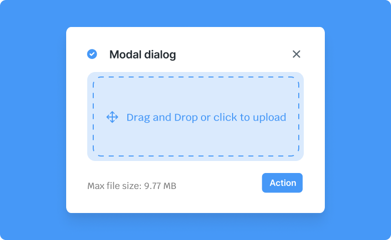
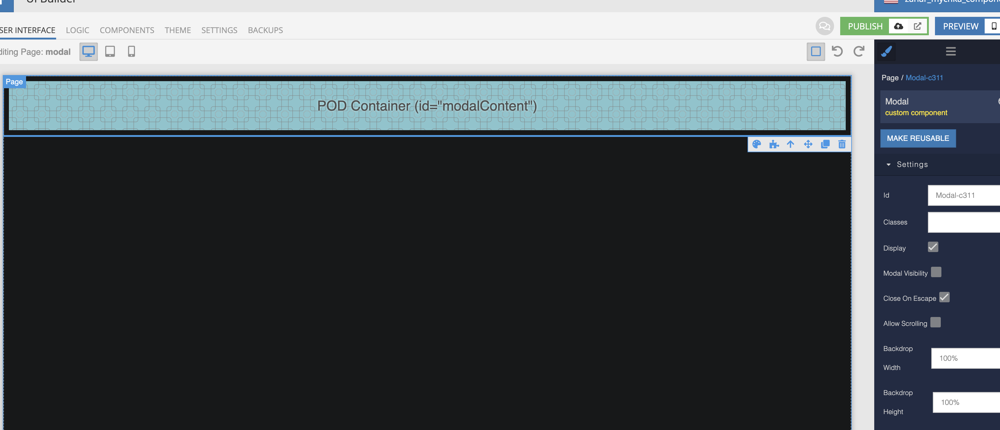
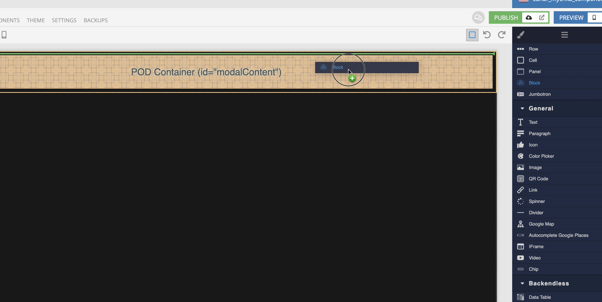
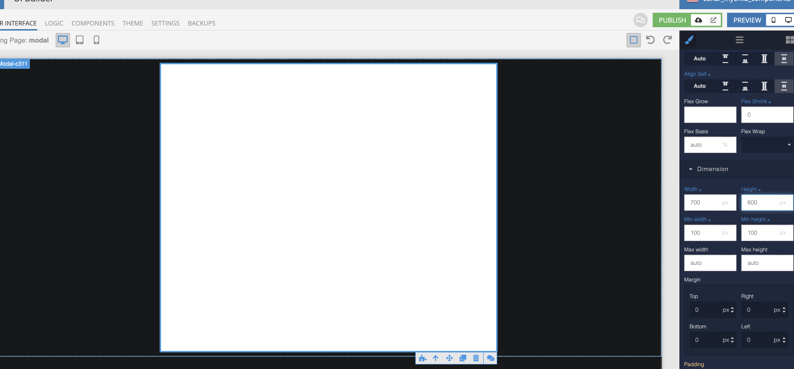
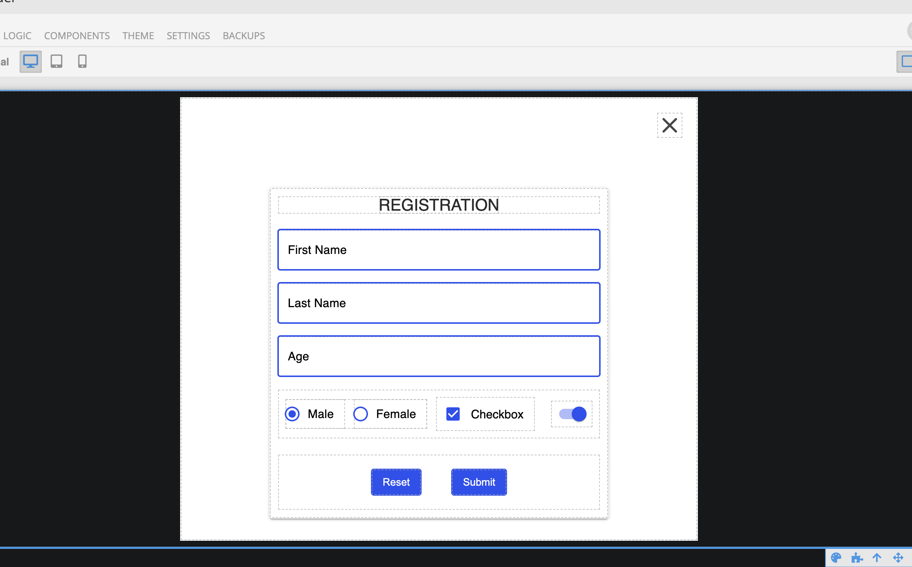
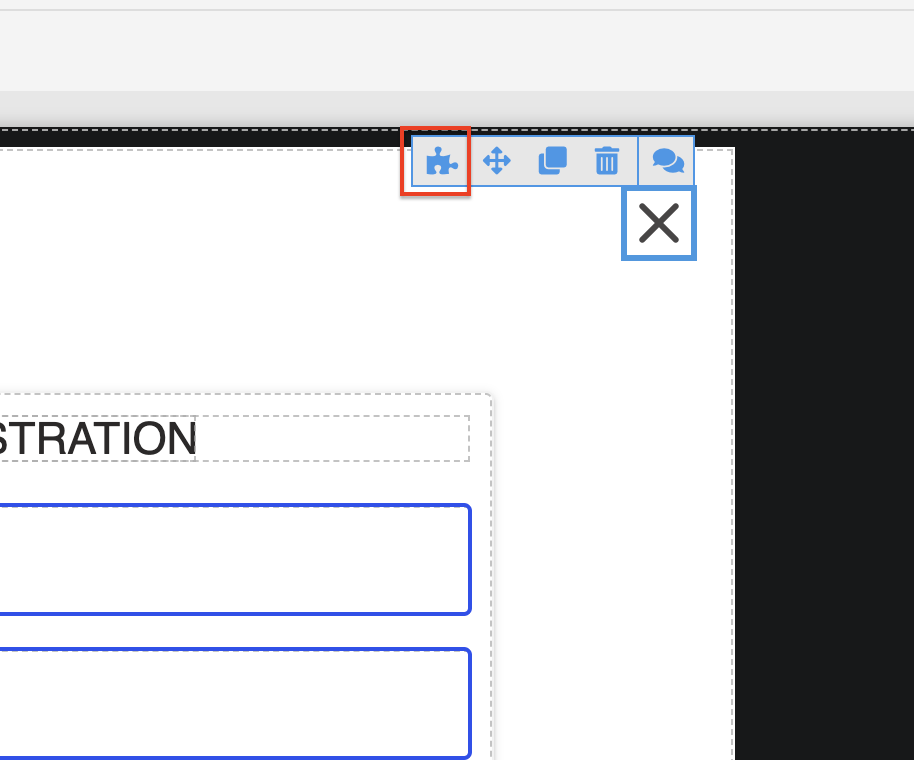
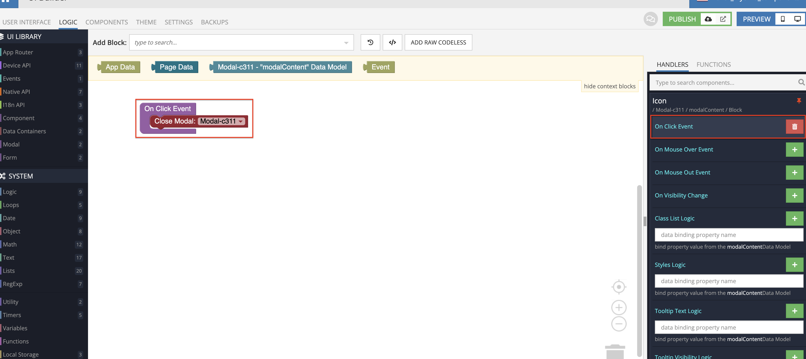
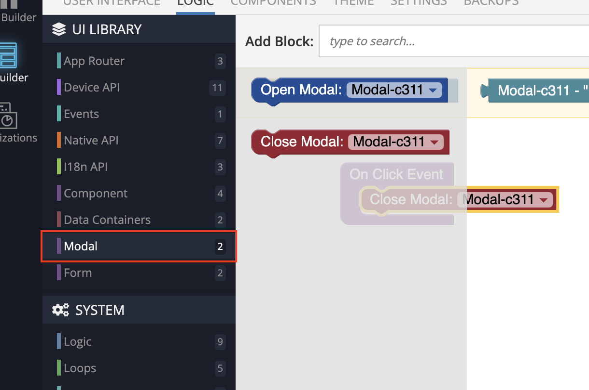

# Modal
Modal is a component of Backendless UI-Builder designer. This component is a Pod container, so you can insert anything into it - from a block with elements to other components by dragging it onto this component.

<p align="center">
  
</p>

## Properties

| Property                               | Type     | Default Value | Logic                  | Data Binding | UI Setting | Description                                                                                         |
|----------------------------------------|----------|---------------|------------------------|--------------|------------|-----------------------------------------------------------------------------------------------------|
| Modal Visibility<br/>`modalVisibility` | Checkbox | `false`       | Modal Visibility Logic | YES          | YES        | This handler allows you to control the visibility of the modal.                                     |
| Close On Escape<br/>`closeOnEscape`    | Checkbox | `true`        | Close On Escape Logic  | YES          | YES        | This handler allows you to add the close of the modal window by pressing Escape button or backdrop. |
| Allow Scrolling<br/>`allowScrolling`   | Checkbox | `false`       | Allow Scrolling Logic  | YES          | YES        | This handler allows you to control the page scroll ability when a modal is open.                    |

## Events

| Name              | Triggers                                                             | Context Blocks                           |
|-------------------|----------------------------------------------------------------------|------------------------------------------|
| On Close Event    | triggered when the user clicks on the backdrop or Escape button      |                                          |

## Actions

| Action         | Inputs        | Returns        |
|----------------|---------------|----------------|
| Open Modal     |               |                |
| Close Modal    |               |                |

## Styles

**Dimensions**
````
@bl-customComponent-modal-width: 100%;
@bl-customComponent-modal-height: 100%;
@bl-customComponent-modal-backdrop-z-index: 1;
@bl-customComponent-modal-content-z-index: 2;
@bl-customComponent-modal-component-z-index: 100;
````

**Colors**
````
@bl-customComponent-modal-backdrop-color: rgba(0, 0, 0, 0.5);
````

## <a name="guide"></a> Usage Guide

Add the Modal component to the page.



Drag the Block component into the Modal component.



Set any styles for the Block component (background color, width, height, etc.).



Add content to the Block component:



Also, if you want to add a close button for the modal, do the following:

  1. Go to the Logic of Button.

  

  2. Add a `Close Modal` action to the `On Click Event` section.

  

  3. The `Close Modal` action you can find here.

  
