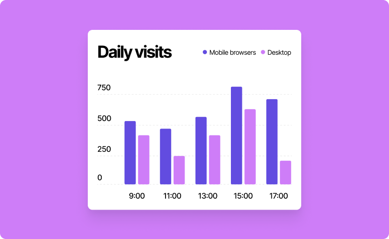

# Multiple Bar Chart

Multiple Bar Chart is a component of Backendless UI-Builder designer. This is a bar chart whose purpose is to show the progress of each item.

  

## Usage

Add a component to your page and add data (array of objects) to the property `Chart data`. Each element of the array must contain the properties "goal", "progress" and "name".

### Component Elements

<dl>
<dt>Name</dt>
<dd>To the left of the bar is the name of the bar.</dd>
<dt>Bar</dt>
<dd>The bar is to the right of the name and it shows the member's progress.</dd>
</dl>

### Component Properties

  Name               | Type       | Default value      | Description
 --------------------|------------|--------------------|-------------------------------------------------------------------------------------
  Disable            | bool       | false              | This property allows you to disable component.
  Chart data         | array      |                    | You can enter an array of objects in the `Chart data` property. Each element of the array must contain the properties "goal", "progress" and "name", if you do not specify these properties, the component will display its data.
