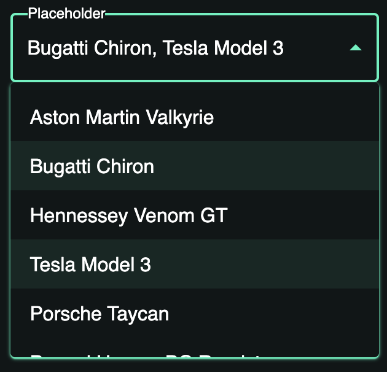

# Multiple Select

Multiple Select is a component of Backendless UI-Builder designer. This component allows you to handle multiple selections.

<p align="center">
  
</p>

## Properties

| Property            | Type                                                         | Default Value        | Logic                     | Data Binding | UI Setting | Description                                                                                                                                                              |
|---------------------|--------------------------------------------------------------|----------------------|---------------------------|--------------|------------|--------------------------------------------------------------------------------------------------------------------------------------------------------------------------|
| Disabled            | *Checkbox*                                                   | `false`              | Disabled Logic            | YES          | YES        | This handler allows you to disable a component.                                                                                                                          |
| Placeholder         | *Text*                                                       | 'Placeholder'        |                           | NO           | YES        | This handler allows you to specify a placeholder for a component.                                                                                                        |
| Select All Checkbox | *Checkbox*                                                   | `true`               | Select All Checkbox Logic | YES          | YES        | This handler allows you to add a checkbox to select all options.                                                                                                         |
| Select All Label    | *Text*                                                       | 'Select all options' | Select All Label Logic    | YES          | YES        | This handler allows you to specify label for "Select All Checkbox".                                                                                                      |
| Variant             | *Select* <br/>'outlined' <br/>\| 'filled' <br/>\| 'standart' | 'outlined'           |                           | NO           | YES        | This handler allows you to select a variant of the component.                                                                                                            |
| Type                | *Select* <br/>'default' <br/>\| 'checkmark' <br/>\| 'chip'   | 'checkmark'          |                           | NO           | YES        | This handler allows you to select a type of the component.                                                                                                               |
| Value               | *Text*                                                       | ''                   | Value Logic               | YES          | YES        | This handler allows you to add value by default. Enter the value separated by a comma. Signature of value: '`String`, `String`'.                                         |
| Options             | *JSON*                                                       |                      | Options Logic             | YES          | YES        | This handler allows you to add options to the component. Watch [Codeless Examples](#Examples). Signature of options: list of objects { label: `String`, value: `String`} |

## Events

| Name             | Triggers                                      | Context Blocks                                                      |
|------------------|-----------------------------------------------|---------------------------------------------------------------------|
| On Change Event  | when the user select an item from the options | Select Value: list of objects { label: `String`, value: `String` }  |

## Styles

**Theme**
````
@bl-customComponent-multipleSelect-themeColor: @themePrimary;
@bl-customComponent-multipleSelect-backgroundColor: @appBackgroundColor;
@bl-customComponent-multipleSelect-textColor: @appTextColor;
````

**Dimensions**
````
@bl-customComponent-multipleSelect-width: 300px;
@bl-customComponent-multipleSelect-margin: 0;
````

**Colors**
````
@bl-customComponent-option-backgroundColor-onHover: rgba(@themePrimary, 0.15);
@bl-customComponent-optionSelected-backgroundColor: rgba(@themePrimary, 0.078);
@bl-customComponent-optionCheckmark-color: @bl-customComponent-multipleSelect-themeColor;
@bl-customComponent-selectAllCheckbox-backgroundColor: rgba(@themePrimary, 0.5);
@bl-customComponent-optionChip-backgroundColor: @bl-customComponent-optionSelected-backgroundColor;
````

## <a name="Examples"></a> Codeless Examples

Adding options to the component:


