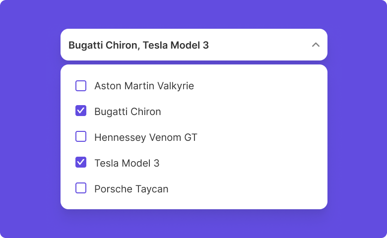
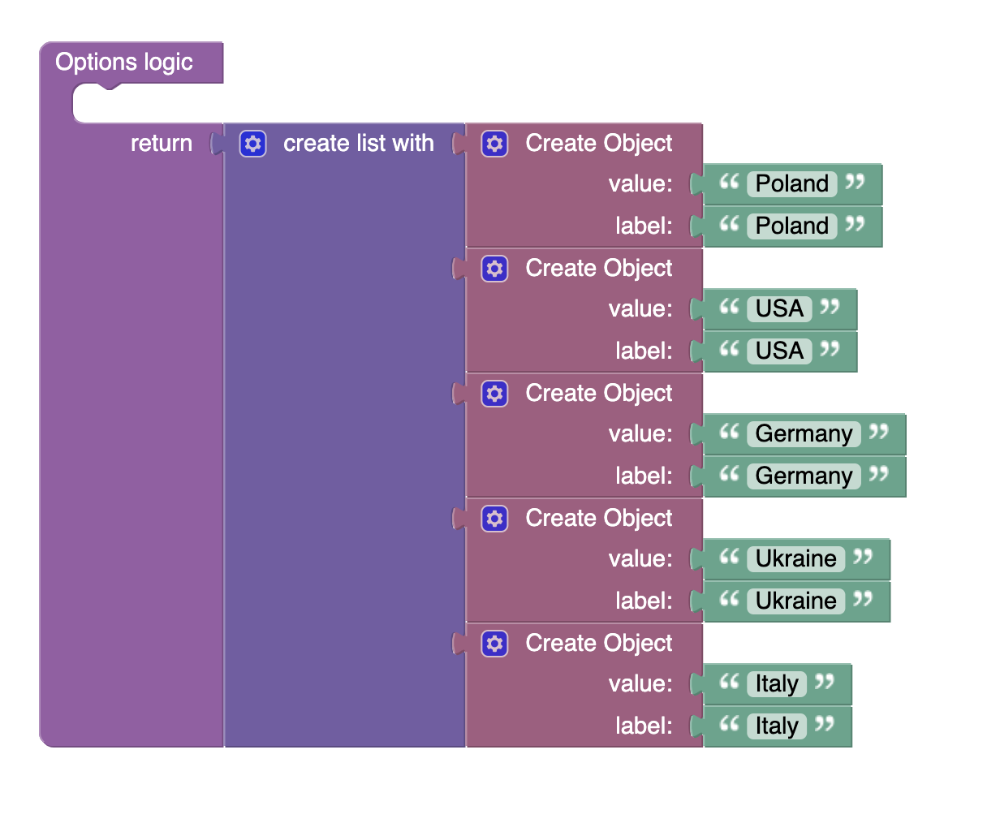

# Multiple Select

Multiple Select is a component of Backendless UI-Builder designer. This component allows you to handle multiple selections.

<p align="center">
  
</p>

## Properties

| Property                                    | Type                                                                     | Default Value                                                                                                                                                                                                                                                                                                                                        | Logic                     | Data Binding | UI Setting | Description                                                                                                                                                              |
|---------------------------------------------|--------------------------------------------------------------------------|------------------------------------------------------------------------------------------------------------------------------------------------------------------------------------------------------------------------------------------------------------------------------------------------------------------------------------------------------|---------------------------|--------------|------------|--------------------------------------------------------------------------------------------------------------------------------------------------------------------------|
| Disabled<br/>`disabled`                     | Checkbox                                                                 | `false`                                                                                                                                                                                                                                                                                                                                              | Disabled Logic            | YES          | YES        | This handler allows you to disable a component.                                                                                                                          |
| Placeholder<br/>`placeholder`               | Text                                                                     | 'Placeholder'                                                                                                                                                                                                                                                                                                                                        |                           | NO           | YES        | This handler allows you to specify a placeholder for a component.                                                                                                        |
| Select All Checkbox<br/>`selectAllCheckbox` | Checkbox                                                                 | `true`                                                                                                                                                                                                                                                                                                                                               | Select All Checkbox Logic | YES          | YES        | This handler allows you to add a checkbox to select all options.                                                                                                         |
| Select All Label<br/>`selectAllLabel`       | Text                                                                     | 'Select all options'                                                                                                                                                                                                                                                                                                                                 | Select All Label Logic    | YES          | YES        | This handler allows you to specify label for "Select All Checkbox".                                                                                                      |
| Variant<br/>`variant`                       | Select [Outlined:`outlined`<br/>Filled:`filled`<br/>Standard:`standard`] | Outlined:`outlined`                                                                                                                                                                                                                                                                                                                                  |                           | NO           | YES        | This handler allows you to select a variant of the component.                                                                                                            |
| Type<br/>`type`                             | Select [Default:`default`<br/>Checkmark:`checkmark`<br/>Chip:`chip`]     | Checkmark:`checkmark`                                                                                                                                                                                                                                                                                                                                |                           | NO           | YES        | This handler allows you to select a type of the component.                                                                                                               |
| Value<br/>`value`                           | Text                                                                     | 'Bugatti Chiron, Tesla Model 3'                                                                                                                                                                                                                                                                                                                      | Value Logic               | YES          | YES        | This handler allows you to add value by default. Enter the value separated by a comma. Signature of value: '`String`, `String`'.                                         |
| Options<br/>`options`                       | JSON                                                                     | `[`<br/>`{"value": "Aston Martin Valkyrie", "label": "Aston Martin Valkyrie"},`<br/>`{"value": "Bugatti Chiron", "label": "Bugatti Chiron"},`<br/>`{"value": "Hennessey Venom GT", "label": "Hennessey Venom GT"},`<br/>`{"value": "Tesla Model 3", "label": "Tesla Model 3"},`<br/>`{"value": "Porsche Taycan", "label": "Porsche Taycan"}`<br/>`]` | Options Logic             | YES          | YES        | This handler allows you to add options to the component. Watch [Codeless Examples](#examples). Signature of options: list of objects { label: `String`, value: `String`} |

## Events

| Name             | Triggers                                      | Context Blocks                                                      |
|------------------|-----------------------------------------------|---------------------------------------------------------------------|
| On Change Event  | when the user select an item from the options | Select Value: list of objects { label: `String`, value: `String` }  |

## Actions

| Action                         | Inputs                                         | Returns                                       |
|--------------------------------|------------------------------------------------|-----------------------------------------------|
| Set Options to Multiple Select | Options: [{label: `String`, value: `String`}]  |                                               |
| Get Options of Multiple Select |                                                | Options: [{label: `String`, value: `String`}] |
| Set Value to Multiple Select   | Value: `String`                                |                                               |
| Get Value of Multiple Select   |                                                | `String`: current selected value              |

## Styles

**Theme**
````
@bl-customComponent-multipleSelect-themeColor: @themePrimary;
@bl-customComponent-multipleSelect-backgroundColor: @appBackgroundColor;
@bl-customComponent-multipleSelect-textColor: @appTextColor;
````

**Dimensions**
````
@bl-customComponent-multipleSelect-width: 300px;
@bl-customComponent-multipleSelect-margin: 0;
@bl-customComponent-multipleSelect-options-width: 300px;
@bl-customComponent-multipleSelect-options-minHeight: 200px;
````

**Colors**
````
@bl-customComponent-multipleSelect-option-backgroundColor-onHover: rgba(@themePrimary, 0.15);
@bl-customComponent-multipleSelect-optionSelected-backgroundColor: rgba(@themePrimary, 0.078);
@bl-customComponent-multipleSelect-optionSelected-backgroundColor-onHover: rgba(@themePrimary, 0.122);
@bl-customComponent-multipleSelect-optionCheckmark-color: @bl-customComponent-multipleSelect-themeColor;
@bl-customComponent-multipleSelect-optionChip-backgroundColor: @bl-customComponent-multipleSelect-optionSelected-backgroundColor;
@bl-customComponent-multipleSelect-borderColor-onHover: rgba(@themePrimary, 0.75);
@bl-customComponent-multipleSelect-dropDownButton-color: @bl-customComponent-multipleSelect-themeColor;
@bl-customComponent-multipleSelect-selectAllCheckbox-backgroundColor: rgba(@themePrimary, 0.5);
````

**Decorations**
````
@bl-customComponent-multipleSelect-selectAllCheckbox-borderBottom: 2px solid @bl-customComponent-multipleSelect-themeColor;
@bl-customComponent-multipleSelect-selectAllCheckbox-borderTopLeftRadius: 4px;
@bl-customComponent-multipleSelect-selectAllCheckbox-borderTopRightRadius: 4px;
@boxShadowPrimary: 0px 2px 1px -1px  @themePrimary, 0px 1px 1px 0px  @themePrimary, 0px 1px 3px 0px  @themePrimary;
@bl-customComponent-multipleSelect-options-boxShadow: @boxShadowPrimary;
````

## <a id="examples"></a> Codeless Examples

Adding options to the component:


