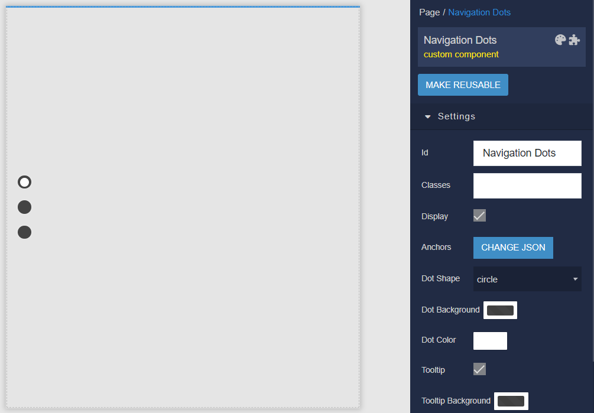
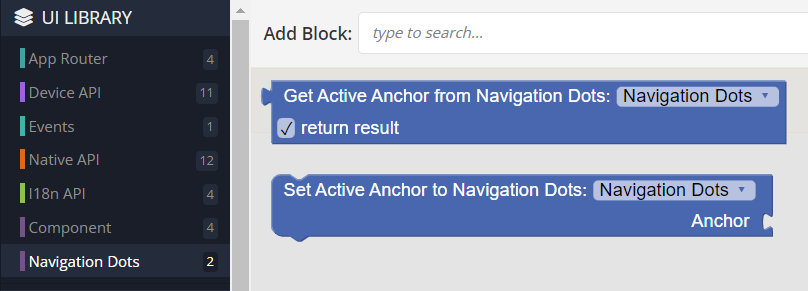
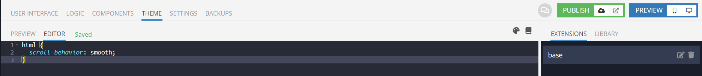

# Navigation Dots

Navigation Dots is the component that can be used in Backendless [UI-Builder](https://backendless.com/developers/#ui-builder). This component provides a visually appealing way to navigate through different sections on a webpage.

<p align="center">
  
</p>

## Properties

| Property                                    | Type                                           | Default value     | Logic                    | Data Binding | UI Setting | Description                                                                                                               |
|---------------------------------------------|------------------------------------------------|-------------------|--------------------------|--------------|------------|---------------------------------------------------------------------------------------------------------------------------|
| Sections <br> `sections`                    | *JSON*                                         | `[]`              | Sections Logic           | YES          | NO         | This logic allows you to specify the array of sections.  Signature of sections: list of DOM elements `[Element, Element]` |
| Dot Shape <br> `dotShape`                   | *Select* <br> [`circle`, `square`, `triangle`] | `circle`          |                          | NO           | YES        | Controls the dot shape type.                                                                                              |
| Dot Background <br> `background`            | *Color*                                        | `rgba(0,0,0,0.7)` | Dot Background Logic     | YES          | YES        | This logic allows you to specify the color of the dot container.                                                          |
| Dot Color <br> `color`                      | *Color*                                        | `#ffffff`         | Dot Color Logic          | YES          | YES        | This logic allows you to specify the color of an internal dot.                                                            |
| Tooltip <br> `tooltip`                      | *Checkbox*                                     | `true`            |                          | NO           | YES        | Controls whether a tooltip will be shown when hovering over a dot by default or not.                                      |
| Tooltip Background <br> `tooltipBackground` | *Color*                                        | `rgba(0,0,0,0.7)` | Tooltip Background Logic | YES          | YES        | This logic allows you to specify the background of the tooltip.                                                           |
| Tooltip Color <br> `tooltipColor`           | *Color*                                        | `#ffffff`         | Tooltip Color Logic      | YES          | YES        | This logic allows you to specify the color of the tooltip.                                                                |

## Events

| Name     | Triggers                               | Context Blocks           |
|----------|----------------------------------------|--------------------------|
| On Click | when the user clicks on the component. | activeSection: `Element` |

## Actions

| Action                                  | Inputs             | Returns   |
|-----------------------------------------|--------------------|-----------|
| Get Active Section from Navigation Dots |                    | `Element` |
| Set Active Section to Navigation Dots   | Section: `Element` |           |

## Styles

````
@bl-customComponent-navigation-dots-width: 200px;
@bl-customComponent-navigation-dots-height: 100%;
@bl-customComponent-navigation-dots-textShadow: 0 1px 1px rgba(0, 0, 0, .5);
@bl-customComponent-navigation-dots-zIndex: 111;

@bl-customComponent-navigation-dots-nav-width: 100%;
@bl-customComponent-navigation-dots-nav-padding: 0 0 0 18px;

@bl-customComponent-navigation-dots-nav-item-padding: 8px 0;
@bl-customComponent-navigation-dots-nav-item-transform: rotate(0deg);
@bl-customComponent-navigation-dots-nav-item-dot-transform: rotate(0deg);
@bl-customComponent-navigation-dots-nav-item-onHover-filter: contrast(200%) saturate(200%) opacity(100%);

@bl-customComponent-navigation-dots-circle-square-size: 18px;
@bl-customComponent-navigation-dots-circle-square-dot-size: 12px;
@bl-customComponent-navigation-dots-circle-square-dot-left: 3px;
@bl-customComponent-navigation-dots-circle-square-boxShadow: 0 0 3px rgba(255, 255, 255, .5);
@bl-customComponent-navigation-dots-circle-borderRadius: 50%;
@bl-customComponent-navigation-dots-square-borderRadius: 0;

@bl-customComponent-navigation-dots-triangle-borderWidth-left: 13.5px;
@bl-customComponent-navigation-dots-triangle-borderWidth-right: 13.5px;
@bl-customComponent-navigation-dots-triangle-borderWidth-bottom: 18px;
@bl-customComponent-navigation-dots-triangle-dot-borderWidth-left: 9px;
@bl-customComponent-navigation-dots-triangle-dot-borderWidth-right: 9px;
@bl-customComponent-navigation-dots-triangle-dot-borderWidth-bottom: 12px;
@bl-customComponent-navigation-dots-triangle-dot-left: 4px;
@bl-customComponent-navigation-dots-triangle-dot-top: 11.5px;

@bl-customComponent-navigation-dots-tooltip-fontSize: 12px;
@bl-customComponent-navigation-dots-tooltip-textTransform: uppercase;
@bl-customComponent-navigation-dots-tooltip-fontWeight: 700;
@bl-customComponent-navigation-dots-tooltip-left: 24px;
@bl-customComponent-navigation-dots-tooltip-textAlign: center;
@bl-customComponent-navigation-dots-tooltip-borderRadius: 100px;
@bl-customComponent-navigation-dots-tooltip-padding: 3px 8px;
````

## Usage Examples

Below is an example of using the Navigation Dots component.

The first step is to add a component to the page and select the necessary settings on the right.

<p align="center">
  
</p>

The second step is to add the sections we need (with content) for navigation.

<p align="center">
  
</p>

Each of the sections (these are ordinary container blocks, for example) needs to add a unique ID and a unique anchor, and the anchor will act as a tooltip when hovering over the navigation dot.

<p align="center">
  
</p>

The third step is to add logic for the navigation sections in our Navigation Dots component logic.

<p align="center">
  
</p>

After this, you can view the result. Clicking on a navigation dot will scroll the page to the corresponding section. In this case, a normal scroll across the page between sections will display the corresponding dot of the navigation bar active.

<p align="center">
  
</p>

In addition, you have two actions at your disposal: `Get Active Section from Navigation Dots` will return the currently active DOM element, and `Set Active Section to Navigation Dots` will set the passed DOM element as the active section (at the moment that you need according to the logic of your project).

<p align="center">
  
</p>

And one more point regarding the smoothness of scrolling. In order to ensure smooth scrolling between sections, add the following parameter to your html in styles.

````
html {
  scroll-behavior: smooth;
}
````

<p align="center">
  
</p>
