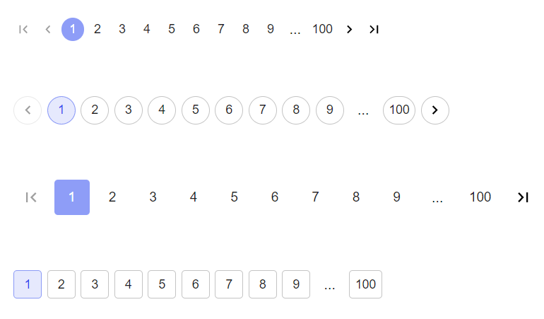
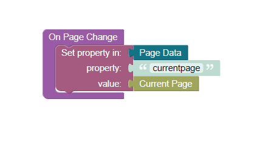

# Pagination

Pagination is a component of Backendless UI-Builder designer. This allows you to create pages with a control panel for switching between pages.

The component based on external [pagination](https://mui.com/material-ui/react-pagination/).

<p align="center">
  
</p>

## Properties

| Property                 | Type                                                       | Default Value | Loigc               | Data Binding | UI Setting | Description                                                                |
|--------------------------|------------------------------------------------------------|---------------|---------------------|--------------|------------|----------------------------------------------------------------------------|
| pageCount                | Number                                                     | 10            | Page Count Loigc    | YES          | YES        | Allows to determine the count of pages                                     |
| siblingCount             | Number                                                     | 1             | Sibling Count Logic | NO           | YES        | Allows to determine how many digits to display either side of current page |
| variant                  | Select ["normal", "outline", "rounded", "rounded-outline"] | normal        |                     | NO           | YES        | Allows to determine the variant of pagination style                        |
| size                     | Select ["small", "normal", "large"]                        | normal        |                     | NO           | YES        | Allows to determine the size for pagination                                |
| isNextButtonVisible      | Checkbox                                                   | `true`        |                     | NO           | YES        | Allows to determine the visible or not visibel "Next" button               |
| isPrevButtonVisible      | Checkbox                                                   | `true`        |                     | NO           | YES        | Allows to determine the visible or not visible "Previous" button           |
| isFirstPageButtonVisible | Checkbox                                                   | `true`        |                     | NO           | YES        | Allows to determine the visible or not visible "First Page" button         |
| isLastPageButtonVisible  | Checkbox                                                   | `true`        |                     | NO           | YES        | Allows to determine the visible or not visible "Last Page" button          |

## Events

| Name           | Triggered                                 | Context Block         |
|----------------|-------------------------------------------|-----------------------|
| On Page Change | when the current page change              | currentPage: `Number` |
| On Go Next     | when the user clicks on next button       |                       |
| On Go Back     | when the user clicks on back button       |                       |
| On Go First    | when the user clicks on first-page button |                       |
| On Go Last     | when the user clicks on last-page button  |                       |

## Actions

| Action              | Inputs | Return |
|---------------------|--------|--------|
| Go to Next Page     |        |        |
| Go to Previous Page |        |        |
| Go to First Page    |        |        |
| Go to Last Page     |        |        |

## Styles
**Theme**
```
@bl-customComponent-pagination-themeColor: @themePrimary;
@bl-customComponent-pagination-backgroundColor: @appBackgroundColor;
@bl-customComponent-pagination-textColor: @appTextColor;
```

**Colors**
```
@bl-customComponent-pagination-buttonColor: fade(@bl-customComponent-pagination-textColor, 87%);
@bl-customComponent-pagination-buttonColorSelected: if(luma(@bl-customComponent-pagination-textColor) < 50%, #ffffff, #000000);
```

**Dimensions**
```
@bl-customComponent-pagination-button-smallSize: 26px;
@bl-customComponent-pagination-button-normalSize: 32px;
@bl-customComponent-pagination-button-largeSize: 40px;
```

## <a name="Examples"></a> Codeless Examples

Addition of current page to Page Data:


