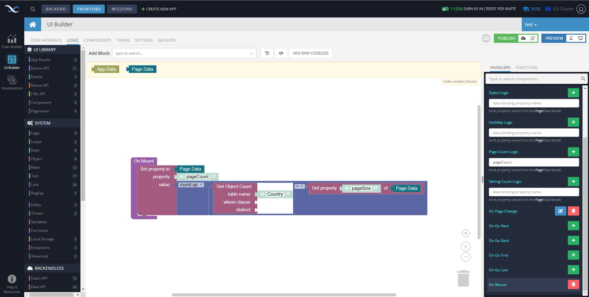

# Pagination

Pagination is a component of Backendless UI-Builder designer. This allows you to create pages with a control panel for switching between pages.

The component based on external [pagination](https://mui.com/material-ui/react-pagination/).

<p align="center">
  
</p>

## Properties

| Property                                      | Type                                                                                                  | Default Value    | Logic               | Data Binding | UI Setting | Description                                                                |
|-----------------------------------------------|-------------------------------------------------------------------------------------------------------|------------------|---------------------|--------------|------------|----------------------------------------------------------------------------|
| Page Count: `pageCount`                       | Number                                                                                                | 10               | Page Count Logic    | YES          | YES        | Allows to determine the count of pages                                     |
| Sibling Count: `siblingCount`                 | Number                                                                                                | 1                | Sibling Count Logic | YES          | YES        | Allows to determine how many digits to display either side of current page |
| Variant: `variant`                            | Select [Normal: `normal`, Outline: `outline`, Rounded: `rounded`, Rounded-Outline: `rounded-outline`] | Normal: `normal` |                     | NO           | YES        | Allows to determine the variant of pagination style                        |
| Size: `size`                                  | Select [Small: `small`, Normal: `normal`, Large: `large`]                                             | Normal: `normal` |                     | NO           | YES        | Allows to determine the size for pagination                                |
| Next Button: `isNextButtonVisible`            | Checkbox                                                                                              | `true`           |                     | NO           | YES        | Allows to determine the visible or not visible "Next" button               |
| Previous Button: `isPrevButtonVisible`        | Checkbox                                                                                              | `true`           |                     | NO           | YES        | Allows to determine the visible or not visible "Previous" button           |
| First Page Button: `isFirstPageButtonVisible` | Checkbox                                                                                              | `true`           |                     | NO           | YES        | Allows to determine the visible or not visible "First Page" button         |
| Last Page Button: `isLastPageButtonVisible`   | Checkbox                                                                                              | `true`           |                     | NO           | YES        | Allows to determine the visible or not visible "Last Page" button          |

## Events

| Name              | Triggered                                                                                                                                                                                                       | Context Block         |
|-------------------|-----------------------------------------------------------------------------------------------------------------------------------------------------------------------------------------------------------------|-----------------------|
| On Mounted        | immediately after the component is mounted and appeared on the page                                                                                                                                             |                       |
| On Before Unmount | immediately before the component is unmounted and destroyed. Perform any necessary cleanup in this method, such as invalidating timers or cleaning up any RT subscriptions that were created in this component. |                       |
| On Page Change    | when the current page change                                                                                                                                                                                    | currentPage: `Number` |
| On Go Next        | when the user clicks on next button                                                                                                                                                                             |                       |
| On Go Back        | when the user clicks on back button                                                                                                                                                                             |                       |
| On Go First       | when the user clicks on first-page button                                                                                                                                                                       |                       |
| On Go Last        | when the user clicks on last-page button                                                                                                                                                                        |                       |

## Actions

| Action              | Inputs | Return |
|---------------------|--------|--------|
| Go to Next Page     |        |        |
| Go to Previous Page |        |        |
| Go to First Page    |        |        |
| Go to Last Page     |        |        |

## Styles
**Theme**
```
@bl-customComponent-pagination-themeColor: @themePrimary;
@bl-customComponent-pagination-backgroundColor: @appBackgroundColor;
@bl-customComponent-pagination-textColor: @appTextColor;
```

**Colors**
```
@bl-customComponent-pagination-buttonColor: fade(@bl-customComponent-pagination-textColor, 87%);
@bl-customComponent-pagination-buttonColorSelected: if(luma(@bl-customComponent-pagination-textColor) < 50%, #ffffff, #000000);
```

**Dimensions**
```
@bl-customComponent-pagination-button-smallSize: 26px;
@bl-customComponent-pagination-button-normalSize: 32px;
@bl-customComponent-pagination-button-largeSize: 40px;
```

## Usage guide

We will display this data table:


Add Data Grid and Pagination component to the page:


Configure the columns to be displayed:


Add property “pageSize” to “Page Data” to some mount event:


Now we need to calculate how many pages we have. For that, in Pagination On Mounted event we use the block for getting the count of rows in our table and then divide this count by the count of rows on one page(pageSize). This result we round up for integer number:



Add “pageCount” from “Page Data” to data binding for Page Count Logic:


Now we load the table's data in Pagination On Page Change event and calculate page offset and set it to “Page Data”:


Get table data from “Page Data” to Data Grid "Rows Data Logic":


Finally, If you want to add some logic to control events you should add action in control events: "On Go Next", "On Go Back", "On Go Last", and "On Go First".


### Now in the preview, we have a component Data Grid with component Pagination


