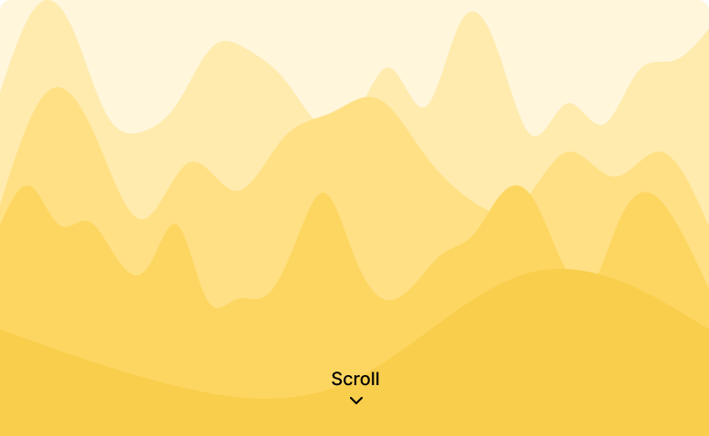
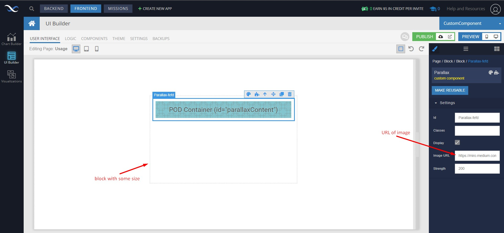
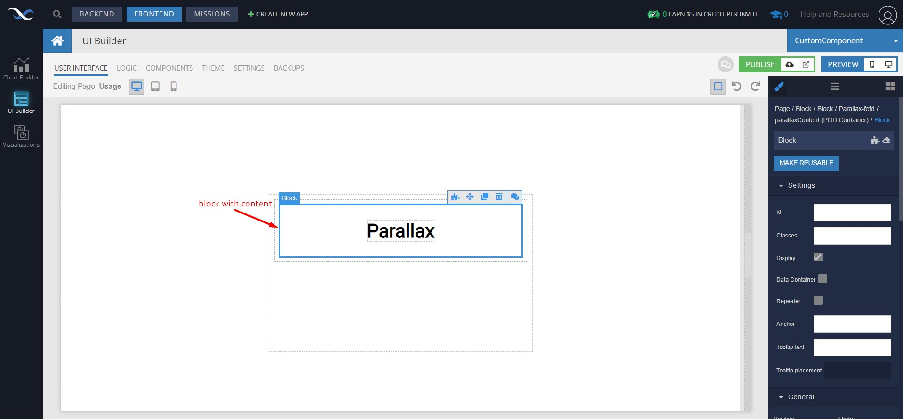
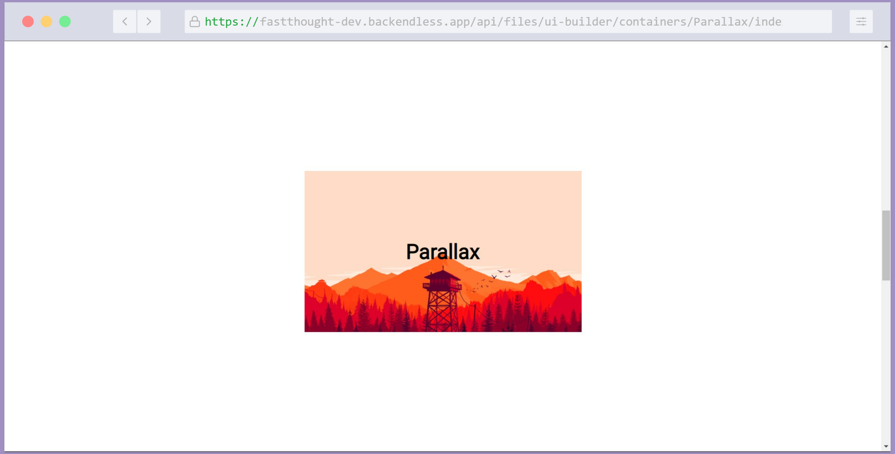

# Parallax

Parallax is a component of Backendless UI-Builder designer. This allows you to add image with content and parallax effect.

  

## Properties

| Property | Type   | Default Value | Logic           | Data Binding | UI Setting | Description                                                                                       |
|----------|--------|---------------|-----------------|--------------|------------|---------------------------------------------------------------------------------------------------|
| imageUrl | Text   |               | Image URl Logic | YES          | YES        | Allows to determine image URL                                                                     |
| strength | Number | 200           | Strength Logic  | YES          | YES        | Allows to determine the strength of parallax. The value should be between 100(low) and 2000(high) |

## Example

  

## Usage guide

To add a Parallax component to your webpage, follow these simple steps:

1. Insert a Parallax component to a block with some size on a page that has scrolling.

    

2. Insert some block with content to the Parallax pod.

    

3. Open preview and see the results of your work.

    
