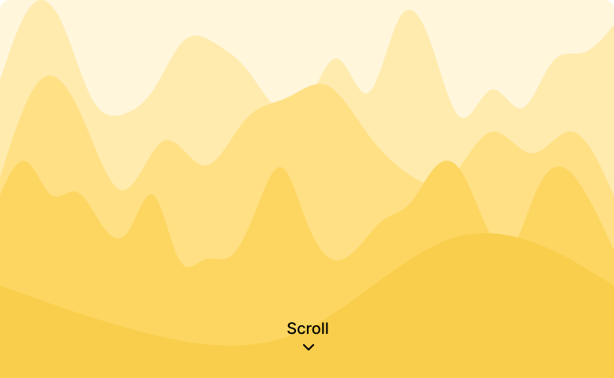
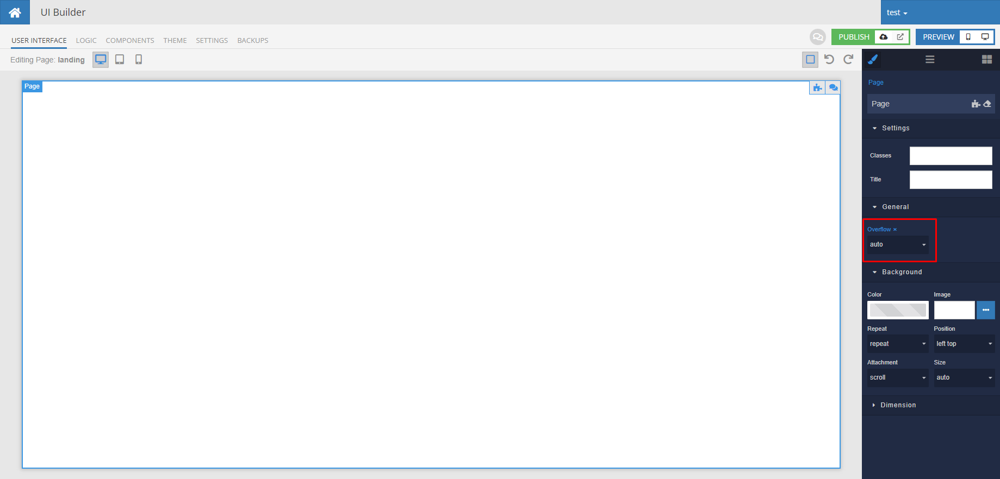
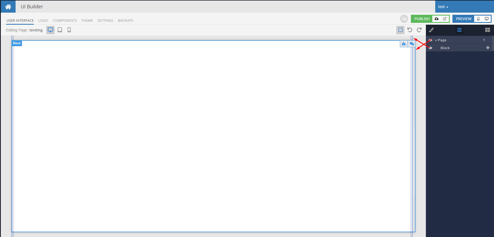
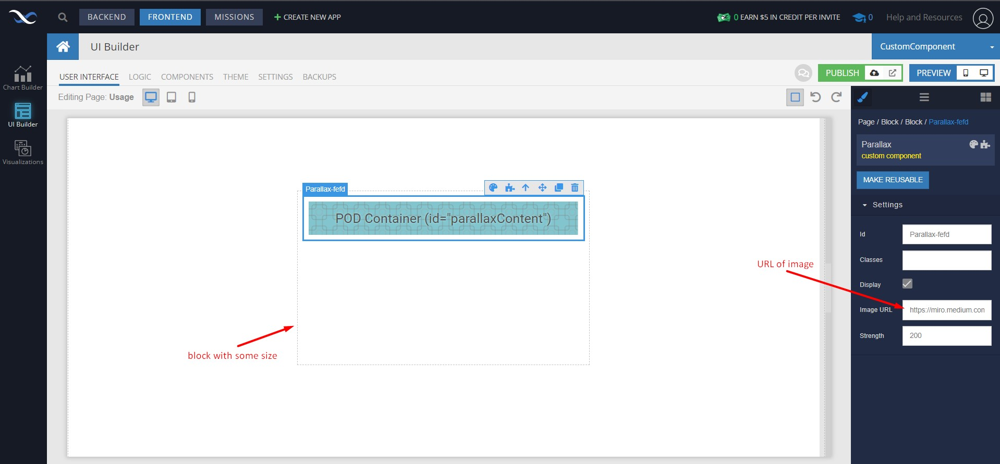
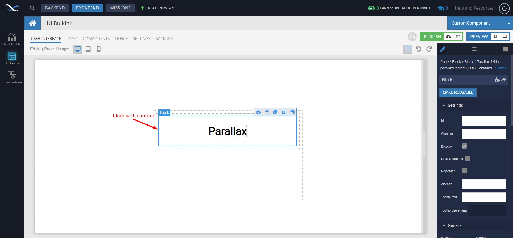
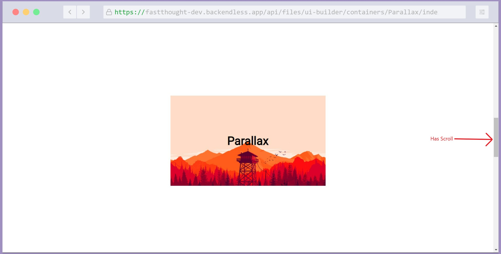

# Parallax

Parallax is a component of Backendless UI-Builder designer. This allows you to add image with content and parallax effect.

  

## Demo

View an example of how to install this component and how it works in your UI [here](https://app.arcade.software/share/YUeMF4obifFfbK8E1dM5).

## Properties

| Property | Type   | Default Value | Logic           | Data Binding | UI Setting | Description                                                                                       |
|----------|--------|---------------|-----------------|--------------|------------|---------------------------------------------------------------------------------------------------|
| imageUrl | Text   |               | Image URl Logic | YES          | YES        | Allows to determine image URL                                                                     |
| strength | Number | 200           | Strength Logic  | YES          | YES        | Allows to determine the strength of parallax. The value should be between 100(low) and 2000(high) |

## Example

  

## Usage guide

To add a Parallax component to your webpage, follow these simple steps:

1. For example, I have a Page that has "height: 100%" and "overflow: auto"(also can be 'scroll'). Into Page, I add a block with "height: 2000px" that is more height than Page. I get an overflow of Page.

    

    

2. After, insert some block with some size which makes size for the Parallax component. After, insert the Parallax component with the setting "image URL" which must have the URL of some image, into that block.

    

3. Insert some block with content to the Parallax pod.

    

4. Open preview and see the results of your work.

    
