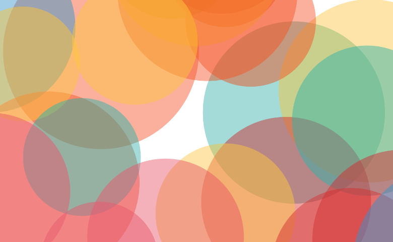
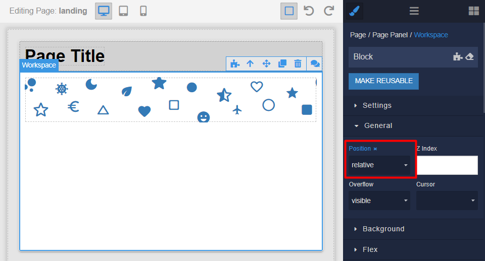
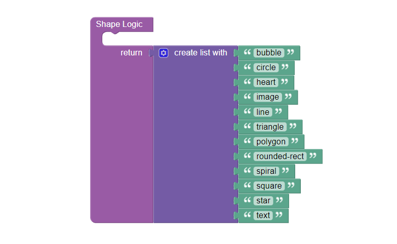
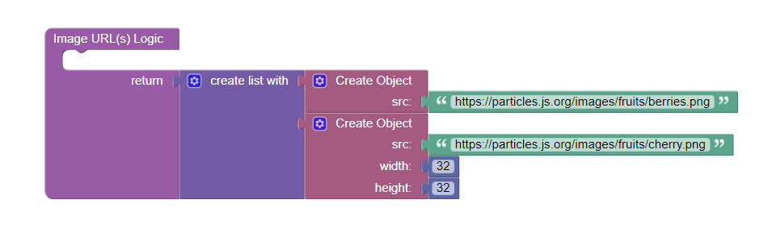
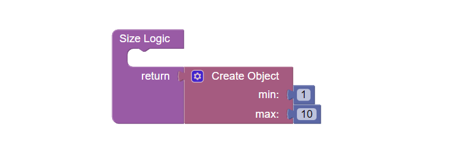

# Particles

Particles is the component for Backendless [UI-Builder](https://backendless.com/developers/#ui-builder), based on the
[tsParticles](https://particles.js.org/) library. It allows creating animated backgrounds or visual effects in your
application.

<p align="center">
  
</p>

## Properties

| Property                                                 | Type                                                                                                                                                                                                                                    | Default value | Logic                  | Data Binding | UI Setting | Description                                                                                                                                                                                         |
|----------------------------------------------------------|-----------------------------------------------------------------------------------------------------------------------------------------------------------------------------------------------------------------------------------------|---------------|------------------------|--------------|------------|-----------------------------------------------------------------------------------------------------------------------------------------------------------------------------------------------------|
| Auto Play <br> `autoPlay`                                | *Checkbox*                                                                                                                                                                                                                              | `true`        |                        | NO           | YES        | Enables start playing animations automatically.                                                                                                                                                     |
| Full Screen <br> `fullScreen`                            | *Checkbox*                                                                                                                                                                                                                              | `true`        |                        | NO           | YES        | Enables applying the background to the full window size. If disabled, the canvas fills the nearest parent block that has the Position property, watch [Usage](#usage).                              |
| Z Index <br> `zIndex`                                    | *Number*                                                                                                                                                                                                                                | 0             |                        | NO           | YES        | Controls the CSS z-index property set for the canvas in the full screen mode.                                                                                                                       |
| Background Color <br> `background`                       | *Color*                                                                                                                                                                                                                                 |               | Background Color Logic | YES          | YES        | Specifies the background color of the canvas.                                                                                                                                                       |
| Width <br> `width`                                       | *String*                                                                                                                                                                                                                                |               |                        | NO           | YES        | Specifies the width of the canvas when fullscreen mode is disabled.                                                                                                                                 |
| Height <br> `height`                                     | *String*                                                                                                                                                                                                                                |               |                        | NO           | YES        | Specifies the height of the canvas when full screen mode is disabled.                                                                                                                               |
| Duration <br> `duration`                                 | *Number*                                                                                                                                                                                                                                |               |                        | NO           | YES        | Controls the particles effect duration in seconds.                                                                                                                                                  |
| Delay <br> `delay`                                       | *Number*                                                                                                                                                                                                                                |               |                        | NO           | YES        | Controls the initial delay before starting the animation.                                                                                                                                           |
| Shape <br> `shape`                                       | *Select* <br/> "Bubble" \| "Circle" \| "Heart" \| "Image" \| "Line" \| "Triangle" \| "Polygon" \| "Rounded Rectangle" \| "Spiral" \| "Square" \| "Star" \| "Text"                                                                       | "Bubble"      | Shape Logic            | NO           | YES        | Defines the shape of the particles. Specify a list of shapes by Shape Logic to use multiple types. Watch [Codeless Examples](#codeless-examples).                                                   |
| Number <br> `number`                                     | *Number*                                                                                                                                                                                                                                | 15            |                        | NO           | YES        | Controls the number of particles displayed on the canvas.                                                                                                                                           |
| Size <br> `size`                                         | *Number*                                                                                                                                                                                                                                | 5             | Size Logic             | NO           | YES        | Controls the size of particles displayed on the canvas. Specify an object with minimum and maximum values by Size Logic to use a range for the size. Watch [Codeless Examples](#codeless-examples). |
| Color <br> `color`                                       | *Color*                                                                                                                                                                                                                                 |               | Color Logic            | YES          | YES        | Defines the color of the particles. Specify a list of colors by Color Logic to use multiple values.                                                                                                 |
| Color Animation <br> `colorAnimation`                    | *Checkbox*                                                                                                                                                                                                                              | `true`        |                        | NO           | YES        | Enable animation of particle color.                                                                                                                                                                 |
| Move <br> `move`                                         | *Checkbox*                                                                                                                                                                                                                              | `true`        |                        | NO           | YES        | Enable particle movement.                                                                                                                                                                           |
| Speed <br> `speed`                                       | *Number*                                                                                                                                                                                                                                | 2             |                        | NO           | YES        | Controls the speed of particle movement.                                                                                                                                                            |
| Direction <br> `direction`                               | *Select* <br/> "None" \| "Top" \| "Top Right" \| "Right" \| "Bottom Right" \| "Bottom" \| "Bottom Left" \| "Left" \| "Top Left" \| "Inside" \| "Outside"                                                                                | "None"        |                        | NO           | YES        | Specifies the direction of particle movement.                                                                                                                                                       |
| Out Modes <br> `outModes`                                | *Select* <br/> "None" \| "Bounce" \| "Split" \| "Destroy" \| "Out" \| "Bounce Horizontal" \| "Bounce Vertical"                                                                                                                          | "Out"         |                        | NO           | YES        | Specifies the particle out mode.                                                                                                                                                                    |
| Rotate <br> `rotate`                                     | *Checkbox*                                                                                                                                                                                                                              | `false`       |                        | NO           | YES        | Rotate particles by a random angle.                                                                                                                                                                 |
| Rotation Animation </br> `rotationAnimation`             | *Checkbox*                                                                                                                                                                                                                              | `false`       |                        | NO           | YES        | Enable animation of particle rotation.                                                                                                                                                              |
| Rolling Animation <br> `rollingAnimation`                | *Checkbox*                                                                                                                                                                                                                              | `false`       |                        | NO           | YES        | Enable particle rolling animation.                                                                                                                                                                  |
| Line Links Visibility <br> `lineLinksVisibility`         | *Checkbox*                                                                                                                                                                                                                              | `false`       |                        | NO           | YES        | Enable particle links.                                                                                                                                                                              |
| Triangle Links Visibility <br> `triangleLinksVisibility` | *Checkbox*                                                                                                                                                                                                                              | `false`       |                        | NO           | YES        | Fills the triangles made by link lines.                                                                                                                                                             |
| Links Color <br> `linksColor`                            | *Color*                                                                                                                                                                                                                                 |               |                        | NO           | YES        | Specifies the color of the links.                                                                                                                                                                   |
| Collision Mode <br> `collisionMode`                      | *Select* <br/> "Unset" \| "Bounce" \| "Absorb" \| "Destroy"                                                                                                                                                                             | "Unset"       |                        | NO           | YES        | Defines the particle collision mode.                                                                                                                                                                |
| Text Value(s) <br> `textValue`                           | *String*                                                                                                                                                                                                                                |               | Text Value(s) Logic    | NO           | YES        | Defines a particle value for the Text shape. Specify a list of text values by Text Value(s) Logic to use multiple values.                                                                           |
| Image URL(s) <br> `imageURL`                             | *String*                                                                                                                                                                                                                                |               | Image URL(s) Logic     | NO           | YES        | Defines the image source for Image shape. Specify a list of URLs by Image URL(s) Logic to use multiple images. Watch [Codeless Examples](#codeless-examples).                                       |
| Presets <br> `preset`                                    | *Select* <br/> "Unset" \| "Big Circles" \| "Bubbles" \| "Confetti" \| "Fire" \| "Firefly" \| "Fireworks" \| "Growing" \| "Hyperspace" \| "Light" \| "Links" \| "Sea Anemone" \| "Snow" \| "Stars" \| "Tetradic Confetti" \| "Triangles" | "Unset"       |                        | NO           | YES        | Defines a particle preset. Select the Unset value to customize particles.                                                                                                                           |
| Custom Options <br> `customOptions`                      | *JSON*                                                                                                                                                                                                                                  |               | Custom Options Logic   | NO           | YES        | Defines your own particle configuration. Watch [Configuration](#configuration).                                                                                                                     |

## Events

| Name          | Triggers                                      | Context Blocks    |
|---------------|-----------------------------------------------|-------------------|
| On Load Event | when particles are correctly loaded in canvas | Options: `Object` |

## Actions

| Action            | Inputs | Returns |
|-------------------|--------|---------|
| Start Particles   |        |         |
| Stop Particles    |        |         |
| Play Particles    |        |         |
| Pause Particles   |        |         |
| Destroy Particles |        |         |
| Refresh Particles |        |         |

## Styles

````
@bl-customComponent-particles-width: 100%;
@bl-customComponent-particles-height: 100%;
````

## Usage

**The most common use case** is tо set the canvas to a parent block size. To do this, disable Full Screen property and
specify the Position property as `relative` for the desired container. To display elements placed in front of the
Particles component above the canvas, you should specify a higher `Z Index` property for those elements.

<p align="center">
  
</p>

## Codeless Examples

Adding multiple shape types to the component:

<p align="center">
  
</p>

<details>
<summary>Try yourself</summary>

```
<block xmlns="http://www.w3.org/1999/xhtml" type="lists_create_with" id=",{4hrFFw$],H!IBY=+Y#" x="453.2497612770475" y="285.5449102652035"><mutation items="12"></mutation><value name="ADD0"><block type="text" id="E@h|WsW?:)n*LA.0*iF,"><field name="TEXT">bubble</field></block></value><value name="ADD1"><block type="text" id="@8W_Z/;:t3iu_[t0~H`*"><field name="TEXT">circle</field></block></value><value name="ADD2"><block type="text" id="XQKo)=HbHroo.J,x/s^I"><field name="TEXT">heart</field></block></value><value name="ADD3"><block type="text" id=";~:/((gGRXYT$?P_}[R*"><field name="TEXT">image</field></block></value><value name="ADD4"><block type="text" id="=+J5uMMt0W(*@#ZSOiTw"><field name="TEXT">line</field></block></value><value name="ADD5"><block type="text" id=")R~[~v*]C:RyH5snz{,b"><field name="TEXT">triangle</field></block></value><value name="ADD6"><block type="text" id="x-`no+a*Jnnu5kAdD+TM"><field name="TEXT">polygon</field></block></value><value name="ADD7"><block type="text" id="7D!#cJ)V5vs,x`slNVV7"><field name="TEXT">rounded-rect</field></block></value><value name="ADD8"><block type="text" id="!{Vn/Vx?:3hDFj.Fyuz]"><field name="TEXT">spiral</field></block></value><value name="ADD9"><block type="text" id="UeclJOmcW=W6?hZXz[5k"><field name="TEXT">square</field></block></value><value name="ADD10"><block type="text" id=".^|dEtIlR(xTW^*_bCoX"><field name="TEXT">star</field></block></value><value name="ADD11"><block type="text" id="qU8Pmm9+nJ4ZVxJp)+4c"><field name="TEXT">text</field></block></value></block>
```

</details>

Adding multiple images to the component:

<p align="center">
  
</p>

<details>
<summary>Try yourself</summary>

```
<block xmlns="http://www.w3.org/1999/xhtml" type="lists_create_with" id="]28]9k{tD,GKD)K%d;+W" x="236.39999389648438" y="161"><mutation items="2"></mutation><value name="ADD0"><block type="create_object" id="`t_}DpMfSG-D/M?!#?:("><mutation><properties><item id="property" prop-name="src"></item></properties></mutation><value name="create_object_mutator_container_properties_stack_property0"><block type="text" id="0mWnfLB:ABRf)1dItTM="><field name="TEXT">https://particles.js.org/images/fruits/berries.png</field></block></value></block></value><value name="ADD1"><block type="create_object" id="@v+T)4cv,?kCwvVIF(Z)"><mutation><properties><item id="property" prop-name="src"></item><item id="property" prop-name="width"></item><item id="property" prop-name="height"></item></properties></mutation><value name="create_object_mutator_container_properties_stack_property0"><block type="text" id="Blp],@(Y;:ZKlu1{j^TX"><field name="TEXT">https://particles.js.org/images/fruits/cherry.png</field></block></value><value name="create_object_mutator_container_properties_stack_property1"><block type="math_number" id="1secZ#6vh+5IctFjrJ+$"><field name="NUM">32</field></block></value><value name="create_object_mutator_container_properties_stack_property2"><block type="math_number" id="Z8Dl)d|1Idvd(Lh$8qv7"><field name="NUM">32</field></block></value></block></value></block>
```

</details>

Adding a particle size range:

<p align="center">
  
</p>

<details>
<summary>Try yourself</summary>

```
<block xmlns="http://www.w3.org/1999/xhtml" type="create_object" id="[lSD|WKeig:bxEwM`wz," x="244.6624984741211" y="160"><mutation><properties><item id="property" prop-name="min"></item><item id="property" prop-name="max"></item></properties></mutation><value name="create_object_mutator_container_properties_stack_property0"><block type="math_number" id="zM+yb]Fd=)}]$grs9}dB"><field name="NUM">1</field></block></value><value name="create_object_mutator_container_properties_stack_property1"><block type="math_number" id=".53K%PJC~+2CGX=xd/,f"><field name="NUM">10</field></block></value></block>
```

</details>

## Configuration

The Custom Options object overrides the values of the settings and can include all parameters that you want to specify for particles. You can find samples on [tsParticles](https://particles.js.org/) to use the ready-made solution.

Below is the complete list of possible properties for the Custom Options object:

| Property               | Type              | Description                                                                                                                                                                                                                                                                                                                                                                                                |
|------------------------|-------------------|------------------------------------------------------------------------------------------------------------------------------------------------------------------------------------------------------------------------------------------------------------------------------------------------------------------------------------------------------------------------------------------------------------|
| autoPlay               | *Boolean*         | Sets if the animations should start automatically or manually.                                                                                                                                                                                                                                                                                                                                             |
| background             | *Object*          | Background options, that will be used to the canvas element, they are all [CSS properties](https://developer.mozilla.org/en-US/docs/Web/CSS/background). Signature of Background option: `{color: String, image: String, opacity: Number, position: String, repeat: String, size: String}`.                                                                                                                |
| backgroundMask         | *Object*          | Background Mask options, what's behind the canvas will become hidden and particles will uncover it. Signature of Background Mask option: `{enable: Boolean, cover: {color: {value: String}, opacity: Number}, composite: String}`. Canvas composite operation values here: [GlobalCompositeOperation](https://developer.mozilla.org/en-US/docs/Web/API/CanvasRenderingContext2D/globalCompositeOperation). |
| delay                  | *Number*          | The initial delay before starting the animation.                                                                                                                                                                                                                                                                                                                                                           |
| detectRetina           | *Boolean*         | Enables the retina detection, if disabled the ratio used by canvas will be always 1 and not the device setting.                                                                                                                                                                                                                                                                                            |
| duration               | *Number*          | The Particles effect duration in seconds, then the container will be destroyed.                                                                                                                                                                                                                                                                                                                            |
| fpsLimit               | *Number*          | The FPS (Frame Per Second) limit applied to all particles animations.                                                                                                                                                                                                                                                                                                                                      |
| fullScreen             | *Object*          | The options to set the particles in the background using CSS fixed position. Signature of FullScreen option: `{enable: Boolean, zIndex: Number}`.                                                                                                                                                                                                                                                          |
| interactivity          | *String*          | The particles interaction options, watch [Interactivity configuration](#interactivity-configuration).                                                                                                                                                                                                                                                                                                      |
| particles              | *Object*          | The particles options, watch [Particles configuration](#particles-configuration).                                                                                                                                                                                                                                                                                                                          |
| pauseOnBlur            | *Boolean*         | Enables or disabled the animation on window blur.                                                                                                                                                                                                                                                                                                                                                          |
| pauseOnOutsideViewport | *Boolean*         | Enable or disabled the animation if the element is outside the viewport.                                                                                                                                                                                                                                                                                                                                   |
| zLayers                | *Number*          | The maximum layers used in the z-axis.                                                                                                                                                                                                                                                                                                                                                                     |
| absorbers              | *Object \| Array* | Absorber options, watch [Absorber configuration](#absorber-configuration).                                                                                                                                                                                                                                                                                                                                 |
| emitters               | *Object \| Array* | Particles emitter object options, watch [Emitter configuration](#emitter-configuration).                                                                                                                                                                                                                                                                                                                   |
| polygon                | *Object*          | Particles polygon mask effect, watch [Polygon Mask configuration](#polygon-mask-configuration).                                                                                                                                                                                                                                                                                                            |

### Interactivity configuration
The interactivity option allows you to define the interactive behavior of the particles. It provides various
configurations to enable user interaction with the particles.

<details>
<summary>Here are some common properties of the interactivity option.</summary>

| Property  | Type              | Description                                                                                                                                               |
|-----------|-------------------|-----------------------------------------------------------------------------------------------------------------------------------------------------------|
| detectsOn | *String*          | Where the mouse events will be detected (`"window" \| "canvas" \| "parent"`).                                                                             |
| events    | *Object*          | Interaction events options, this configures which events are enabled and which modes should be used. Watch [Events configuration](#events-configuration). |
| modes     | *Object*          | Interaction modes options, this configures every mode behavior. It contains read-only properties: `_container` and `_engine`.                             |

#### Events configuration

| Property | Type     | Signatures                                                                                                                           |
|----------|----------|--------------------------------------------------------------------------------------------------------------------------------------|
| onClick  | *String* | `{enable: Boolean, mode: "attract" \| "bubble" \| "pause" \| "push" \| "remove" \| "repulse" \| "trail" \| "emitter" \| "absorber"}` |
| onDiv    | *Object* | `{enable: Boolean, mode: "bounce" \| "bubble" \| "repulse", selectors: String, type: "circle" \| "rectangle"}`                       |
| onHover  | *Object* | `{enable: Boolean, mode: String, parallax: {enable: Boolean, force: Number, smooth: Number}} `                                       |
| resize   | *Object* | `{delay: Number, enable: Boolean}`                                                                                                   |

</details>

### Particles configuration

The particles option allows you to define various properties related to the appearance and behavior of the particles
themselves. It contains sub-properties that control the characteristics of individual particles.

<details>
<summary>Here are some common properties of the particles option.</summary>

| Property         | Type      | Signatures                                                                                                                                                                                                                                                                                                    |
|------------------|-----------|---------------------------------------------------------------------------------------------------------------------------------------------------------------------------------------------------------------------------------------------------------------------------------------------------------------|
| bounce           | *Object*  | `{horizontal: {value: Number}, vertical: {value: Number}}`                                                                                                                                                                                                                                                    |
| collisions       | *Object*  | `{enable: Boolean, mode: "bounce" \| "absorb" \| "destroy"}`                                                                                                                                                                                                                                                  |
| color            | *Object*  | `{value: String \| Array, animation: {enable: Boolean, speed: Number, sync: Boolean, count: Number, decay: Number, delay: Number, offset: Number}`                                                                                                                                                            |
| move             | *Object*  | Watch [Move option configuration](#move-option-configuration).                                                                                                                                                                                                                                                |
| life             | *Object*  | `{count: Number, delay: {random: Boolean, sync: Boolean, value: Number}, duration: {random: Boolean, sync: Boolean, value: Number}}`                                                                                                                                                                          |
| links            | *Object*  | `{blink: Boolean, color: String, consent: Boolean, distance: Number, enable: Boolean, frequency: Number, id: String, opacity: Number, shadow: {blur: Number, color: String, enable: Boolean}, triangles: {color: String, enable: Boolean, frequency: Number, opacity: Number}, warp: Boolean, width: Number}` |
| number           | *Object*  | `{density: {enable: Boolean, height: Number, width: Number}, limit: Number, value: Number}`                                                                                                                                                                                                                   |
| opacity          | *Object*  | `{value: Number, animation: {count: Number, decay: Number, delay: Number, destroy: "max" \| "none" \| "min", enable: Boolean, mode: "auto" \| "increase" \| "decrease" \| "random", speed: Number, startValue: "max" \| "min" \| "random", sync: Boolean }}`                                                  |
| orbit            | *Object*  | `{enable: Boolean, animation: {count: Number, decay: Number, delay: Number, enable: Boolean, speed: Number, sync: Boolean}, color: String, opacity: Number, radius: Number, rotation: {random: Boolean, value: Number}, width: Number}`                                                                       |
| reduceDuplicates | *Boolean* | `true \| false`                                                                                                                                                                                                                                                                                               |
| repulse          | *Object*  | `{distance: Number, duration: Number, enabled: Boolean, factor: Number, random: Boolean, speed: Number, value: Number}`                                                                                                                                                                                       |
| roll             | *Object*  | `{backColor: String, darken: {enable: Boolean, value: Number}, enable: Boolean, enlighten: {enable: Boolean, value: Number}, mode: "both" \| "horizontal" \| "vertical", speed: Number}`                                                                                                                      |
| rotate           | *Object*  | `{direction: "clockwise \| counter-clockwise" \| "random", path: Boolean, value: Number, animation: {enable: Boolean, speed: Number, sync: Boolean}}`                                                                                                                                                         |
| shadow           | *Object*  | `{blur: Number, color: String, enable: Boolean, offset: {x: Number, y: Number}}`                                                                                                                                                                                                                              |
| shape            | *Object*  | `{close: Boolean, fill: Boolean, options: {[type: String]: {close: Boolean, fill: Boolean, particles: Object}}, type: String}`                                                                                                                                                                                |
| size             | *Object*  | `{animation: {count: Number, decay: Number, delay: Number, destroy: "max" \| "none" \| "min", enable: Boolean, mode: "auto" \| "increase" \| "decrease" \| "random", speed: Number, startValue: "max" \| "min" \| "random", sync: Boolean }, value: Number}`                                                  |
| stroke           | *Object*  | `{color: String, opacity: Number, width: Number}`                                                                                                                                                                                                                                                             |
| tilt             | *Object*  | `{animation: {decay: Number, enable: Boolean, speed: Number, sync: Boolean}, direction: "clockwise" \| "counter-clockwise" \| "random", enable: Boolean, random: Boolean, value: Number}`                                                                                                                     |
| twinkle          | *Object*  | `{lines: {color: String, enable: Boolean, frequency: Number, opacity: number}, particles: {color: String, enable: Boolean, frequency: Number, opacity: number}}`                                                                                                                                              |
| wobble           | *Object*  | `{distance: Number, enable: Boolean, speed: Number}`                                                                                                                                                                                                                                                          |
| zIndex           | *Object*  | `{opacityRate: Number, sizeRate: Number, value: Number, velocityRate: Number}`                                                                                                                                                                                                                                |

#### Move option configuration

| Property  | Type               | Signatures                                                                                                                              |
|-----------|--------------------|-----------------------------------------------------------------------------------------------------------------------------------------|
| angle     | *Object*           | `{offset: Number, value: Number}`                                                                                                       |
| attract   | *Object*           | `{distance: Number, enable: Boolean, rotate: {x: Number, y: Number}}`                                                                   |
| center    | *Object*           | `{mode: "percent" \| "precise", radius: Number, x: Number, y: Number}`                                                                  |
| decay     | *Number \| Object* | `{min: Number, max: Number}`                                                                                                            |
| direction | *Number \| String* | `"none" \| "left" \| "top" \| "bottom" \| "right" \| "outside" \| "inside" \| "bottomLeft" \| "bottomRight" \| "topLeft" \| "topRight"` |
| distance  | *Number \| Object* | `{horizontal: Number, vertical: Number}`                                                                                                |
| drift     | *Number \| Object* | `{min: Number, max: Number}`                                                                                                            |
| enable    | *Boolean*          | `true \| false`                                                                                                                         |
| gravity   | *Object*           | `{acceleration: Number, enable: Boolean, maxSpeed: Number, inverse: Boolean}`                                                           |
| outModes  | *String*           | `"split" \| "none" \| "bounce" \| "destroy" \| "out" \| "bounceHorizontal" \| "bounceVertical"`                                         |
| path      | *Object*           | `{clamp: Boolean, delay: {value: Number}, enable: Boolean, generator: String, options: Object}`                                         |
| random    | *Boolean*          | `true \| false`                                                                                                                         |
| size      | *Boolean*          | `true \| false`                                                                                                                         |
| speed     | *Number \| Object* | `{min: Number, max: Number}`                                                                                                            |
| spin      | *Object*           | `{acceleration: Number, enable: Boolean, position: {mode: "percent" \| "precise"}, x: Number, y: Number}`                               |
| straight  | *Boolean*          | `true \| false`                                                                                                                         |
| trail     | *Object*           | `{enable: Boolean, fill: {color: String, image: String}, length: Number}`                                                               |
| vibrate   | *Boolean*          | `true \| false`                                                                                                                         |
| warp      | *Boolean*          | `true \| false`                                                                                                                         |

</details>

### Absorber configuration

The absorbers option allows you to define elements that act as "absorbers" for the particles. Absorbers are typically
stationary elements that attract particles towards them. When particles come in close proximity to an absorber, they get
absorbed or disappear from the canvas.

<details>
<summary>Here are some common properties of the absorbers option.</summary>

| Property  | Type      | Description                                                                                                                                       |
|-----------|-----------|---------------------------------------------------------------------------------------------------------------------------------------------------|
| color     | *String*  | Absorber color.                                                                                                                                   |
| destroy   | *Boolean* | Absorber destroy, this enable particle destruction, if disabled the particle will randomly respawn.                                               |
| draggable | *Boolean* | Absorber draggable, this enables dragging on absorbers.                                                                                           |
| opacity   | *Number*  | Absorber opacity.                                                                                                                                 |
| orbits    | *Boolean* | Absorber orbits, this enable particles orbiting while being attracted by the attracter.                                                           |
| position  | *Object*  | Absorber position, percent values calculated on canvas size. Signature of Position option: `{x: Number, y: Number}`.                              |
| size      | *Object*  | Absorber size, these values will be used as pixels. Signature of Size option: `{density: Number, limit: Number, random: Boolean, value: Number}`. |
| name      | *String*  | Absorber name.                                                                                                                                    |

</details>

### Emitter configuration
The emitters option allows you to define elements that act as "emitters" for particles. Emitters are sources from which
particles are emitted or generated. They continuously produce particles and determine their initial properties.

<details>
<summary>Here are some common properties of the emitters option.</summary>

| Property   | Type               | Description                                                                                                                                                                                                         |
|------------|--------------------|---------------------------------------------------------------------------------------------------------------------------------------------------------------------------------------------------------------------|
| autoPlay   | *Boolean*          | Starts the emitter automatically.                                                                                                                                                                                   |
| direction  | *Number \| String* | The direction of the emitted particles, The Move property direction list is an enumeration used for values.                                                                                                         |
| domId      | *String*           | Using this id to link the emitter to an HTML element.                                                                                                                                                               |
| fill       | *Boolean*          | Sets if the particles will spawn at the emitter perimeter or inside the area.                                                                                                                                       |
| life       | *Object*           | The emitter life options. Signature of Life option: `{count: Number, delay: Number, duration: Number, wait: Boolean}`.                                                                                              |
| name       | *String*           | The emitter name.                                                                                                                                                                                                   |
| particles  | *Object*           | Particles emitted customization. These settings will override other particle settings for the particles emitted by this emitter. Particles number options won't override anything, they will be ignored completely. |
| position   | *Object*           | The relative position (in percent) of the emitter, where particles spawn. If size is specified, the position will be the center of the size options. Signature of Position option: `{x: Number, y: Number}`.        |
| rate       | *Object*           | The particles emitting rate options. Signature of Rate option: `{delay: Number, quantity: Number}`.                                                                                                                 |
| shape      | *String*           | The emitter shape type (`"square" \| "circle" \| "polygon" \| "star"`).                                                                                                                                             |
| size       | *Object*           | The size of the particles emitter area. Signature of Size option: `{height: Number, mode: "percent" \| "precise", width: Number}`.                                                                                  |
| spawnColor | *Object*           | The particle spawn color. Signature of Spawn Color option: `{value: String \| Array, animation: {enable: Boolean, speed: Number, sync: Boolean, count: Number, decay: Number, delay: Number, offset: Number}`.      |
| startCount | *Number*           | The number of starting particles of the emitter.                                                                                                                                                                    |

</details>

### Polygon Mask configuration

The polygon option allows you to define a polygon mask for the particles. When using the polygon mask, particles will be
rendered within the boundaries of the specified polygon.

<details>
<summary>Here are some common properties of the polygon option.</summary>

| Property | Type               | Description                                                                                                                                                          |
|----------|--------------------|----------------------------------------------------------------------------------------------------------------------------------------------------------------------|
| data     | *String \| Object* | Defines the data for the polygon mask. Signature of Data option: `{path: String, size: {height: number, width: Number}}`.                                            |
| draw     | *Object*           | Customizes the appearance of the stroke. Signature of Draw option: `{enable: Boolean, stroke: {color: String, opacity: Number, width: Number}}`.                     |
| enable   | *Boolean*          | Controls whether the polygon mask functionality is enabled or disabled.                                                                                              |
| inline   | *Object*           | Controls the arrangement of particles. Signature of Inline option: `{arrangement: "equidistant" \| "onePerPoint" \| "perPoint" \| "randomLength" \| "randomPoint"}`. |
| move     | *Object*           | Controls the behavior of particle movement within the polygonal mask. Signature of Move option: `{radius: Number, type: "path" \| "radius"}`.                        |
| position | *Object*           | Polygon Mask position, percent values calculated on canvas size. Signature of Position option: `{x: Number, y: Number}`.                                             |
| scale    | *Number*           | The size of the polygon mask in relation to the canvas.                                                                                                              |
| type     | *String*           | The type of interaction between the particles and the polygon mask (`"inline" \| "inside" \| "none" \| "outside"`).                                                  |
| url      | *String*           | The source of the SVG image to be used as a polygonal mask.                                                                                                          |

</details>
