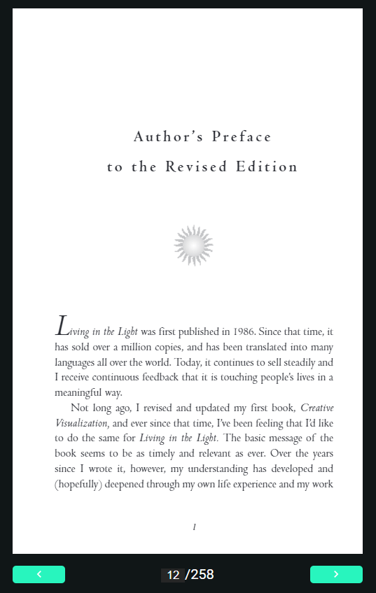

# PDF Viewer

This is a component for Backendless [UI-Builder](https://backendless.com/developers/#ui-builder) designer based on the [PDF Viewer](https://github.com/wojtekmaj/react-pdf/tree/v4.x) library.

The component allows you to add a pdf viewer to your UI-Builder application

<p align="center">
  
</p>

## Properties

| Property                 | Type                                | Default Value   | Logic             | Data Binding | UI Setting | Description                                                          |
|--------------------------|-------------------------------------|-----------------|-------------------|--------------|------------|----------------------------------------------------------------------|
| PDF URL:`pdfUrl`         | Text                                |                 | PDF URL Logic     | YES          | YES        | Allows write URL of PDF file, but file must be in Backendless Files. |
| Width:`width`            | Text                                | "0px"           | Width Logic       | YES          | YES        | Allows determine the width of the PDF Viewer.                        |
| Height:`height`          | Text                                | "0px"           | Height Logic      | YES          | YES        | Allows determine the height of the PDF Viewer.                       |

## Events

| Name            | Triggers                                     | Context Blocks       |
|-----------------|----------------------------------------------|----------------------|
| On Load Success | when the PDF file is successfully downloaded | Page Count: `Number` |
| On Load Error   | when a PDF download error                    | Message: `String`    |


## Action

| Action                  | Inputs         | Returns |
|-------------------------|----------------|---------|
| Set Page for PDF Viewer | page: `Number` |         |

## Styles

**Theme**
````
@bl-customComponent-pdfViewer-themeColor: @themePrimary;
@bl-customComponent-pdfViewer-themeTextColor: @appTextColor;
````

**Others**
````
@bl-customComponent-pdfViewer-input-background-color: if(@isLightTheme, darken(#fff, 10%), lighten(#000, 15%));
@bl-customComponent-pdfViewer-button-icon-size: 16px;
@bl-customComponent-pdfViewer-button-icon-color: contrast(@buttonContainedBackground);
@bl-customComponent-pdfViewer-no-data-icon-size: 40px;
````
