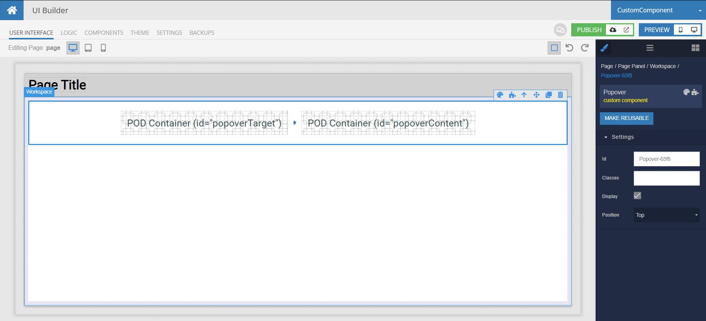
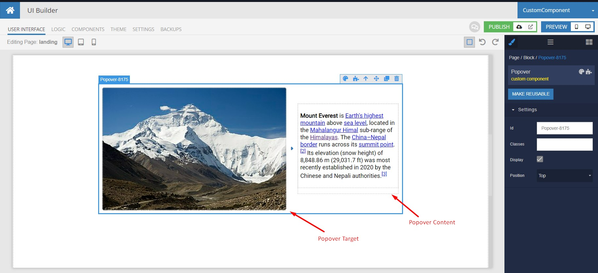
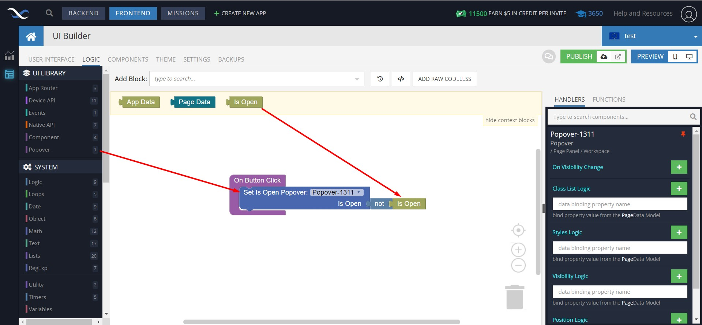
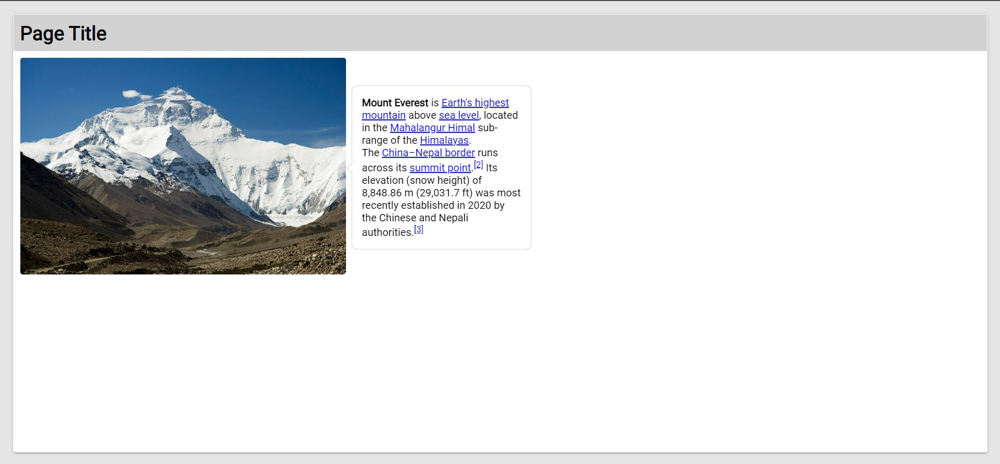

# Popover

This is a component for Backendless [UI-Builder](https://backendless.com/developers/#ui-builder) designer based on the [Popover](https://react-bootstrap.github.io/components/overlays/#popovers) library.

The component allows you to render a popup window in your UI-Builder application.

## Properties

| Property | Type                                    | Default Value | Logic          | Data Binding | UI Setting | Description                                                            |
| -------- | --------------------------------------- | ------------- | -------------- | ------------ | ---------- | ---------------------------------------------------------------------- |
| position | Select ["top", "right","bottom","left"] | "top"         | Position Logic | NO           | YES        | Allows to determine the position of the popover relative to the button |

## Events

| Name            | Triggers                   | Context Blocks     |
| --------------- | -------------------------- | ------------------ |
| On Target Click | when user clicks on target | Is Open: `Boolean` |

## Actions

| Action      | Inputs             | Returns |
| ----------- | ------------------ | ------- |
| Set Is Open | Is Open: `Boolean` |         |

## Styles

**Dimensions**
```
@bl-customComponent-popover-border-width: 1px;
@bl-customComponent-popover-max-width: 276px;
@bl-customComponent-popover-arrow-size: 10px;
```

**Colors**
```
@bl-customComponent-popover-background-color: @appBackgroundColor;
@bl-customComponent-popover-border-color: if(@isLightTheme, rgba(0, 0, 0, 0.175), rgba(255, 255, 255, 0.175));
```

**Others**
```
@bl-customComponent-popover-border: @bl-customComponent-popover-border-width solid @bl-customComponent-popover-border-color;
```

## Usage

1. Add component Popover in page
    

2. Add in popover target and content
    

3. Add logic for Popover "On Button Click" event
    

4. Get result
    
