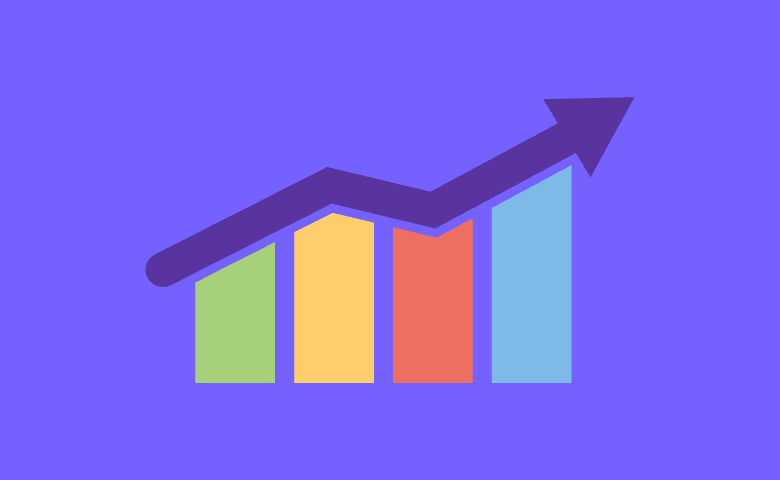
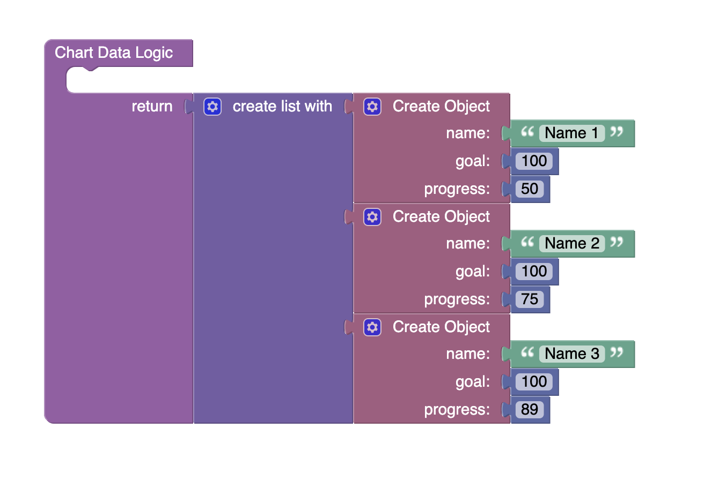

# Progress Bar Chart

Progress Bar Chart is a component of Backendless UI-Builder designer. This is a bar chart whose purpose is to show the progress of each item.

<p align="center">
  
</p>

## Properties

| Property          | Type                                                   | Default Value     | Logic                   | Data Binding | UI Setting | Description                                                                                                                                                                                    |
|-------------------|--------------------------------------------------------|-------------------|-------------------------|--------------|------------|------------------------------------------------------------------------------------------------------------------------------------------------------------------------------------------------|
| Disabled          | *Checkbox*                                             | `false`           | Disabled Logic          | YES          | YES        | This handler allows you to disable a component.                                                                                                                                                |
| Grid Visibility   | *Checkbox*                                             | `true`            | Grid Visibility Logic   | YES          | YES        | This handler allows you to control the visibility of the grid.                                                                                                                                 |
| Chart Orientation | *Select* <br/> "Vertical Bars" <br/> "Horizontal Bars" | "Horizontal Bars" | Chart Orientation Logic | YES          | YES        | This handler allows you to specify the chart orientation.                                                                                                                                      |
| Grid Marks        | *Select* <br/> "2" <br/> "4" <br/> "5" <br/> "10"      | "4"               | Grid Marks Logic        | YES          | YES        | This handler allows you to specify the number of marks.                                                                                                                                        |
| Height            | *Number*                                               | 500               | Height Logic            | YES          | YES        | This handler allows you to specify the height of a component.                                                                                                                                  |
| Width             | *Number*                                               | 500               | Width Logic             | YES          | YES        | This handler allows you to specify the width of a component.                                                                                                                                   |
| Data              | *JSON*                                                 | []                | Data Logic              | YES          | YES        | This handler allows you to add chart items to the component. Watch [Codeless Examples](#Examples). Signature of the item: list of object {name: `String`, goal: `Number`, progress: `Number`}. |                                                                                                                        |

## Styles

**Theme**
````
@bl-customComponent-progressBarChart-themeColor: @themePrimary;
@bl-customComponent-progressBarChart-backgroundColor: @appBackgroundColor;
@bl-customComponent-progressBarChart-textColor: @appTextColor;
````

**Dimensions**
````
@bl-customComponent-progressBarChart-width: 100%;
@bl-customComponent-progressBarChart-labelWidth: 60px;
@bl-customComponent-progressBarChart-labelMarginRight: 16px;
````

**Colors**
````
@bl-customComponent-progressBarChart-shapeColor: #121212;
@bl-customComponent-progressBarChart-chartBarColor: #212121;
@bl-customComponent-progressBarChart-chartNameColor: @bl-customComponent-progressBarChart-textColor;
@bl-customComponent-progressBarChart-chartFillColor: @bl-customComponent-progressBarChart-themeColor;
````

## <a name="Examples"></a> Codeless Examples

Adding of chart items to component:


