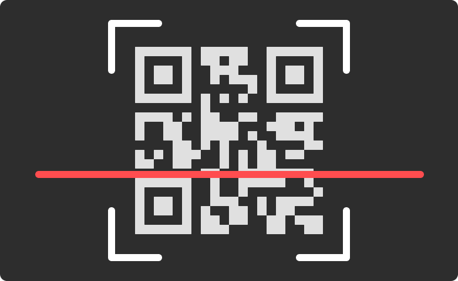

# QR Scanner

QR Scanner is a component for Backendless [UI-Builder](https://backendless.com/developers/#ui-builder) based on the
external [QR Scanner](https://github.com/nimiq/qr-scanner) library. It allows scanning QR codes directly from a web application.

<p align="center">
  
</p>

## Properties

| Property                 | Type                                                                  | Default value    | Logic | Data Binding | UI Setting | Description                                                           |
|--------------------------|-----------------------------------------------------------------------|------------------|-------|--------------|------------|-----------------------------------------------------------------------|
| Highlight Scan Region    | *Checkbox*                                                            | `true`           |       | NO           | YES        | enables showing an outline around the scan region on the video stream |
| Highlight Code Outline   | *Checkbox*                                                            | `true`           |       | NO           | YES        | enables showing an outline around detected QR codes                   |
| Hide After Scan          | *Checkbox*                                                            | `true`           |       | NO           | YES        | enables hiding the scanner on successful decoding                     |
| Max Scans Per Second     | *Number*                                                              | 25               |       | NO           | YES        | controls the frequency of scans                                       |
| Scan Button Visibility   | *Checkbox*                                                            | `true`           |       | NO           | YES        | enables showing the Scan QR Code button                               |
| Scan Button Label        | *Text*                                                                | "Scan QR Code"   |       | NO           | YES        | controls the label of the scan button                                 |
| Upload Button Visibility | *Checkbox*                                                            | `true`           |       | NO           | YES        | enables showing the Upload QR Code button                             |
| Upload Button Label      | *Text*                                                                | "Upload QR Code" |       | NO           | YES        | controls the label of the upload button                               |
| Direction                | *Select* <br/> "Row" \| "Row reverse" \| "Column" \| "Column reverse" | "Row"            |       | NO           | YES        | controls the direction of the buttons                                 |

## Events

| Name                    | Triggers                                           | Context Blocks            |
|-------------------------|----------------------------------------------------|---------------------------|
| On Decode Error Event   | when decoding returns an error                     | Error: `String`           |
| On Decode Success Event | when the decode is successful                      | Decoded QR Code: `String` |
| On Scanner Click Event  | when the user clicks the mouse on the scanner area |                           |
| On Start Scan Failed    | when an error occurs while starting the scan       | Error: `String`           |

## Actions

| Action             | Inputs                                  | Returns                                                                     |
|--------------------|-----------------------------------------|-----------------------------------------------------------------------------|
| Start Scan         |                                         |                                                                             |
| Stop Scan          |                                         |                                                                             |
| Get Cameras List   |                                         | `Array`: a list of the device's cameras, defined via their `id` and `label` |
| Has Camera         |                                         | `Boolean`: the presence of a camera in the device                           |
| Set Camera         | camera: "environment" \| "user" \| `id` |                                                                             |

## Styles

**Theme**

````
@bl-customComponent-qrScanner-themeColor: @themePrimary;
@bl-customComponent-qrScanner-disabledColor: @disabledColor;
@bl-customComponent-qrScanner-shadowColor: @appComponentShadowColor;
@bl-customComponent-qrScanner-borderRadius: @appComponentBorderRadius;
````

**General**

````
@bl-customComponent-qrScanner-button-background: @bl-customComponent-qrScanner-themeColor;
@bl-customComponent-qrScanner-button-color: contrast(@bl-customComponent-qrScanner-button-background);
@bl-customComponent-qrScanner-button-disabledBackground: @bl-customComponent-qrScanner-disabledColor;
@bl-customComponent-qrScanner-button-disabledColor: contrast(@bl-customComponent-qrScanner-button-disabledBackground);
@bl-customComponent-qrScanner-modal-backgroundColor: rgba(0, 0, 0, 0.5);
@bl-customComponent-qrScanner-modal-zIndex: 999;
@bl-customComponent-qrScanner-scanRegion-highlightColor: @bl-customComponent-qrScanner-themeColor;
````

**Dimensions**

````
@bl-customComponent-qrScanner-width: 100%;
@bl-customComponent-qrScanner-gap: 5px;
@bl-customComponent-qrScanner-button-width: 100%;
@bl-customComponent-qrScanner-button-minWidth: 64px;
@bl-customComponent-qrScanner-button-margin: 2px;
@bl-customComponent-qrScanner-button-padding: 6px 16px;
@bl-customComponent-qrScanner-modal-padding: 20px;
@bl-customComponent-qrScanner-video-maxWidth: 100%;
@bl-customComponent-qrScanner-video-maxHeight: 100%;
````

**Typography**

````
@bl-customComponent-qrScanner-button-lineHeight: 1.75;
@bl-customComponent-qrScanner-button-fontSize: 14px;
````

**Decoration**

````
@bl-customComponent-qrScanner-button-borderWidth: 0;
@bl-customComponent-qrScanner-button-borderRadius: @bl-customComponent-qrScanner-borderRadius;
@bl-customComponent-qrScanner-button-shadowColor: @bl-customComponent-qrScanner-shadowColor;
@bl-customComponent-qrScanner-button-shadowHover: 0px 2px 4px -1px fade(@bl-customComponent-qrScanner-button-shadowColor, 20%), 0px 4px 5px 0px fade(@bl-customComponent-qrScanner-button-shadowColor, 14%), 0px 1px 10px 0px fade(@bl-customComponent-qrScanner-button-shadowColor, 12%);
@bl-customComponent-qrScanner-button-shadowDisabled: none;
@bl-customComponent-qrScanner-video-borderRadius: @bl-customComponent-qrScanner-borderRadius;
````
