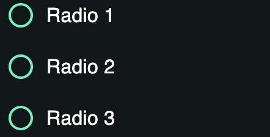
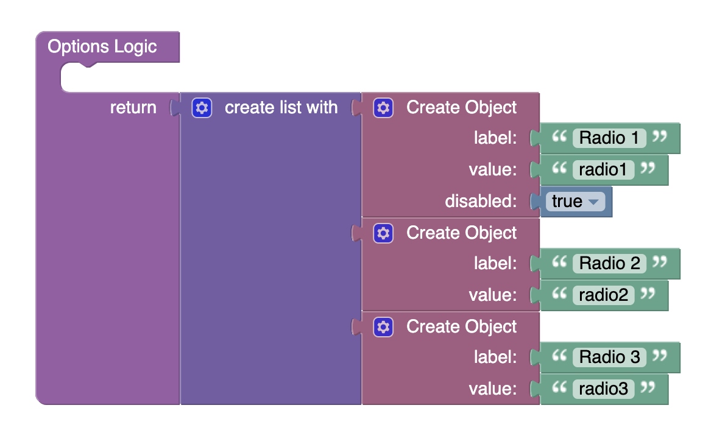

# Radio Buttons List
Radio Buttons List is a component of Backendless UI-Builder designer. The main goal of this component is to display radio buttons.

<p align="center">
  
</p>

## Properties

| Property                | Type     | Default Value                                                                                                                                                             | Logic          | Data Binding | UI Setting | Description                                                                                                                                                                                                                                                            |
|-------------------------|----------|---------------------------------------------------------------------------------------------------------------------------------------------------------------------------|----------------|--------------|------------|------------------------------------------------------------------------------------------------------------------------------------------------------------------------------------------------------------------------------------------------------------------------|
| Disabled<br/>`disabled` | Checkbox | `false`                                                                                                                                                                   | Disabled Logic | YES          | YES        | This handler allows you to disable a component.                                                                                                                                                                                                                        |
| Options<br/>`options`   | JSON     | `[`</br>`{"label": "Radio 1", "value": "radio1", "disabled": true},`<br/>`{"label": "Radio 2", "value": "radio2"},`</br>`{"label": "Radio 3", "value": "radio3"}`<br/>`]` | Options Logic  | YES          | YES        | This handler allows you to add options to the component. Watch [Codeless Examples](#Examples). Signature of options: List of object `{value: String, label: String}`. If you need to disable an option, add the `disabled: true` property to the object of the option. |
| Value<br/>`value`       | Text     | "radio3"                                                                                                                                                                  | Value Logic    | YES          | YES        | This handler allows you to select value by default.                                                                                                                                                                                                                    |

## Events

| Name                    | Triggers                                 | Context Blocks                                  |
|-------------------------|------------------------------------------|-------------------------------------------------|
| On Change Event         | when the user clicks on the radio button | Value: `String`                                 |

## Actions

| Action           | Inputs                                          | Returns                                         |
|------------------|-------------------------------------------------|-------------------------------------------------|
| Set value        | Value: `String`                                 |                                                 |
| Get value        |                                                 | `String`: current selected value                |
| Set options      | Options: [{label: `String`, value: `String`}]   |                                                 |
| Get options      |                                                 | Options: [{label: `String`, value: `String`}]   |

## Styles

**Theme**
````
@bl-customComponent-radioButtonsList-themeColor: @themePrimary;
@bl-customComponent-radioButtonsList-backgroundColor: @appBackgroundColor;
@bl-customComponent-radioButtonsList-textColor: @appTextColor;
````

**Dimensions**
````
@bl-customComponent-radioButtonsList-inputRadio-width: 42px;
@bl-customComponent-radioButtonsList-radioButtonIcon-width: 24px;
@bl-customComponent-radioButtonsList-radioButtonLabel-fontSize: 16px;
@bl-customComponent-radioButtonsList-disabled-opacity: 0.38;
@bl-customComponent-radioButtonsList-disabled-cursor: default;
````

**Colors**
````
@bl-customComponent-radioButtonsList-radioButtonIcon-fill: @bl-customComponent-radioButtonsList-themeColor;
@bl-customComponent-radioButtonsList-radioButtonIcon-backgroundColor-onHover: rgba(@themePrimary, 0.04);
````

## <a name="Examples"></a> Codeless Examples

Adding options to component:


