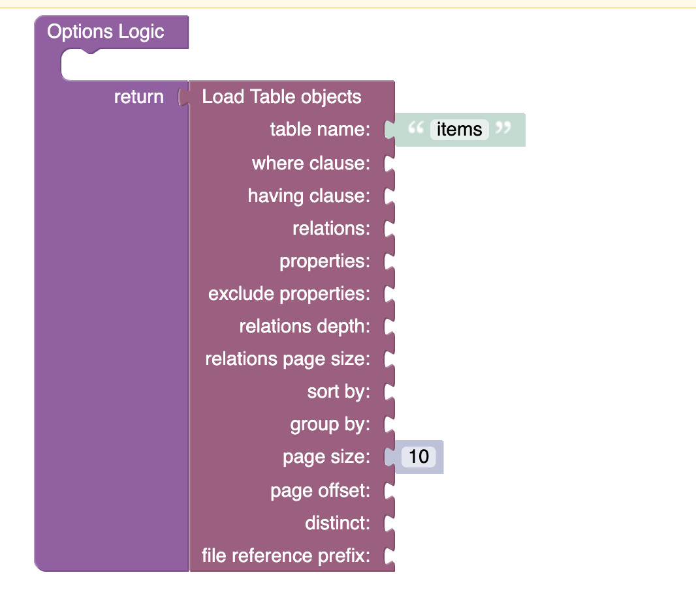

# Radio Buttons List
Radio Buttons List is a component of Backendless UI-Builder designer. The main goal of this component is to display radio buttons.

<p align="center">
  
</p>

## Properties

| Property | Type       | Default Value | Logic          | Data Binding | UI Setting | Description                                                                                                                                                             |
|----------|------------|---------------|----------------|--------------|------------|-------------------------------------------------------------------------------------------------------------------------------------------------------------------------|
| Disabled | *Checkbox* | `false`       | Disabled Logic | YES          | YES        | This handler allows you to disable a component.                                                                                                                         |
| Options  | *JSON*     | `[]`          | Options Logic  | YES          | YES        | This handler allows you to add options to the component. Watch [Codeless Examples](#Examples). Signature of options: List of object {value: `String`, label: `String`}. |
| Value    | *Text*     |               | Value Logic    | YES          | YES        | This handler allows you to select value by default.                                                                                                                     |

## Events

| Name                    | Triggers                                 | Context Blocks                                  |
|-------------------------|------------------------------------------|-------------------------------------------------|
| On Change Event         | when the user clicks on the radio button | Value: `String`                                 |

## Actions

| Action           | Inputs                                          | Returns                                         |
|------------------|-------------------------------------------------|-------------------------------------------------|
| Set value        | Value: `String`                                 |                                                 |
| Get value        |                                                 | `String`: current selected value                |
| Set options      | Options: [{label: `String`, value: `String`}]   |                                                 |
| Get options      |                                                 | Options: [{label: `String`, value: `String`}]   |

## Styles

**Theme**
````
@bl-customComponent-radioButtonsList-themeColor: @themePrimary;
@bl-customComponent-radioButtonsList-backgroundColor: @appBackgroundColor;
@bl-customComponent-radioButtonsList-textColor: @appTextColor;
````

**Dimensions**
````
@bl-customComponent-radioButtonsList-inputRadio-width: 42px;
@bl-customComponent-radioButtonsList-radioButtonIcon-width: 24px;
````

## <a name="Examples"></a> Codeless Examples

Adding options to component:


