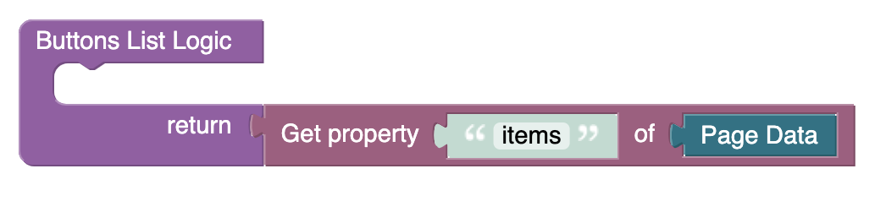

# Radio Buttons List
Radio Buttons List is a component of Backendless UI-Builder designer. The main goal of this component is to display radio buttons.

<p align="center">
  
</p>

## Properties

| Property      | Type           | Default value | Logic               | Data Binding | UI Setting | Description                                                                                    |
|---------------|----------------|---------------|---------------------|--------------|------------|------------------------------------------------------------------------------------------------|
| Disabled      | *Checkbox*     | `false`       | Disabled Logic      | YES          | YES        | This handler allows you to disable component.                                                  |
| Buttons List  | *JSON*         |               | Buttons List Logic  | YES          | YES        | This handler allows you to add an array of radio buttons. Watch [Codeless Examples](#Examples) |

## Events

| Name                    | Triggers                                 | Context Blocks                                                         |
|-------------------------|------------------------------------------|------------------------------------------------------------------------|
| On Change Event         | when the user clicks on the radio button | Value: `Object`                                                        |

## Styles

**Theme**
````
@bl-customComponent-radioButtonsList-themeColor: @themePrimary;
@bl-customComponent-radioButtonsList-backgroundColor: @appBackgroundColor;
@bl-customComponent-radioButtonsList-textColor: @appTextColor;
````

**Dimensions**
````
@bl-customComponent-radioButtonsList-inputRadio-width: 42px;
@bl-customComponent-radioButtonsList-radioButtonIcon-width: 24px;
````

## <a name="Examples"></a> Codeless Examples

Adding radio buttons list to component:


