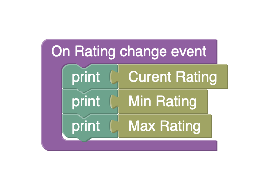

# Rating
Rating is a component of Backendless UI-Builder designer. It allows you to rate anything, or see the rating of a particular item.

## Properties

| Property      | Type                            | Default value | Logic               | Data Binding | UI Setting | Description
|---------------|---------------------------------|---------------|---------------------|--------------|------------|-----------------------------------------------------------
| Disabled      | *Checkbox*                      | false         | Disabled logic      | YES          | YES        | If you need the rating to be disabled, you can click on the `Disabled` checkbox.
| Icon          | *Select*  [`star`, `heart`] | 'star'        | Icon logic          | NO           | YES        | You can select the icon to be displayed. This property has two icons: a `heart` and a `star`.
| Default value | *Number*                        | 0             | Default value logic | YES          | YES        | You can select the initial value to be displayed. Watch [Codeless Examples](#Examples).
| Icons amount  | *Number*                        | 5             | Icons amont logic   | YES          | YES        | This option is to set the number of icons in the rating.
| Icon color    | *Color*                         | `#FAAF00`     | Icon color logic    | NO           | YES        | This property allows you to change the color of rating icon.
| Precision     | *Select*  [`0.5`, `1`]      | 1             | Precision logic     | YES          | YES        | This handler allows you to specify the precision of the rating evaluation.

## Events

| Name              | Triggers                                                                | Context Blocks                                                                 |
|-------------------|-------------------------------------------------------------------------|--------------------------------------------------------------------------------|
| On Rating change  | When the user clicks on the icon. Watch [Codeless Examples](#Examples). | `Rating value: [curentRating: number, minRating: number, maxRating: number]`   |

##  Codeless Examples

Working with the 'On Rating change' event and its context blocks:

Adding of default value to the rating:

