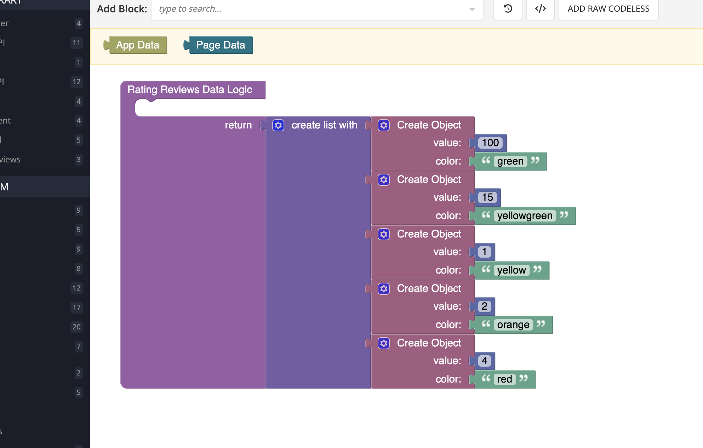
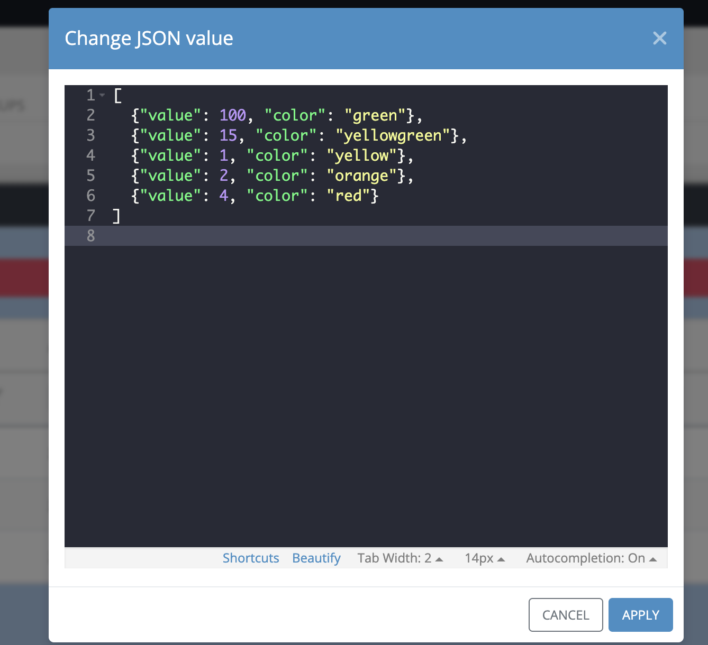

# Rating Reviews

Rating Reviews is a component of Backendless UI-builder designer. This allows simply adding rating reviews to the app.

<p align="center">
  
</p>

## Properties

| Property                                    | Type                                                                     | Default Value                                                                                                                                                                                       | Logic                     | Data Binding | UI Setting | Description                                                                                                                                               |
|---------------------------------------------|--------------------------------------------------------------------------|-----------------------------------------------------------------------------------------------------------------------------------------------------------------------------------------------------|---------------------------|--------------|------------|-----------------------------------------------------------------------------------------------------------------------------------------------------------|
| Rating Reviews Data<br/>`ratingReviewsData` | JSON                                                                     | `[{"value": 100, "color": "green"},`<br/>`{"value": 15, "color": "yellowgreen"},`<br/>`{"value": 1, "color": "yellow"},`<br/>`{"value": 2, "color": "orange"},`<br/>`{"value": 4, "color": "red"}]` | Rating Reviews Data Logic | YES          | YES        | This handler adds review data for component. Watch [Codeless Examples](#codeless-examples). Signature of Review Data: `[{value: Number, color: String}]`. |
| Color<br/>`color`                           | Color                                                                    | '#337AB7'                                                                                                                                                                                           |                           | NO           | YES        | This is a handler that controls component main color.                                                                                                     |
| Icon Type<br/>`iconType`                    | Select [Star:`star`<br/>Heart:`heart`]                                   | Star:`star`                                                                                                                                                                                         |                           | NO           | YES        | This is a handler that controls icon type.                                                                                                                |
| Icon Size<br/>`iconSize`                    | Text                                                                     | '20px'                                                                                                                                                                                              |                           | NO           | YES        | This is a handler that controls icon size(only 'px').                                                                                                     |
| Width<br/>`width`                           | Text                                                                     | '500px'                                                                                                                                                                                             |                           | NO           | YES        | This is a handler that controls component width.                                                                                                          |
| View<br/>`view`                             | Select [Standard:`standard`<br/>Simple:`simple`<br/>Detailed:`detailed`] | Standard:`standard`                                                                                                                                                                                 |                           | NO           | YES        | This is a handler that controls different views of the component.                                                                                         |
| Localizations<br/>`localizations`           | JSON                                                                     | {averageText: '/', reviewstext: 'Reviews'}                                                                                                                                                          |                           | NO           | YES        | This is a handler that controls text labels.                                                                                                              |

## Events

| Name           | Triggers                                  | Context Blocks  |
|----------------|-------------------------------------------|-----------------|
| On Click Event | When the user clicks on the progress bar. | Score: `Number` |

## Actions

| Action                                   | Inputs | Returns                                                       |
|------------------------------------------|--------|---------------------------------------------------------------|
| Get Average in Customer Reviews          |        | `Number`: average score.                                       |
| Get Percents Array in Customer Reviews   |        | `Array`: `[Number]` array with the percentages of each grade. |
| Get total of reviews in Customer Reviews |        | `Number`: total number of reviews.

## Styles

**Other**
````
@bl-customComponent-customer-reviews-color: @appTextColor;
@bl-customComponent-customer-reviews-font-family: @inputOutlinedFontFamily;
@bl-customComponent-customer-reviews-progress-bar-background: #eee;
````

## Codeless Examples

Adding data to a component through Logic.



Adding data to a component through Settings.



<details><summary>Try yourself</summary>

````javascript
<block xmlns="http://www.w3.org/1999/xhtml" type="lists_create_with" id="%B8lJ4{Dxx7JbfVg9|+g"><mutation items="5"></mutation><value name="ADD0"><block type="create_object" id="|lNTllXqL;OK`=g^ubuY"><mutation><properties><item id="property" prop-name="value"></item><item id="property" prop-name="color"></item></properties></mutation><value name="create_object_mutator_container_properties_stack_property0"><block type="math_number" id="GF4jme#ZQnC48!h:b_0u"><field name="NUM">100</field></block></value><value name="create_object_mutator_container_properties_stack_property1"><block type="text" id="x^8}t};5#2y^?wX-b1=R"><field name="TEXT">green</field></block></value></block></value><value name="ADD1"><block type="create_object" id="nw1ujjKHu=h^j#]]-29E"><mutation><properties><item id="property" prop-name="value"></item><item id="property" prop-name="color"></item></properties></mutation><value name="create_object_mutator_container_properties_stack_property0"><block type="math_number" id="OIPiz$gyFy?ZVP5#)O*:"><field name="NUM">15</field></block></value><value name="create_object_mutator_container_properties_stack_property1"><block type="text" id="xh.?%{5U#rucqk)n1?Bx"><field name="TEXT">yellowgreen</field></block></value></block></value><value name="ADD2"><block type="create_object" id="g%Qn/S?V0mOnaIX,Wn~~"><mutation><properties><item id="property" prop-name="value"></item><item id="property" prop-name="color"></item></properties></mutation><value name="create_object_mutator_container_properties_stack_property0"><block type="math_number" id="Miz,WchtTNL6pQ$%x3u/"><field name="NUM">1</field></block></value><value name="create_object_mutator_container_properties_stack_property1"><block type="text" id="}(C1v]~Vn-SGu#Tl9JK^"><field name="TEXT">yellow</field></block></value></block></value><value name="ADD3"><block type="create_object" id="Nm!tB[-EKB@QaU-JXh~`"><mutation><properties><item id="property" prop-name="value"></item><item id="property" prop-name="color"></item></properties></mutation><value name="create_object_mutator_container_properties_stack_property0"><block type="math_number" id="@ni]E$V/(#0jEnSViwYW"><field name="NUM">2</field></block></value><value name="create_object_mutator_container_properties_stack_property1"><block type="text" id="VRvF*|ro;qIKDxvqxp]U"><field name="TEXT">orange</field></block></value></block></value><value name="ADD4"><block type="create_object" id="_8T9#A:zK-Xaserc5]4L"><mutation><properties><item id="property" prop-name="value"></item><item id="property" prop-name="color"></item></properties></mutation><value name="create_object_mutator_container_properties_stack_property0"><block type="math_number" id="72}Y62vP.flZ#F36MU.]"><field name="NUM">4</field></block></value><value name="create_object_mutator_container_properties_stack_property1"><block type="text" id="#S?|$HR$T|AqX=+L|:Ua"><field name="TEXT">red</field></block></value></block></value></block>
````
</details>
