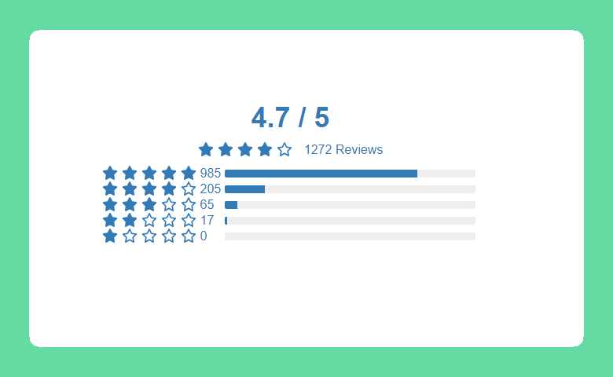

# Rating Reviews

Rating Reviews is a component of Backendless UI-builder designer. This allows simply adding rating reviews to the app.

<p align="center">
  
</p>

## Properties

| Property               | Type                                                 | Default Value | Logic             | Data Binding | UI Setting | Description                                                                                                                               |
|------------------------|------------------------------------------------------|---------------|-------------------|--------------|------------|-------------------------------------------------------------------------------------------------------------------------------------------|
| Review Data            | *JSON*                                               |               | Review Data Logic | YES          | YES        | This handler adds review data for component. Watch [Codeless Examples](#codeless-examples). Signature of Review Data: `[{value, color}]`. |
| Color                  | *Color*                                              | '#337AB7'     |                   | NO           | YES        | This is a handler that controls component main color.                                                                                     |
| Icon Size              | *Text*                                               | '20px'        |                   | NO           | YES        | This is a handler that controls icon size(only 'px').                                                                                     |
| Width                  | *Text*                                               | '500px'       |                   | NO           | YES        | This is a handler that controls component width.                                                                                          |
| View                   | *Select* <br/>[`oneColor`, `twoColor`, `multiColor`] | 'oneColor'    |                   | NO           | YES        | This is a handler that controls different views of the component.                                                                         |
| One Color Average Text | *Text*                                               | 'out of'      |                   | NO           | YES        | This is a handler that controls 'average' text in 'One Color' view.                                                                       |
| Reviews Text           | *Text*                                               | 'Reviews'     |                   | NO           | YES        | This is a handler that controls 'Reviews' text.                                                                                           |

## Events

| Name             | Triggers                                  | Context Blocks  |
|------------------|-------------------------------------------|-----------------|
| Get Rating Score | When the user clicks on the progress bar. | Score: `Number` |

## Actions

| Action                                   | Inputs | Returns                                                       |
|------------------------------------------|--------|---------------------------------------------------------------|
| Get Average in Customer Reviews          |        | `Number`: average score.                                       |
| Get Percents Array in Customer Reviews   |        | `Array`: `[Number]` array with the percentages of each grade. |
| Get total of reviews in Customer Reviews |        | `Number`: total number of reviews.

## Styles

**Other**
````
@bl-cutomComponent-customer-reviews-color: @appTextColor;
@bl-cutomComponent-customer-reviews-font-family: @inputOutlinedFontFamily;
@bl-cutomComponent-customer-reviews-progress-bar-background: #eee;
````

## Codeless Examples

Addition data to component.


<details><summary>Codeless example</summary>

````javascript
<block xmlns="http://www.w3.org/1999/xhtml" type="lists_create_with" id=".t,UvW@3`Hy(@i,NZ$/?" x="216" y="105"><mutation items="5"></mutation><value name="ADD0"><block type="create_object" id="GuR+H}c9R!%,SI[Hbpk["><mutation><properties><item id="property" prop-name="value"></item><item id="property" prop-name="color"></item></properties></mutation><value name="create_object_mutator_container_properties_stack_property0"><block type="math_number" id="Q)gD]4PV.~`he(S_yd7E"><field name="NUM">985</field></block></value><value name="create_object_mutator_container_properties_stack_property1"><block type="text" id="={:X={dvUeX+}+$q(vs3"><field name="TEXT">#76dc99</field></block></value></block></value><value name="ADD1"><block type="create_object" id="~33q:1?@w;8[bRz$.L2p"><mutation><properties><item id="property" prop-name="value"></item><item id="property" prop-name="color"></item></properties></mutation><value name="create_object_mutator_container_properties_stack_property0"><block type="math_number" id="h,M+)/L=y56.uI7[R%HN"><field name="NUM">205</field></block></value><value name="create_object_mutator_container_properties_stack_property1"><block type="text" id="xX2JtD8,z:CBoH6+ePd$"><field name="TEXT">#b7ea84</field></block></value></block></value><value name="ADD2"><block type="create_object" id="M`6xZK{7_t[i`2-?%(+8"><mutation><properties><item id="property" prop-name="value"></item><item id="property" prop-name="color"></item></properties></mutation><value name="create_object_mutator_container_properties_stack_property0"><block type="math_number" id="cdspatulQBXL}FBQ3fB:"><field name="NUM">65</field></block></value><value name="create_object_mutator_container_properties_stack_property1"><block type="text" id=")4[_o*qqDjbg0Gre8%M!"><field name="TEXT">#f7d657</field></block></value></block></value><value name="ADD3"><block type="create_object" id="3]BW$qx+Z1[sY]Zeo3Rh"><mutation><properties><item id="property" prop-name="value"></item><item id="property" prop-name="color"></item></properties></mutation><value name="create_object_mutator_container_properties_stack_property0"><block type="math_number" id="p//39aXnc3W[R%@|9Sio"><field name="NUM">17</field></block></value><value name="create_object_mutator_container_properties_stack_property1"><block type="text" id="zde*R7c=%gzIFon9;~oz"><field name="TEXT">#f8b95a</field></block></value></block></value><value name="ADD4"><block type="create_object" id="%S`cPN!GhA{|A7rMg]8~"><mutation><properties><item id="property" prop-name="value"></item><item id="property" prop-name="color"></item></properties></mutation><value name="create_object_mutator_container_properties_stack_property0"><block type="math_number" id="p;IP^KA0nT`NtKGN:-I/"><field name="NUM">0</field></block></value><value name="create_object_mutator_container_properties_stack_property1"><block type="text" id="SeF@tc~qSTZ6NS.%R{9~"><field name="TEXT">#f17a55</field></block></value></block></value></block>
````
</details>
