# ReCaptcha

ReCaptcha is a component of Backendless UI-Builder designer. reCAPTCHA is a free service that protects your website from spam and abuse. reCAPTCHA uses an advanced risk analysis engine and adaptive CAPTCHAs to keep automated software from engaging in abusive activities on your site. It does this while letting your valid users pass through with ease.
In this component we use [ReCaptcha v2](https://www.google.com/recaptcha/about/).

<p align="center">
  
</p>


## Demo

View an example of how to install this component and how it works in your UI [here](https://app.arcade.software/share/tZ7HL5qPaMGEaEZ9kwEZ).

## Properties

| Property          | Type                                             | Default Value  | Logic                   | Data Binding | UI Setting | Description                                                      |
|-------------------|--------------------------------------------------|----------------|-------------------------|--------------|------------|------------------------------------------------------------------|
| Verification Type | Select ["image", "audio"]                        | "image"        | Verification Type Logic | YES          | YES        | Allows to determine the type of verification by image or audio.  |
| Size              | Select ["compact", "normal", "invisible"]        | "normal"       | Size Logic              | YES          | YES        | Allows to determine the reCaptcha size.                          |
| Badge             | Select ["bottom-right", "bottom-left", "inline"] | "bottom-right" |                         | NO           | YES        | Allows to determine the position. Work when Size is "invisible". |
| Theme             | Select ["light", "dark"]                         | "light"        | Theme Color             | YES          | YES        | Allows to determine the theme.                                   |

## Events

| Name        | Triggers                                                       | Context Blocks |
|-------------|----------------------------------------------------------------|----------------|
| On Errored  | when the challenge errored, most likely due to network issues. |                |

## Actions

| Action                   | Inputs | Return                                                       |
|--------------------------|--------|--------------------------------------------------------------|
| On Token Sent            |        | `String`: can get when the user passed the captcha           |
| On Pass(ed)              |        | `Boolean`: `true` when the user passed the captcha           |
| Get a Token of Invisible |        | `String`: can provide a token if the user passes the captcha |

## Settings

| Name     | Type   | Default Value | Required | Description                       |
|----------|--------|---------------|----------|-----------------------------------|
| Site-key | *Text* |               | YES      | Site-key needed to use reCaptcha. |

## Styles
```
@bl-customComponent-reCaptcha-invisible-z-index: 1;
```

## Before Usage
Before usage, you need:

1. Create a Google account if you don't have one.
2. Register your site in [Google Recaptcha](https://www.google.com/recaptcha/admin/create). Choose reCaptcha v2 "I'm not a robot" (invisible captcha mode will not work in this case) or Invisible reCaptcha badge.
3. Get your site-key and secret-key

## Usage
Let's look at example

We have some "form" data table

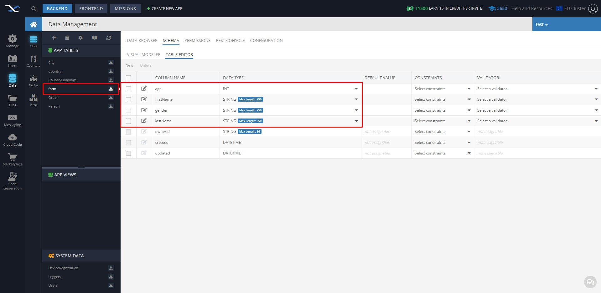

And we have some form where we put reCaptcha and reCaptcha must have an `id`

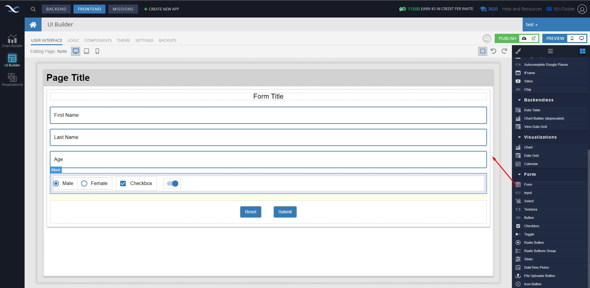

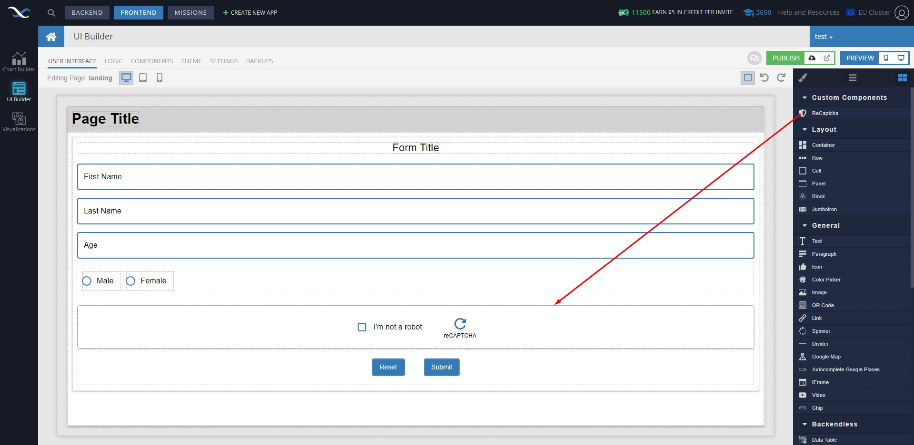


In SETTINGS we set site-key.

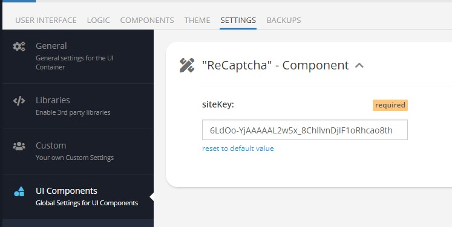

### We need to create in Cloud Code a new API service with POST method on reCaptcha API https://www.google.com/recaptcha/api/siteverify and send a secret-key and token. In response, we get the following object:
```
{
    "success": true|false,
    "challenge_ts": timestamp,  // timestamp of the challenge load (ISO format yyyy-MM-dd'T'HH:mm:ssZZ)
    "hostname": string,         // the hostname of the site where the reCAPTCHA was solved
    "error-codes": [...]        // optional
}
```

1. Go to Backend > Cloud Code > Services > Add New Service

    

2. Add new service

    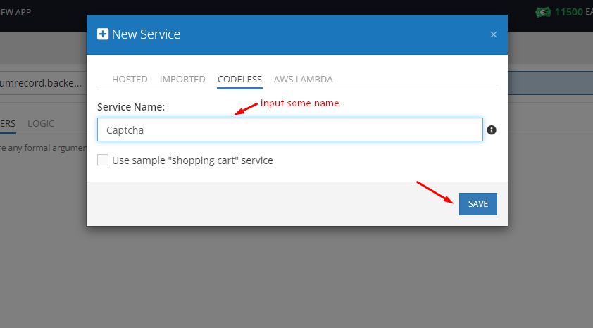

3. After must open the modal window "New Codeless Method". Fill in as in the screenshot

    

4. After go to edit over the getResult method

    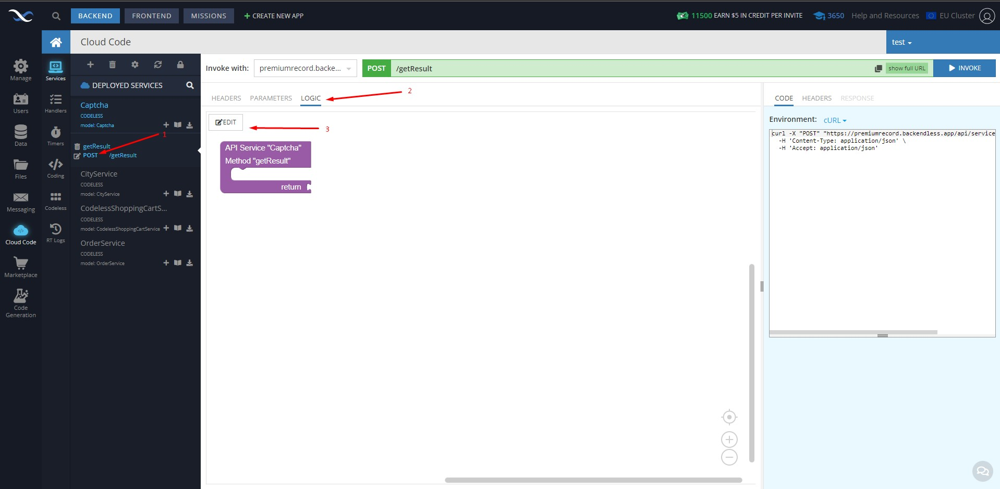

5. Make logic like in the screenshot. In the prop secret of the query object we put the secret key from your Google reCAPTCHA admin console. And when logic will be made, click on "DEPLOY MODEL"

    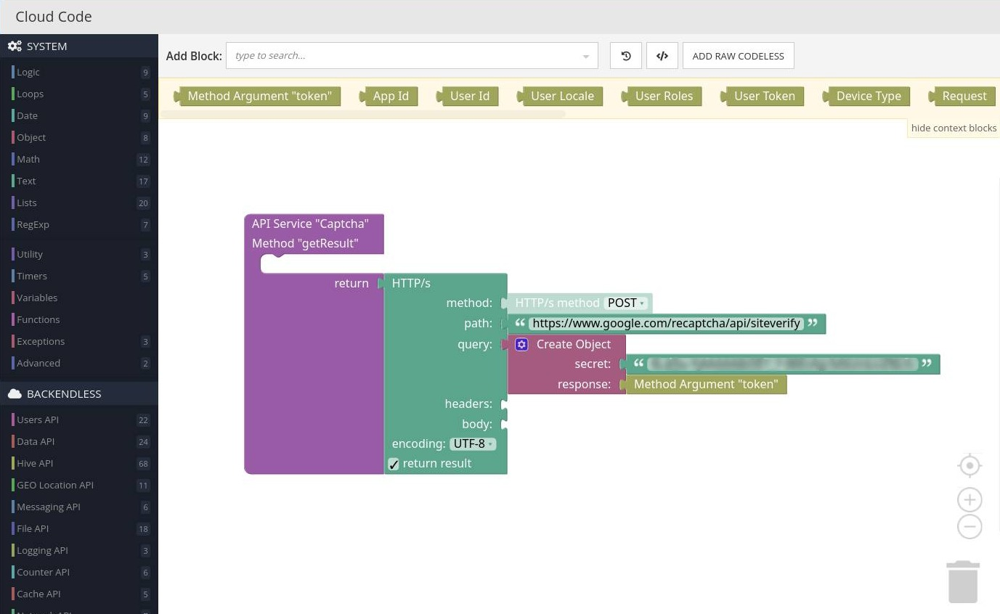

### After that, we create an API service to save the form data to the database.

1. Add new service FormData

    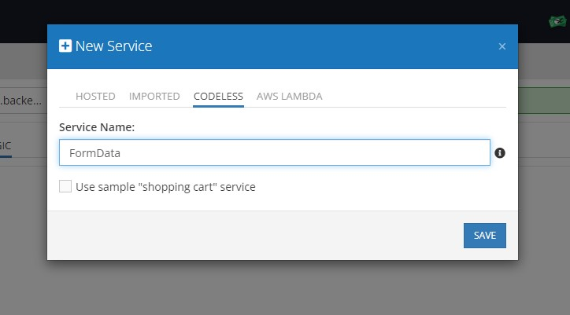

2. Add new Codeless Method createForm

    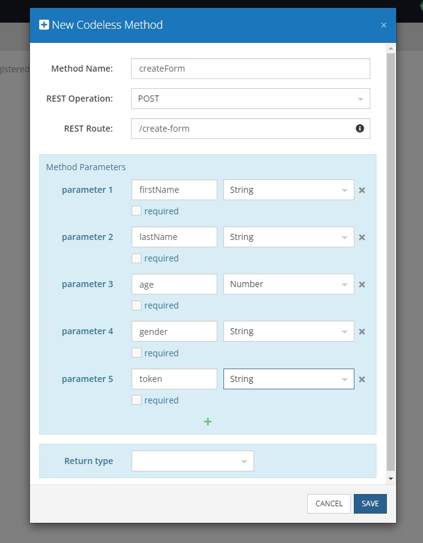

3. Make logic like in the screenshot. We need to make conditions, if the captcha is successful, we save the data, otherwise nothing (or you might want to return an error). And when logic will be made, click on "DEPLOY MODEL"

    

### In form logic add On Submit Event.


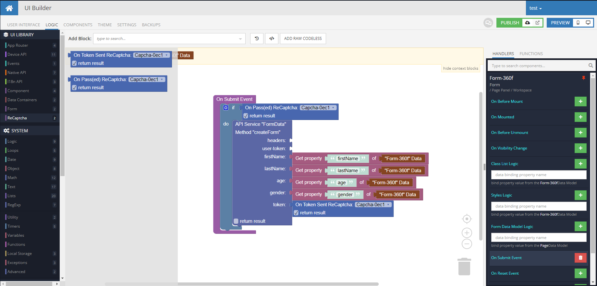

### If you use invisible size for reCaptcha, add this Logic for On Submit Event

1. You can create a variable to save the token

    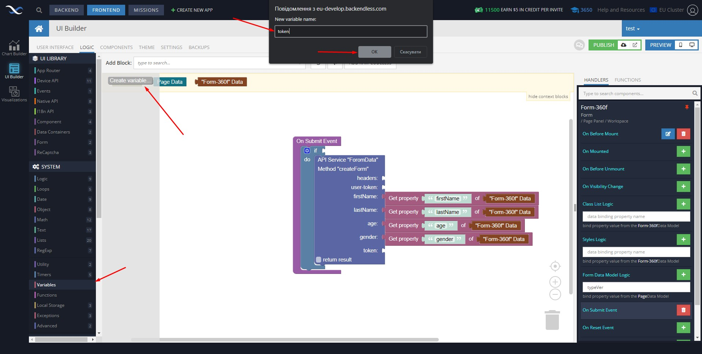
    

2. Now "On Submit Event" must look like on this screenshot

    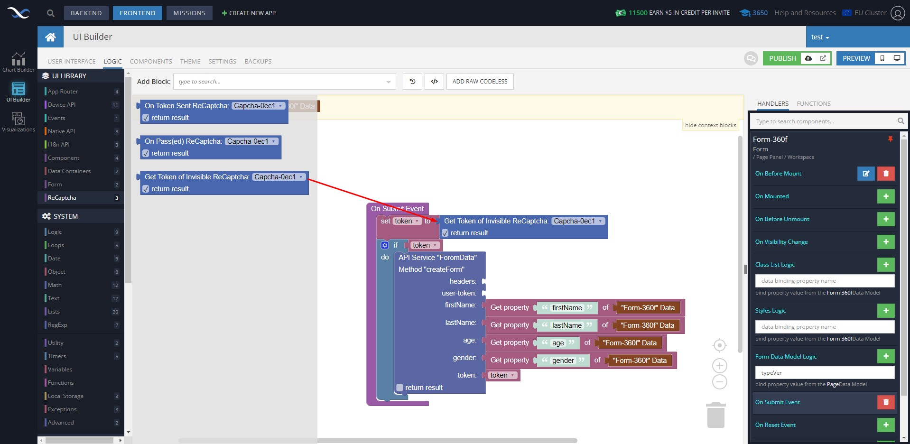
