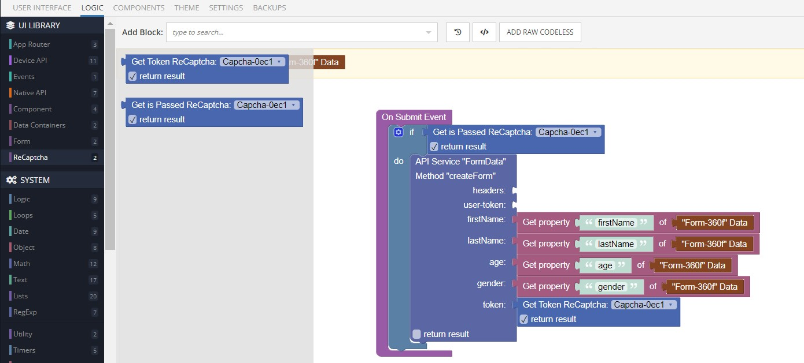

# ReCaptcha

ComponentName is a component of Backendless UI-Builder designer. This allows you to upgrade your security from bots when need to send some form

In this component we use [ReCaptcha v2](https://www.google.com/recaptcha/about/).

## Properties

| Property | Type                                             | Default Value  | Logic       | Data Binding | UI Setting | Description                                                     |
|----------|--------------------------------------------------|----------------|-------------|--------------|------------|-----------------------------------------------------------------|
| Type     | Select ["image", "audio"]                        | "image"        |             | NO           | YES        | Allows to determine the type of verification by image or audio. |
| Size     | Select ["compact", "normal", "invisible"]        | "normal"       | Size Logic  | YES          | YES        | Allows to determine the reCaptcha size.                         |
| Badge    | Select ["bottom-right", "bottom-left", "inline"] | "bottom-right" |             | NO           | YES        | Allows to determine the position. Work when Size is inline.     |
| Theme    | Select ["light", "dark"]                         | "light"        | Theme Color | YES          | YES        | Allows to determine the theme.                                  |

## Action

| Action        | Inputs | Return                                         |
|---------------|--------|------------------------------------------------|
| Get Token     |        | `String`: can get when the user passed captcha |
| Get Is Passed |        | `Boolean`: `true` when the user passed captcha |

## Before Usage
Before usage, you need:

1. Create google account if you doesnt have.
2. Register your site in [Google Recaptcha](https://www.google.com/recaptcha/admin/create). Chose reCaptcha v2 "I'm not a robot" Checkbox ( invisible captcha not be working ) or Invisible reCaptcha badge.
3. Get your site-key and secret-key

## Usage
Let's look at an example

We have some form where we put reCaptcha and reCaptcha must have id


In SETTINGS we input site-key.


We need to create in [Cloud Code](https://eu-develop.backendless.com/app/test/bl/services) new API service with POST method on reCaptcha API https://www.google.com/recaptcha/api/siteverify and send secret-key and token. In answer, we get the object:
```
{
    "success": true|false,
    "challenge_ts": timestamp,  // timestamp of the challenge load (ISO format yyyy-MM-dd'T'HH:mm:ssZZ)
    "hostname": string,         // the hostname of the site where the reCAPTCHA was solved
    "error-codes": [...]        // optional
}
```


After that, we create an API service to save the form data to the database. We need to make conditions, if the captcha is successful, we save the data, otherwise nothing


In form logic add On Submit Event.


