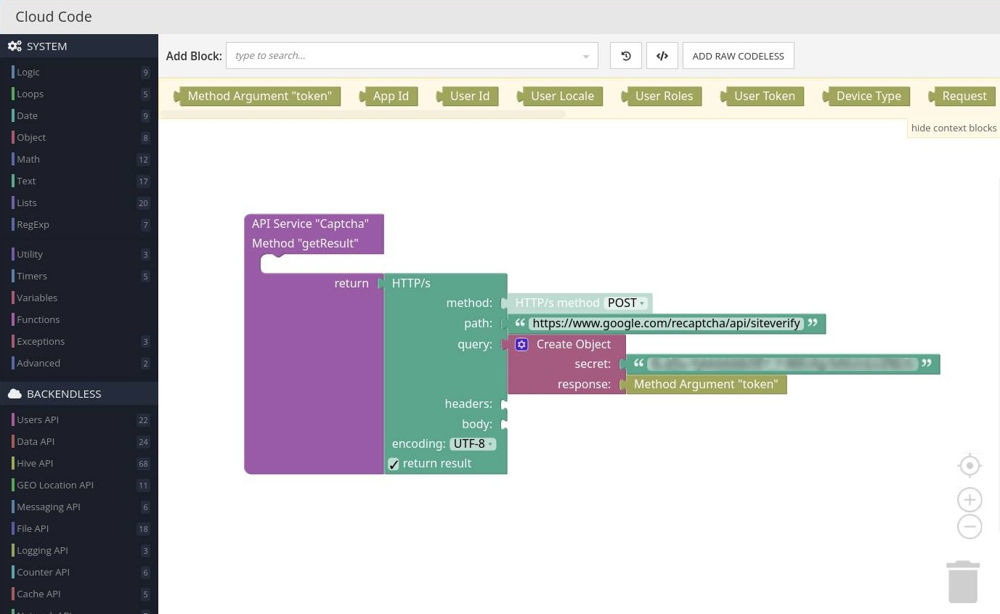

# ReCaptcha

ReCaptcha is a component of Backendless UI-Builder designer. reCAPTCHA is a free service that protects your website from spam and abuse. reCAPTCHA uses an advanced risk analysis engine and adaptive CAPTCHAs to keep automated software from engaging in abusive activities on your site. It does this while letting your valid users pass through with ease.
In this component we use [ReCaptcha v2](https://www.google.com/recaptcha/about/).

## Properties

| Property | Type                                             | Default Value  | Logic       | Data Binding | UI Setting | Description                                                     |
|----------|--------------------------------------------------|----------------|-------------|--------------|------------|-----------------------------------------------------------------|
| Type     | Select ["image", "audio"]                        | "image"        |             | NO           | YES        | Allows to determine the type of verification by image or audio. |
| Size     | Select ["compact", "normal", "invisible"]        | "normal"       | Size Logic  | YES          | YES        | Allows to determine the reCaptcha size.                         |
| Badge    | Select ["bottom-right", "bottom-left", "inline"] | "bottom-right" |             | NO           | YES        | Allows to determine the position. Work when Size is inline.     |
| Theme    | Select ["light", "dark"]                         | "light"        | Theme Color | YES          | YES        | Allows to determine the theme.                                  |

## Actions

| Action        | Inputs | Return                                         |
|---------------|--------|------------------------------------------------|
| On Token Sent |        | `String`: can get when the user passed captcha |
| On Pass(ed)   |        | `Boolean`: `true` when the user passed captcha |

## Settings

| Name     | Type   | Default Value | Required | Description                       |
|----------|--------|---------------|----------|-----------------------------------|
| Site-key | *Text* |               | YES      | Site-key needed to use reCaptcha. |

## Before Usage
Before usage, you need:

1. Create google account if you don't have.
2. Register your site in [Google Recaptcha](https://www.google.com/recaptcha/admin/create). Choose reCaptcha v2 "I'm not a robot" (invisible captcha mode will not work in this case) or Invisible reCaptcha badge.
3. Get your site-key and secret-key

## Usage
Let's look at example

We have some form where we put reCaptcha and reCaptcha must have an `id`


In SETTINGS we set site-key.


We need to create in Cloud Code a new API service with POST method on reCaptcha API https://www.google.com/recaptcha/api/siteverify and send a secret-key and token. In response, we get the following object:
```
{
    "success": true|false,
    "challenge_ts": timestamp,  // timestamp of the challenge load (ISO format yyyy-MM-dd'T'HH:mm:ssZZ)
    "hostname": string,         // the hostname of the site where the reCAPTCHA was solved
    "error-codes": [...]        // optional
}
```



After that, we create an API service to save the form data to the database. We need to make conditions, if the captcha is successful, we save the data, otherwise nothing (or you might want to return an error)


In form logic add On Submit Event.


