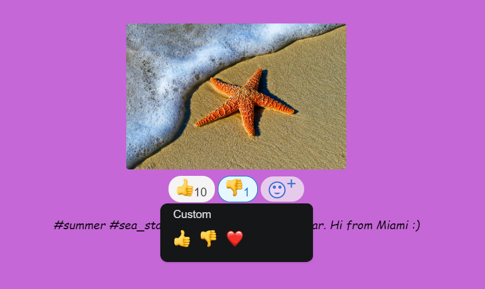
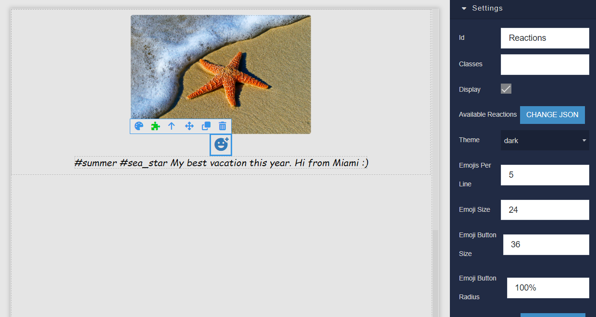
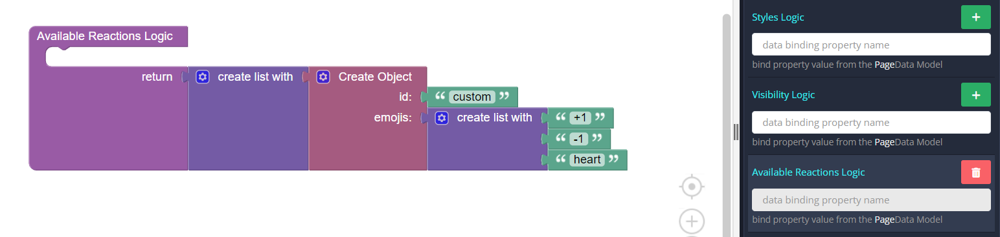
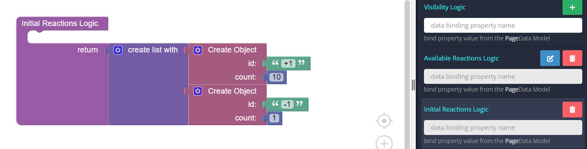
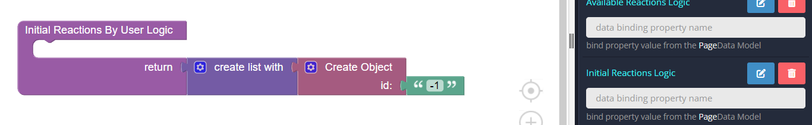
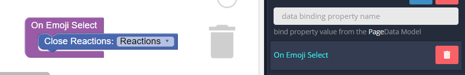
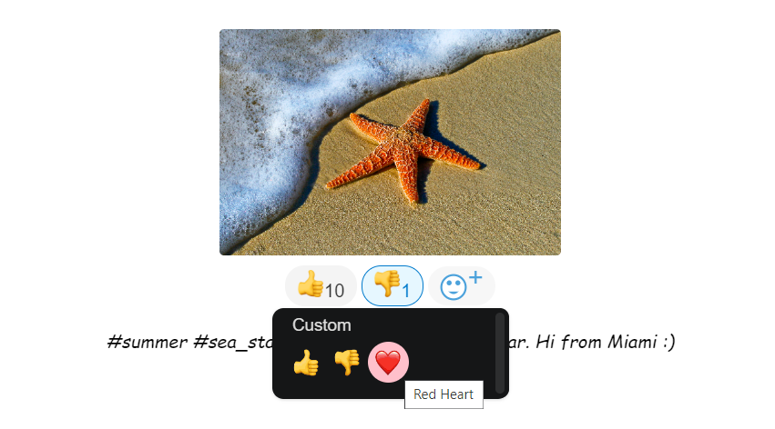

# Reactions

Reactions is the component that can be used in Backendless [UI-Builder](https://backendless.com/developers/#ui-builder). This component is a custom React component for displaying and selecting emoji reactions. It provides users with a selection of emojis to choose from, tracks the user's selections and their count, and allows for interactions such as clicking on emojis to add or remove them. Users can open and close the emoji reactions panel, and the component handles the management of selected reactions, both for individual users and the overall count. It also features a visual representation of selected reactions, and it is highly customizable, supporting various styles and configurations.

<p align="center">
  
</p>

## Properties


## Events


## Actions


## Styles

````
@bl-customComponent-reactions-width: 100%;
@bl-customComponent-reactions-flexDirrection: column;
@bl-customComponent-reactions-alignItems: center;

@bl-customComponent-reactions-picker-height: 200px;
@bl-customComponent-reactions-picker-min-height: 130px;
@bl-customComponent-reactions-picker-zIndex: 111;

@bl-customComponent-reaction-control-flexDirrection: row;
@bl-customComponent-reaction-control-alignItems: center;

@bl-customComponent-reaction-control-emoji-btn-margin: 2px;
@bl-customComponent-reaction-control-emoji-btn-padding: 3px 10px;
@bl-customComponent-reaction-control-emoji-btn-borderRadius: 17px;
@bl-customComponent-reaction-control-emoji-btn-border: 1px solid transparent;
@bl-customComponent-reaction-control-emoji-btn-background: #f4f4f4;
@bl-customComponent-reaction-control-emoji-btn-hover-border: 1px solid #e0e0e0;
@bl-customComponent-reaction-control-emoji-btn-hover-background: #fff;
@bl-customComponent-reaction-control-emoji-btn-transition: all .3s linear;
@bl-customComponent-reaction-control-emoji-btn-cursor: pointer;

@bl-customComponent-reaction-control-emoji-flexDirrection: row;
@bl-customComponent-reaction-control-emoji-count-color: #333333;
@bl-customComponent-reaction-control-emoji-user-count-color: #007acc;
@bl-customComponent-reaction-control-emoji-user-border: 1px solid #007acc;
@bl-customComponent-reaction-control-emoji-user-background: #e6f7ff;

@bl-customComponent-reaction-control-btn-alignItems: end;
@bl-customComponent-reaction-control-btn-fill: #007acc;
@bl-customComponent-reaction-control-btn-hover-background: #f4f4f4;
@bl-customComponent-reaction-control-btn-emoji-fill: #fff;
@bl-customComponent-reaction-control-btn-emoji-hover-fill: #ff0;
````

## Usage Examples

Below is an example of using the Reactions component.

Let's add a component to the page and select the necessary settings on the right.

<p align="center">
  
</p>

Now we need to add available reactions to display in the picker.
We can do this step right there in the settings on the right by adding json, all available reactions that you can use in this component are here(add your own ones):

<details>
<summary>All available reactions</summary>
```
[{
  "id": "custom",
  "emojis": ["grinning","smiley","smile","grin","laughing","sweat_smile","rolling_on_the_floor_laughing","joy","slightly_smiling_face","upside_down_face","melting_face","wink","blush","innocent","smiling_face_with_3_hearts","heart_eyes","star-struck","kissing_heart","kissing","relaxed","kissing_closed_eyes","kissing_smiling_eyes","smiling_face_with_tear","yum","stuck_out_tongue","stuck_out_tongue_winking_eye","zany_face","stuck_out_tongue_closed_eyes","money_mouth_face","hugging_face","face_with_hand_over_mouth","face_with_open_eyes_and_hand_over_mouth","face_with_peeking_eye","shushing_face","thinking_face","saluting_face","zipper_mouth_face","face_with_raised_eyebrow","neutral_face","expressionless","no_mouth","dotted_line_face","face_in_clouds","smirk","unamused","face_with_rolling_eyes","grimacing","face_exhaling","lying_face","relieved","pensive","sleepy","drooling_face","sleeping","mask","face_with_thermometer","face_with_head_bandage","nauseated_face","face_vomiting","sneezing_face","hot_face","cold_face","woozy_face","dizzy_face","face_with_spiral_eyes","exploding_head","face_with_cowboy_hat","partying_face","disguised_face","sunglasses","nerd_face","face_with_monocle","confused","face_with_diagonal_mouth","worried","slightly_frowning_face","white_frowning_face","open_mouth","hushed","astonished","flushed","pleading_face","face_holding_back_tears","frowning","anguished","fearful","cold_sweat","disappointed_relieved","cry","sob","scream","confounded","persevere","disappointed","sweat","weary","tired_face","yawning_face","triumph","rage","angry","face_with_symbols_on_mouth","smiling_imp","imp","skull","skull_and_crossbones","hankey","clown_face","japanese_ogre","japanese_goblin","ghost","alien","space_invader","robot_face","wave","raised_back_of_hand","raised_hand_with_fingers_splayed","hand","spock-hand","rightwards_hand","leftwards_hand","palm_down_hand","palm_up_hand","ok_hand","pinched_fingers","pinching_hand","v","crossed_fingers","hand_with_index_finger_and_thumb_crossed","i_love_you_hand_sign","the_horns","call_me_hand","point_left","point_right","point_up_2","middle_finger","point_down","point_up","index_pointing_at_the_viewer","+1","-1","fist","facepunch","left-facing_fist","right-facing_fist","clap","raised_hands","heart_hands","open_hands","palms_up_together","handshake","pray","writing_hand","nail_care","selfie","muscle","mechanical_arm","mechanical_leg","leg","foot","ear","ear_with_hearing_aid","nose","brain","anatomical_heart","lungs","tooth","bone","eyes","eye","tongue","lips","biting_lip","baby","child","boy","girl","adult","person_with_blond_hair","man","bearded_person","man_with_beard","woman_with_beard","red_haired_man","curly_haired_man","white_haired_man","bald_man","woman","red_haired_woman","red_haired_person","curly_haired_woman","curly_haired_person","white_haired_woman","white_haired_person","bald_woman","bald_person","blond-haired-woman","blond-haired-man","older_adult","older_man","older_woman","person_frowning","man-frowning","woman-frowning","person_with_pouting_face","man-pouting","woman-pouting","no_good","man-gesturing-no","woman-gesturing-no","ok_woman","man-gesturing-ok","woman-gesturing-ok","information_desk_person","man-tipping-hand","woman-tipping-hand","raising_hand","man-raising-hand","woman-raising-hand","deaf_person","deaf_man","deaf_woman","bow","man-bowing","woman-bowing","face_palm","man-facepalming","woman-facepalming","shrug","man-shrugging","woman-shrugging","health_worker","male-doctor","female-doctor","student","male-student","female-student","teacher","male-teacher","female-teacher","judge","male-judge","female-judge","farmer","male-farmer","female-farmer","cook","male-cook","female-cook","mechanic","male-mechanic","female-mechanic","factory_worker","male-factory-worker","female-factory-worker","office_worker","male-office-worker","female-office-worker","scientist","male-scientist","female-scientist","technologist","male-technologist","female-technologist","singer","male-singer","female-singer","artist","male-artist","female-artist","pilot","male-pilot","female-pilot","astronaut","male-astronaut","female-astronaut","firefighter","male-firefighter","female-firefighter","cop","male-police-officer","female-police-officer","sleuth_or_spy","male-detective","female-detective","guardsman","male-guard","female-guard","ninja","construction_worker","male-construction-worker","female-construction-worker","person_with_crown","prince","princess","man_with_turban","man-wearing-turban","woman-wearing-turban","man_with_gua_pi_mao","person_with_headscarf","person_in_tuxedo","man_in_tuxedo","woman_in_tuxedo","bride_with_veil","man_with_veil","woman_with_veil","pregnant_woman","pregnant_man","pregnant_person","breast-feeding","woman_feeding_baby","man_feeding_baby","person_feeding_baby","angel","santa","mrs_claus","mx_claus","superhero","male_superhero","female_superhero","supervillain","male_supervillain","female_supervillain","mage","male_mage","female_mage","fairy","male_fairy","female_fairy","vampire","male_vampire","female_vampire","merperson","merman","mermaid","elf","male_elf","female_elf","genie","male_genie","female_genie","zombie","male_zombie","female_zombie","troll","massage","man-getting-massage","woman-getting-massage","haircut","man-getting-haircut","woman-getting-haircut","walking","man-walking","woman-walking","standing_person","man_standing","woman_standing","kneeling_person","man_kneeling","woman_kneeling","person_with_probing_cane","man_with_probing_cane","woman_with_probing_cane","person_in_motorized_wheelchair","man_in_motorized_wheelchair","woman_in_motorized_wheelchair","person_in_manual_wheelchair","man_in_manual_wheelchair","woman_in_manual_wheelchair","runner","man-running","woman-running","dancer","man_dancing","man_in_business_suit_levitating","dancers","men-with-bunny-ears-partying","women-with-bunny-ears-partying","person_in_steamy_room","man_in_steamy_room","woman_in_steamy_room","person_climbing","man_climbing","woman_climbing","fencer","horse_racing","skier","snowboarder","golfer","man-golfing","woman-golfing","surfer","man-surfing","woman-surfing","rowboat","man-rowing-boat","woman-rowing-boat","swimmer","man-swimming","woman-swimming","person_with_ball","man-bouncing-ball","woman-bouncing-ball","weight_lifter","man-lifting-weights","woman-lifting-weights","bicyclist","man-biking","woman-biking","mountain_bicyclist","man-mountain-biking","woman-mountain-biking","person_doing_cartwheel","man-cartwheeling","woman-cartwheeling","wrestlers","man-wrestling","woman-wrestling","water_polo","man-playing-water-polo","woman-playing-water-polo","handball","man-playing-handball","woman-playing-handball","juggling","man-juggling","woman-juggling","person_in_lotus_position","man_in_lotus_position","woman_in_lotus_position","bath","sleeping_accommodation","people_holding_hands","two_women_holding_hands","man_and_woman_holding_hands","two_men_holding_hands","couplekiss","woman-kiss-man","man-kiss-man","woman-kiss-woman","couple_with_heart","woman-heart-man","man-heart-man","woman-heart-woman","family","man-woman-boy","man-woman-girl","man-woman-girl-boy","man-woman-boy-boy","man-woman-girl-girl","man-man-boy","man-man-girl","man-man-girl-boy","man-man-boy-boy","man-man-girl-girl","woman-woman-boy","woman-woman-girl","woman-woman-girl-boy","woman-woman-boy-boy","woman-woman-girl-girl","man-boy","man-boy-boy","man-girl","man-girl-boy","man-girl-girl","woman-boy","woman-boy-boy","woman-girl","woman-girl-boy","woman-girl-girl","speaking_head_in_silhouette","bust_in_silhouette","busts_in_silhouette","people_hugging","footprints","smiley_cat","smile_cat","joy_cat","heart_eyes_cat","smirk_cat","kissing_cat","scream_cat","crying_cat_face","pouting_cat","see_no_evil","hear_no_evil","speak_no_evil","kiss","love_letter","cupid","gift_heart","sparkling_heart","heartpulse","heartbeat","revolving_hearts","two_hearts","heart_decoration","heavy_heart_exclamation_mark_ornament","broken_heart","heart_on_fire","mending_heart","heart","orange_heart","yellow_heart","green_heart","blue_heart","purple_heart","brown_heart","black_heart","white_heart","100","anger","boom","dizzy","sweat_drops","dash","hole","bomb","speech_balloon","eye-in-speech-bubble","left_speech_bubble","right_anger_bubble","thought_balloon","zzz","monkey_face","monkey","gorilla","orangutan","dog","dog2","guide_dog","service_dog","poodle","wolf","fox_face","raccoon","cat","cat2","black_cat","lion_face","tiger","tiger2","leopard","horse","racehorse","unicorn_face","zebra_face","deer","bison","cow","ox","water_buffalo","cow2","pig","pig2","boar","pig_nose","ram","sheep","goat","dromedary_camel","camel","llama","giraffe_face","elephant","mammoth","rhinoceros","hippopotamus","mouse","mouse2","rat","hamster","rabbit","rabbit2","chipmunk","beaver","hedgehog","bat","bear","polar_bear","koala","panda_face","sloth","otter","skunk","kangaroo","badger","feet","turkey","chicken","rooster","hatching_chick","baby_chick","hatched_chick","bird","penguin","dove_of_peace","eagle","duck","swan","owl","dodo","feather","flamingo","peacock","parrot","frog","crocodile","turtle","lizard","snake","dragon_face","dragon","sauropod","t-rex","whale","whale2","dolphin","seal","fish","tropical_fish","blowfish","shark","octopus","shell","coral","snail","butterfly","bug","ant","bee","beetle","ladybug","cricket","cockroach","spider","spider_web","scorpion","mosquito","fly","worm","microbe","bouquet","cherry_blossom","white_flower","lotus","rosette","rose","wilted_flower","hibiscus","sunflower","blossom","tulip","seedling","potted_plant","evergreen_tree","deciduous_tree","palm_tree","cactus","ear_of_rice","herb","shamrock","four_leaf_clover","maple_leaf","fallen_leaf","leaves","empty_nest","nest_with_eggs","grapes","melon","watermelon","tangerine","lemon","banana","pineapple","mango","apple","green_apple","pear","peach","cherries","strawberry","blueberries","kiwifruit","tomato","olive","coconut","avocado","eggplant","potato","carrot","corn","hot_pepper","bell_pepper","cucumber","leafy_green","broccoli","garlic","onion","mushroom","peanuts","beans","chestnut","bread","croissant","baguette_bread","flatbread","pretzel","bagel","pancakes","waffle","cheese_wedge","meat_on_bone","poultry_leg","cut_of_meat","bacon","hamburger","fries","pizza","hotdog","sandwich","taco","burrito","tamale","stuffed_flatbread","falafel","egg","fried_egg","shallow_pan_of_food","stew","fondue","bowl_with_spoon","green_salad","popcorn","butter","salt","canned_food","bento","rice_cracker","rice_ball","rice","curry","ramen","spaghetti","sweet_potato","oden","sushi","fried_shrimp","fish_cake","moon_cake","dango","dumpling","fortune_cookie","takeout_box","crab","lobster","shrimp","squid","oyster","icecream","shaved_ice","ice_cream","doughnut","cookie","birthday","cake","cupcake","pie","chocolate_bar","candy","lollipop","custard","honey_pot","baby_bottle","glass_of_milk","coffee","teapot","tea","sake","champagne","wine_glass","cocktail","tropical_drink","beer","beers","clinking_glasses","tumbler_glass","pouring_liquid","cup_with_straw","bubble_tea","beverage_box","mate_drink","ice_cube","chopsticks","knife_fork_plate","fork_and_knife","spoon","hocho","jar","amphora","jack_o_lantern","christmas_tree","fireworks","sparkler","firecracker","sparkles","balloon","tada","confetti_ball","tanabata_tree","bamboo","dolls","flags","wind_chime","rice_scene","red_envelope","ribbon","gift","reminder_ribbon","admission_tickets","ticket","medal","trophy","sports_medal","first_place_medal","second_place_medal","third_place_medal","soccer","baseball","softball","basketball","volleyball","football","rugby_football","tennis","flying_disc","bowling","cricket_bat_and_ball","field_hockey_stick_and_ball","ice_hockey_stick_and_puck","lacrosse","table_tennis_paddle_and_ball","badminton_racquet_and_shuttlecock","boxing_glove","martial_arts_uniform","goal_net","golf","ice_skate","fishing_pole_and_fish","diving_mask","running_shirt_with_sash","ski","sled","curling_stone","dart","yo-yo","kite","8ball","crystal_ball","magic_wand","nazar_amulet","hamsa","video_game","joystick","slot_machine","game_die","jigsaw","teddy_bear","pinata","mirror_ball","nesting_dolls","spades","hearts","diamonds","clubs","chess_pawn","black_joker","mahjong","flower_playing_cards","performing_arts","frame_with_picture","art","thread","sewing_needle","yarn","knot","earth_africa","earth_americas","earth_asia","globe_with_meridians","world_map","japan","compass","snow_capped_mountain","mountain","volcano","mount_fuji","camping","beach_with_umbrella","desert","desert_island","national_park","stadium","classical_building","building_construction","bricks","rock","wood","hut","house_buildings","derelict_house_building","house","house_with_garden","office","post_office","european_post_office","hospital","bank","hotel","love_hotel","convenience_store","school","department_store","factory","japanese_castle","european_castle","wedding","tokyo_tower","statue_of_liberty","church","mosque","hindu_temple","synagogue","shinto_shrine","kaaba","fountain","tent","foggy","night_with_stars","cityscape","sunrise_over_mountains","sunrise","city_sunset","city_sunrise","bridge_at_night","hotsprings","carousel_horse","playground_slide","ferris_wheel","roller_coaster","barber","circus_tent","steam_locomotive","railway_car","bullettrain_side","bullettrain_front","train2","metro","light_rail","station","tram","monorail","mountain_railway","train","bus","oncoming_bus","trolleybus","minibus","ambulance","fire_engine","police_car","oncoming_police_car","taxi","oncoming_taxi","car","oncoming_automobile","blue_car","pickup_truck","truck","articulated_lorry","tractor","racing_car","racing_motorcycle","motor_scooter","manual_wheelchair","motorized_wheelchair","auto_rickshaw","bike","scooter","skateboard","roller_skate","busstop","motorway","railway_track","oil_drum","fuelpump","wheel","rotating_light","traffic_light","vertical_traffic_light","octagonal_sign","construction","anchor","ring_buoy","boat","canoe","speedboat","passenger_ship","ferry","motor_boat","ship","airplane","small_airplane","airplane_departure","airplane_arriving","parachute","seat","helicopter","suspension_railway","mountain_cableway","aerial_tramway","satellite","rocket","flying_saucer","bellhop_bell","luggage","hourglass","hourglass_flowing_sand","watch","alarm_clock","stopwatch","timer_clock","mantelpiece_clock","clock12","clock1230","clock1","clock130","clock2","clock230","clock3","clock330","clock4","clock430","clock5","clock530","clock6","clock630","clock7","clock730","clock8","clock830","clock9","clock930","clock10","clock1030","clock11","clock1130","new_moon","waxing_crescent_moon","first_quarter_moon","moon","full_moon","waning_gibbous_moon","last_quarter_moon","waning_crescent_moon","crescent_moon","new_moon_with_face","first_quarter_moon_with_face","last_quarter_moon_with_face","thermometer","sunny","full_moon_with_face","sun_with_face","ringed_planet","star","star2","stars","milky_way","cloud","partly_sunny","thunder_cloud_and_rain","mostly_sunny","barely_sunny","partly_sunny_rain","rain_cloud","snow_cloud","lightning","tornado","fog","wind_blowing_face","cyclone","rainbow","closed_umbrella","umbrella","umbrella_with_rain_drops","umbrella_on_ground","zap","snowflake","snowman","snowman_without_snow","comet","fire","droplet","ocean","eyeglasses","dark_sunglasses","goggles","lab_coat","safety_vest","necktie","shirt","jeans","scarf","gloves","coat","socks","dress","kimono","sari","one-piece_swimsuit","briefs","shorts","bikini","womans_clothes","purse","handbag","pouch","shopping_bags","school_satchel","thong_sandal","mans_shoe","athletic_shoe","hiking_boot","womans_flat_shoe","high_heel","sandal","ballet_shoes","boot","crown","womans_hat","tophat","mortar_board","billed_cap","military_helmet","helmet_with_white_cross","prayer_beads","lipstick","ring","gem","mute","speaker","sound","loud_sound","loudspeaker","mega","postal_horn","bell","no_bell","musical_score","musical_note","notes","studio_microphone","level_slider","control_knobs","microphone","headphones","radio","saxophone","accordion","guitar","musical_keyboard","trumpet","violin","banjo","drum_with_drumsticks","long_drum","iphone","calling","phone","telephone_receiver","pager","fax","battery","low_battery","electric_plug","computer","desktop_computer","printer","keyboard","three_button_mouse","trackball","minidisc","floppy_disk","cd","dvd","abacus","movie_camera","film_frames","film_projector","clapper","tv","camera","camera_with_flash","video_camera","vhs","mag","mag_right","candle","bulb","flashlight","izakaya_lantern","diya_lamp","notebook_with_decorative_cover","closed_book","book","green_book","blue_book","orange_book","books","notebook","ledger","page_with_curl","scroll","page_facing_up","newspaper","rolled_up_newspaper","bookmark_tabs","bookmark","label","moneybag","coin","yen","dollar","euro","pound","money_with_wings","credit_card","receipt","chart","email","e-mail","incoming_envelope","envelope_with_arrow","outbox_tray","inbox_tray","package","mailbox","mailbox_closed","mailbox_with_mail","mailbox_with_no_mail","postbox","ballot_box_with_ballot","pencil2","black_nib","lower_left_fountain_pen","lower_left_ballpoint_pen","lower_left_paintbrush","lower_left_crayon","memo","briefcase","file_folder","open_file_folder","card_index_dividers","date","calendar","spiral_note_pad","spiral_calendar_pad","card_index","chart_with_upwards_trend","chart_with_downwards_trend","bar_chart","clipboard","pushpin","round_pushpin","paperclip","linked_paperclips","straight_ruler","triangular_ruler","scissors","card_file_box","file_cabinet","wastebasket","lock","unlock","lock_with_ink_pen","closed_lock_with_key","key","old_key","hammer","axe","pick","hammer_and_pick","hammer_and_wrench","dagger_knife","crossed_swords","gun","boomerang","bow_and_arrow","shield","carpentry_saw","wrench","screwdriver","nut_and_bolt","gear","compression","scales","probing_cane","link","chains","hook","toolbox","magnet","ladder","alembic","test_tube","petri_dish","dna","microscope","telescope","satellite_antenna","syringe","drop_of_blood","pill","adhesive_bandage","crutch","stethoscope","x-ray","door","elevator","mirror","window","bed","couch_and_lamp","chair","toilet","plunger","shower","bathtub","mouse_trap","razor","lotion_bottle","safety_pin","broom","basket","roll_of_paper","bucket","soap","bubbles","toothbrush","sponge","fire_extinguisher","shopping_trolley","smoking","coffin","headstone","funeral_urn","moyai","placard","identification_card","atm","put_litter_in_its_place","potable_water","wheelchair","mens","womens","restroom","baby_symbol","wc","passport_control","customs","baggage_claim","left_luggage","warning","children_crossing","no_entry","no_entry_sign","no_bicycles","no_smoking","do_not_litter","non-potable_water","no_pedestrians","no_mobile_phones","underage","radioactive_sign","biohazard_sign","arrow_up","arrow_upper_right","arrow_right","arrow_lower_right","arrow_down","arrow_lower_left","arrow_left","arrow_upper_left","arrow_up_down","left_right_arrow","leftwards_arrow_with_hook","arrow_right_hook","arrow_heading_up","arrow_heading_down","arrows_clockwise","arrows_counterclockwise","back","end","on","soon","top","place_of_worship","atom_symbol","om_symbol","star_of_david","wheel_of_dharma","yin_yang","latin_cross","orthodox_cross","star_and_crescent","peace_symbol","menorah_with_nine_branches","six_pointed_star","aries","taurus","gemini","cancer","leo","virgo","libra","scorpius","sagittarius","capricorn","aquarius","pisces","ophiuchus","twisted_rightwards_arrows","repeat","repeat_one","arrow_forward","fast_forward","black_right_pointing_double_triangle_with_vertical_bar","black_right_pointing_triangle_with_double_vertical_bar","arrow_backward","rewind","black_left_pointing_double_triangle_with_vertical_bar","arrow_up_small","arrow_double_up","arrow_down_small","arrow_double_down","double_vertical_bar","black_square_for_stop","black_circle_for_record","eject","cinema","low_brightness","high_brightness","signal_strength","vibration_mode","mobile_phone_off","transgender_symbol","heavy_multiplication_x","heavy_plus_sign","heavy_minus_sign","heavy_division_sign","heavy_equals_sign","infinity","bangbang","interrobang","question","grey_question","grey_exclamation","exclamation","wavy_dash","currency_exchange","heavy_dollar_sign","recycle","fleur_de_lis","trident","name_badge","beginner","o","white_check_mark","ballot_box_with_check","heavy_check_mark","x","negative_squared_cross_mark","curly_loop","loop","part_alternation_mark","eight_spoked_asterisk","eight_pointed_black_star","sparkle","copyright","registered","tm","hash","keycap_star","zero","one","two","three","four","five","six","seven","eight","nine","keycap_ten","capital_abcd","abcd","1234","symbols","abc","a","ab","b","cl","cool","free","information_source","id","m","new","ng","o2","ok","parking","sos","up","vs","koko","sa","u6708","u6709","u6307","ideograph_advantage","u5272","u7121","u7981","accept","u7533","u5408","u7a7a","congratulations","secret","u55b6","u6e80","red_circle","large_orange_circle","large_yellow_circle","large_green_circle","large_blue_circle","large_purple_circle","large_brown_circle","black_circle","white_circle","large_red_square","large_orange_square","large_yellow_square","large_green_square","large_blue_square","large_purple_square","large_brown_square","black_large_square","white_large_square","black_medium_square","white_medium_square","black_medium_small_square","white_medium_small_square","black_small_square","white_small_square","large_orange_diamond","large_blue_diamond","small_orange_diamond","small_blue_diamond","small_red_triangle","small_red_triangle_down","diamond_shape_with_a_dot_inside","radio_button","white_square_button","black_square_button","checkered_flag","cn","crossed_flags","de","es","flag-ac","flag-ad","flag-ae","flag-af","flag-ag","flag-ai","flag-al","flag-am","flag-ao","flag-aq","flag-ar","flag-as","flag-at","flag-au","flag-aw","flag-ax","flag-az","flag-ba","flag-bb","flag-bd","flag-be","flag-bf","flag-bg","flag-bh","flag-bi","flag-bj","flag-bl","flag-bm","flag-bn","flag-bo","flag-bq","flag-br","flag-bs","flag-bt","flag-bv","flag-bw","flag-by","flag-bz","flag-ca","flag-cc","flag-cd","flag-cf","flag-cg","flag-ch","flag-ci","flag-ck","flag-cl","flag-cm","flag-co","flag-cp","flag-cr","flag-cu","flag-cv","flag-cw","flag-cx","flag-cy","flag-cz","flag-dg","flag-dj","flag-dk","flag-dm","flag-do","flag-dz","flag-ea","flag-ec","flag-ee","flag-eg","flag-eh","flag-england","flag-er","flag-et","flag-eu","flag-fi","flag-fj","flag-fk","flag-fm","flag-fo","flag-ga","flag-gd","flag-ge","flag-gf","flag-gg","flag-gh","flag-gi","flag-gl","flag-gm","flag-gn","flag-gp","flag-gq","flag-gr","flag-gs","flag-gt","flag-gu","flag-gw","flag-gy","flag-hk","flag-hm","flag-hn","flag-hr","flag-ht","flag-hu","flag-ic","flag-id","flag-ie","flag-il","flag-im","flag-in","flag-io","flag-iq","flag-ir","flag-is","flag-je","flag-jm","flag-jo","flag-ke","flag-kg","flag-kh","flag-ki","flag-km","flag-kn","flag-kp","flag-kw","flag-ky","flag-kz","flag-la","flag-lb","flag-lc","flag-li","flag-lk","flag-lr","flag-ls","flag-lt","flag-lu","flag-lv","flag-ly","flag-ma","flag-mc","flag-md","flag-me","flag-mf","flag-mg","flag-mh","flag-mk","flag-ml","flag-mm","flag-mn","flag-mo","flag-mp","flag-mq","flag-mr","flag-ms","flag-mt","flag-mu","flag-mv","flag-mw","flag-mx","flag-my","flag-mz","flag-na","flag-nc","flag-ne","flag-nf","flag-ng","flag-ni","flag-nl","flag-no","flag-np","flag-nr","flag-nu","flag-nz","flag-om","flag-pa","flag-pe","flag-pf","flag-pg","flag-ph","flag-pk","flag-pl","flag-pm","flag-pn","flag-pr","flag-ps","flag-pt","flag-pw","flag-py","flag-qa","flag-re","flag-ro","flag-rs","flag-rw","flag-sa","flag-sb","flag-sc","flag-scotland","flag-sd","flag-se","flag-sg","flag-sh","flag-si","flag-sj","flag-sk","flag-sl","flag-sm","flag-sn","flag-so","flag-sr","flag-ss","flag-st","flag-sv","flag-sx","flag-sy","flag-sz","flag-ta","flag-tc","flag-td","flag-tf","flag-tg","flag-th","flag-tj","flag-tk","flag-tl","flag-tm","flag-tn","flag-to","flag-tr","flag-tt","flag-tv","flag-tw","flag-tz","flag-ua","flag-ug","flag-um","flag-un","flag-uy","flag-uz","flag-va","flag-vc","flag-ve","flag-vg","flag-vi","flag-vn","flag-vu","flag-wales","flag-wf","flag-ws","flag-xk","flag-ye","flag-yt","flag-za","flag-zm","flag-zw","fr","gb","it","jp","kr","pirate_flag","rainbow-flag","ru","transgender_flag","triangular_flag_on_post","us","waving_black_flag","waving_white_flag"]
}]
```
</details>

or in the component logic:

<p align="center">
  
</p>

<details>
<summary>Try yourself</summary>

```
<block xmlns="http://www.w3.org/1999/xhtml" type="lists_create_with" id="T{G,A=b0/p]KEf=jvy(#" x="216.66250610351562" y="100"><mutation items="1"></mutation><value name="ADD0"><block type="create_object" id="Jl29ndCgms0|o3ZacY_r"><mutation><properties><item id="property" prop-name="id"></item><item id="property" prop-name="emojis"></item></properties></mutation><value name="create_object_mutator_container_properties_stack_property0"><block type="text" id="^2J*SUR=V3e1f^BuD]qH"><field name="TEXT">custom</field></block></value><value name="create_object_mutator_container_properties_stack_property1"><block type="lists_create_with" id="9RPMArmiOJ5dbPthq^pA"><mutation items="3"></mutation><value name="ADD0"><block type="text" id="6dQpF#@=z=e|4eOlY3c`"><field name="TEXT">+1</field></block></value><value name="ADD1"><block type="text" id="C+MaZWGKFmQtz/)y+^Qh"><field name="TEXT">-1</field></block></value><value name="ADD2"><block type="text" id="E(uRjC~j{C`~UHP!~o+*"><field name="TEXT">heart</field></block></value></block></value></block></value></block>
```
</details>

Please note that the both `id` and `emojis` are required parameters.

Than, for example, you have a post under which some of the users have already put reactions. In order to pass them to the component, we add the following logic:

<p align="center">
  
</p>

<details>
<summary>Try yourself</summary>

```
<block xmlns="http://www.w3.org/1999/xhtml" type="lists_create_with" id="FxBeLu3F_l+7{1mzB%%/" x="191.64999389648438" y="100"><mutation items="2"></mutation><value name="ADD0"><block type="create_object" id="{tCZCyRI!zxPP=l,;=N4"><mutation><properties><item id="property" prop-name="id"></item><item id="property" prop-name="count"></item></properties></mutation><value name="create_object_mutator_container_properties_stack_property0"><block type="text" id="6dQpF#@=z=e|4eOlY3c`"><field name="TEXT">+1</field></block></value><value name="create_object_mutator_container_properties_stack_property1"><block type="math_number" id="bl+y#-*o=j3sdZwk?32X"><field name="NUM">10</field></block></value></block></value><value name="ADD1"><block type="create_object" id=".vfP[s*[41-XC$ECdz3Y"><mutation><properties><item id="property" prop-name="id"></item><item id="property" prop-name="count"></item></properties></mutation><value name="create_object_mutator_container_properties_stack_property0"><block type="text" id="epy;[PsflBf!$=Ef`;si"><field name="TEXT">-1</field></block></value><value name="create_object_mutator_container_properties_stack_property1"><block type="math_number" id="zK(d3A$efTQP3LO-@2Hm"><field name="NUM">1</field></block></value></block></value></block>
```
</details>

At the same time, each specific user can also have a list of reactions added by him, we will transmit it as follows:

<p align="center">
  
</p>

<details>
<summary>Try yourself</summary>

```
<block xmlns="http://www.w3.org/1999/xhtml" type="lists_create_with" id="FxBeLu3F_l+7{1mzB%%/" x="247.875" y="100"><mutation items="1"></mutation><value name="ADD0"><block type="create_object" id=".vfP[s*[41-XC$ECdz3Y"><mutation><properties><item id="property" prop-name="id"></item></properties></mutation><value name="create_object_mutator_container_properties_stack_property0"><block type="text" id="epy;[PsflBf!$=Ef`;si"><field name="TEXT">-1</field></block></value></block></value></block>
```
</details>

Also, after choosing a reaction, let’s say that we need to close the picker (this action is at your discretion).

<p align="center">
  
</p>

Processing and updating of the general list of reactions and specifically for each user occurs inside the component. In order to further interact with the lists of reactions, you can obtain them using the available actions.

And now, after running the preview, we will see the following result:

<p align="center">
  
</p>
