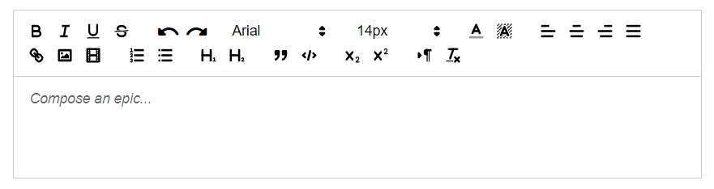

# Rich Editor

This is a component for Backendless [UI-Builder](https://backendless.com/developers/#ui-builder) designer based on the
[Quill](https://quilljs.com/) library.

The component allows rich text editing and presents the user with a WYSIWYG editing area in your application.

<p align="center">
  
</p>

## Properties

| Property            | Type                                                                                                                 | Default value        | Logic           | Data Binding | UI Setting | Description                                 |
|---------------------|----------------------------------------------------------------------------------------------------------------------|----------------------|-----------------|--------------|------------|---------------------------------------------|
| Content             | *Text*                                                                                                               |                      | Content Logic   | YES          | YES        | controls the content of the editor          |
| Placeholder         | *Text*                                                                                                               | "Compose an epic..." |                 | NO           | YES        | controls the placeholder of the editor      |
| Toolbar Position    | *Select*  <br/> "top" \| "bottom"                                                                                    | "top"                |                 | NO           | YES        | controls the position of the editor toolbar |
| Fixed Toolbar       | *Checkbox*                                                                                                           | `true`               |                 | NO           | YES        | enables fixing the toolbar                  |
| Link Insert Button  | *Checkbox*                                                                                                           | `true`               |                 | NO           | YES        | enables inserting a link in the editor      |
| Image Insert Button | *Checkbox*                                                                                                           | `false`              |                 | NO           | YES        | enables inserting an image in the editor    |
| Video Insert Button | *Checkbox*                                                                                                           | `false`              |                 | NO           | YES        | enables inserting a video in the editor     |
| Read Only           | *Checkbox*                                                                                                           | `false`              | Read Only Logic | NO           | YES        | enables read-only content in the editor     |
| Editor Height       | *Text*                                                                                                               |                      |                 | NO           | YES        | controls the height of the editor           |
| Editor Min Height   | *Text*                                                                                                               |                      |                 | NO           | YES        | controls the minimal height of the editor   |
| Border Width        | *Text*                                                                                                               | "1px"                |                 | NO           | YES        | controls the width of the editor border     |
| Border Style        | *Select* <br/> "none" \| "solid" \| "dotted" \| "dashed" \| "double" \| "groove" \| "ridge" \| "inset" \| "outset"   | "solid"              |                 | NO           | YES        | controls the style of the editor border     |
| Border Color        | *Color*                                                                                                              |                      |                 | NO           | YES        | controls the color of the editor border     |

## Events

| Name                | Triggers                                         | Context Blocks                             |
|---------------------|--------------------------------------------------|--------------------------------------------|
| On Focus Event      | when the editor receives the focus               |                                            |
| On Blur Event       | when the editor loses the focus                  |                                            |
| On Text Change      | when the user changes the contents of the editor |                                            |

## Actions

| Action        | Inputs                            | Returns                               | Description                                                             |
|---------------|-----------------------------------|---------------------------------------|-------------------------------------------------------------------------|
| Get Text      | Index: `Number`, Length: `Number` | `String`                              | retrieves the string contents of the editor                             |
| Set Text      | Data: `String`                    |                                       | sets the contents of an editor with the given text                      |
| Get HTML      |                                   | `String`                              | retrieves the full HTML contents of the editor                          |
| Set HTML      | Data: `String`                    |                                       | inserts content represented by HTML snippet                             |
| Get Selection |                                   | { Index: `Number`, Length: `Number` } | returns the current selection range, or null if the editor is unfocused |
| Set Selection | Index: `Number`, Length: `Number` |                                       | sets the user selection to the given range                              |
| Get Length    |                                   | `Number`                              | retrieves the length of the editor contents                             |
| Delete Text   | Index: `Number`, Length: `Number` |                                       | deletes text from the editor                                            |
| Format        | Property: `String`, Value: any    |                                       | format text in the user’s current selection                             |
| Blur          |                                   |                                       | removes focus from the editor                                           |
| Focus         |                                   |                                       | focuses the editor and restores its last range                          |

## Styles

**Theme**

````
@bl-customComponent-richEditor-themeColor: @themePrimary;
@bl-customComponent-richEditor-backgroundColor: @appBackgroundColor;
@bl-customComponent-richEditor-textColor: @appTextColor;
@bl-customComponent-richEditor-disabledColor: @disabledColor;
````

**General**

````
@bl-customComponent-richEditor-button-color: @bl-customComponent-richEditor-themeColor;
@bl-customComponent-richEditor-editor-placeholder-color: fade(@bl-customComponent-richEditor-textColor, 60%);
````

**Dimensions**

````
@bl-customComponent-richEditor-editor-height: auto;
````

**Typography**

````
@bl-customComponent-richEditor-editor-fontSize: 14px;
@bl-customComponent-richEditor-editor-fontFamily: Arial, sans-serif;
````

**Decoration**

````
@bl-customComponent-richEditor-editor-borderWidth: 0px;
@bl-customComponent-richEditor-toolbar-borderWidth: 0px;
@bl-customComponent-richEditor-borderWidth: 0px;
@bl-customComponent-richEditor-borderStyle: solid;
@bl-customComponent-richEditor-borderColor: #ccc;
@bl-customComponent-richEditor-border: @bl-customComponent-richEditor-borderWidth @bl-customComponent-richEditor-borderStyle @bl-customComponent-richEditor-borderColor;
@bl-customComponent-richEditor-toolbar-defaultContent-fontSize: "14px";
@bl-customComponent-richEditor-toolbar-defaultContent-font: "Arial";
````
