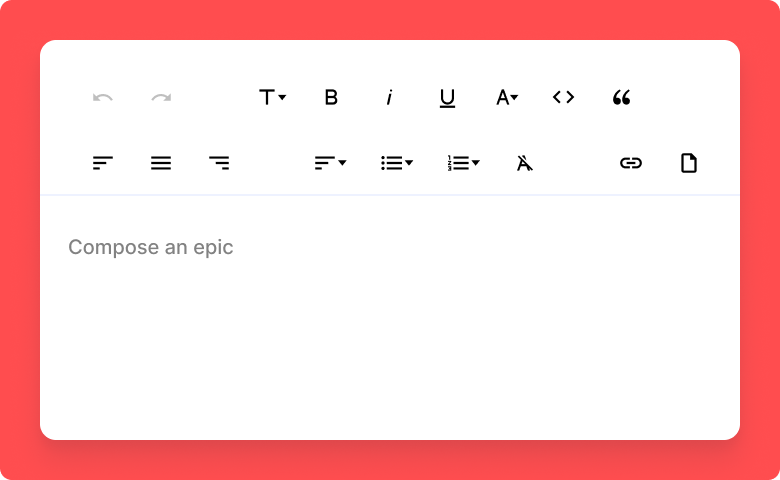
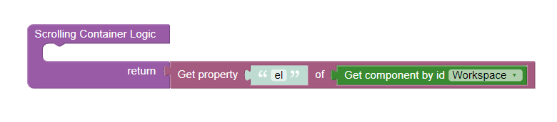

# Rich Editor

This is a component for Backendless [UI-Builder](https://backendless.com/developers/#ui-builder) designer based on the
[Quill](https://quilljs.com/) library.

The component allows rich text editing and presents the user with a WYSIWYG editing area in your application.

<p align="center">
  
</p>

## Properties

| Property                | Type                                                                                                                                                                                                                                         | Default value        | Logic                     | Data Binding | UI Setting | Description                                                                                                                                                                     |
|-------------------------|----------------------------------------------------------------------------------------------------------------------------------------------------------------------------------------------------------------------------------------------|----------------------|---------------------------|--------------|------------|---------------------------------------------------------------------------------------------------------------------------------------------------------------------------------|
| Content                 | *Text*                                                                                                                                                                                                                                       |                      | Content Logic             | YES          | YES        | Controls the content of the editor.                                                                                                                                             |
| Placeholder             | *Text*                                                                                                                                                                                                                                       | "Compose an epic..." | Placeholder Logic         | YES          | YES        | Controls the placeholder of the editor.                                                                                                                                         |
| Toolbar Position        | *Select*  <br/> "top" \| "bottom"                                                                                                                                                                                                            | "top"                |                           | NO           | YES        | Controls the position of the editor toolbar.                                                                                                                                    |
| Fixed Toolbar           | *Checkbox*                                                                                                                                                                                                                                   | `true`               |                           | NO           | YES        | Enables fixing the toolbar.                                                                                                                                                     |
| Show Tooltips           | *Checkbox*                                                                                                                                                                                                                                   | `true`               |                           | NO           | YES        | Enables tooltips on the toolbar buttons.                                                                                                                                        |
| Read Only               | *Checkbox*                                                                                                                                                                                                                                   | `false`              | Read Only Logic           | NO           | YES        | Enables read-only content in the editor.                                                                                                                                        |
| Editor Height           | *Text*                                                                                                                                                                                                                                       |                      |                           | NO           | YES        | Controls the height of the editor.                                                                                                                                              |
| Editor Min Height       | *Text*                                                                                                                                                                                                                                       |                      |                           | NO           | YES        | Controls the minimal height of the editor.                                                                                                                                      |
| Scrolling Container     | *Text*                                                                                                                                                                                                                                       |                      | Scrolling Container Logic | NO           | YES        | Specifies DOM Element or a CSS selector, indicating which container is scrolling. Watch [Codeless Examples](#codeless-examples). Specify only if the editor height isn't fixed. |
| Border Width            | *Text*                                                                                                                                                                                                                                       | "1px"                |                           | NO           | YES        | Controls the width of the editor border.                                                                                                                                        |
| Border Style            | *Select* <br/> "none" \| "solid" \| "dotted" \| "dashed" \| "double" \| "groove" \| "ridge" \| "inset" \| "outset"                                                                                                                           | "solid"              |                           | NO           | YES        | Controls the style of the editor border.                                                                                                                                        |
| Border Color            | *Color*                                                                                                                                                                                                                                      |                      |                           | NO           | YES        | Controls the color of the editor border.                                                                                                                                        |
| Link Insert Button      | *Checkbox*                                                                                                                                                                                                                                   | `true`               |                           | NO           | YES        | Enables inserting a link in the editor.                                                                                                                                         |
| Image Insert Button     | *Checkbox*                                                                                                                                                                                                                                   | `true`               |                           | NO           | YES        | Enables inserting an image in the editor.                                                                                                                                       |
| Video Insert Button     | *Checkbox*                                                                                                                                                                                                                                   | `true`               |                           | NO           | YES        | Enables inserting a video in the editor.                                                                                                                                        |
| Font Style Buttons      | *Checkbox*                                                                                                                                                                                                                                   | `true`               |                           | NO           | YES        | Enables showing buttons that allow the user to make text bold, italic, underlined, or crossed out in the editor.                                                                |
| History Buttons         | *Checkbox*                                                                                                                                                                                                                                   | `true`               |                           | NO           | YES        | Enables showing undo and redo buttons in the editor.                                                                                                                            |
| Font Select             | *Checkbox*                                                                                                                                                                                                                                   | `true`               |                           | NO           | YES        | Enables showing select that allows the user to specify the font in the editor.                                                                                                  |
| Font Size Select        | *Checkbox*                                                                                                                                                                                                                                   | `true`               |                           | NO           | YES        | Enables showing select that allows the user to specify the font size in the editor.                                                                                             |
| Text Color Picker       | *Checkbox*                                                                                                                                                                                                                                   | `true`               |                           | NO           | YES        | Enables showing picker that allows the user to specify the text color in the editor.                                                                                            |
| Background Color Picker | *Checkbox*                                                                                                                                                                                                                                   | `true`               |                           | NO           | YES        | Enables showing picker that allows the user to specify the background color in the editor.                                                                                      |
| Alignment Buttons       | *Checkbox*                                                                                                                                                                                                                                   | `true`               |                           | NO           | YES        | Enables showing buttons that allow the user to specify the text alignment in the editor.                                                                                        |
| List Buttons            | *Checkbox*                                                                                                                                                                                                                                   | `true`               |                           | NO           | YES        | Enables showing buttons that allow the user to create lists in the editor.                                                                                                      |
| Script Buttons          | *Checkbox*                                                                                                                                                                                                                                   | `true`               |                           | NO           | YES        | Enables showing buttons that allow the user to make text subscript or superscript in the editor.                                                                                |
| Text Block Buttons      | *Checkbox*                                                                                                                                                                                                                                   | `true`               |                           | NO           | YES        | Enables showing buttons that allow the user to format text as a quote or code in the editor.                                                                                    |
| Heading Buttons         | *Checkbox*                                                                                                                                                                                                                                   | `true`               |                           | NO           | YES        | Enables showing buttons that allow the user to format text as section headings in the editor.                                                                                   |
| Text Direction Button   | *Checkbox*                                                                                                                                                                                                                                   | `true`               |                           | NO           | YES        | Enables showing button that allows the user to specify the text direction in the editor.                                                                                        |
| Clear Formatting Button | *Checkbox*                                                                                                                                                                                                                                   | `true`               |                           | NO           | YES        | Enables showing button that allows the user to remove all formatting in the editor.                                                                                             |
| Default Font Family     | *Select* <br/> "Arial" \| "Comic Sans MS" \| "Courier New" \| "Georgia" \| "Helvetica" \| "Lucida Sans Unicode" \| "Andale Mono" \| "Book Antiqua" \| "Impact" \| "Tahoma" \| "Terminal" \| "Times New Roman" \| "Trebuchet Ms" \| "Verdana" | "Arial"              |                           | NO           | YES        | Controls the default font family of the editor.                                                                                                                                 |
| Default Font Size       | *Select* <br/> "8px" \| "9px" \| "10px" \| "11px" \| "12px" \| "14px" \| "16px" \| "18px" \| "20px" \| "22px" \| "24px" \| "26px" \| "28px" \| "36px" \| "48px"                                                                              | "14px"               |                           | NO           | YES        | Controls the default font size of the editor.                                                                                                                                   |

## Events

| Name                | Triggers                                         | Context Blocks                             |
|---------------------|--------------------------------------------------|--------------------------------------------|
| On Focus Event      | when the editor receives the focus               |                                            |
| On Blur Event       | when the editor loses the focus                  |                                            |
| On Text Change      | when the user changes the contents of the editor |                                            |

## Actions

| Action                               | Inputs                            | Returns                               | Description                                                             |
|--------------------------------------|-----------------------------------|---------------------------------------|-------------------------------------------------------------------------|
| Get Text from Rich Editor            | Index: `Number`, Length: `Number` | `String`                              | retrieves the string contents of the editor                             |
| Set Text for Rich Editor             | Text: `String`                    |                                       | sets the contents of an editor with the given text                      |
| Get HTML from Rich Editor            |                                   | `String`                              | retrieves the full HTML contents of the editor                          |
| Set HTML for Rich Editor             | Content: `String`                 |                                       | inserts content represented by HTML snippet                             |
| Get Selection Range from Rich Editor |                                   | { Index: `Number`, Length: `Number` } | returns the current selection range, or null if the editor is unfocused |
| Set Selection Range in Rich Editor   | Index: `Number`, Length: `Number` |                                       | sets the user selection to the given range                              |
| Get Length Property from Rich Editor |                                   | `Number`                              | retrieves the length of the editor contents                             |
| Delete Text from Rich Editor         | Index: `Number`, Length: `Number` |                                       | deletes text from the editor                                            |
| Format Rich Editor                   | Property: `String`, Value: any    |                                       | format text in the user’s current selection                             |
| Blur Rich Editor                     |                                   |                                       | removes focus from the editor                                           |
| Focus Rich Editor                    |                                   |                                       | focuses the editor and restores its last range                          |

## Styles

**Theme**

````
@bl-customComponent-richEditor-themeColor: @themePrimary;
@bl-customComponent-richEditor-backgroundColor: @appBackgroundColor;
@bl-customComponent-richEditor-textColor: @appTextColor;
@bl-customComponent-richEditor-disabledColor: @disabledColor;
````

**General**

````
@bl-customComponent-richEditor-button-color: @bl-customComponent-richEditor-themeColor;
@bl-customComponent-richEditor-editor-placeholder-color: fade(@bl-customComponent-richEditor-textColor, 60%);
@bl-customComponent-richEditor-toolbar-tooltip-backgroundColor: #000000;
@bl-customComponent-richEditor-toolbar-tooltip-textColor: #ffffff;
@bl-customComponent-richEditor-toolbar-tooltip-position-bottom: -120%;
@bl-customComponent-richEditor-toolbar-tooltip-position-left: -5px;
@bl-customComponent-richEditor-toolbar-tooltip-zIndex: 9999;
````

**Dimensions**

````
@bl-customComponent-richEditor-editor-image-width: auto;
@bl-customComponent-richEditor-editor-image-height: auto;
@bl-customComponent-richEditor-editor-video-width: auto;
@bl-customComponent-richEditor-editor-video-height: auto;
@bl-customComponent-richEditor-editor-height: auto;
@bl-customComponent-richEditor-toolbar-fontPicker-label-paddingRight: 18px;
@bl-customComponent-richEditor-toolbar-tooltip-padding: 0.5em;
````

**Typography**

````
@bl-customComponent-richEditor-editor-fontSize: 14px;
@bl-customComponent-richEditor-editor-fontFamily: Arial, sans-serif;
@bl-customComponent-richEditor-toolbar-tooltip-fontSize: 12px;
````

**Decoration**

````
@bl-customComponent-richEditor-editor-borderWidth: 0px;
@bl-customComponent-richEditor-toolbar-borderWidth: 0px;
@bl-customComponent-richEditor-borderWidth: 0px;
@bl-customComponent-richEditor-borderStyle: solid;
@bl-customComponent-richEditor-borderColor: #ccc;
@bl-customComponent-richEditor-border: @bl-customComponent-richEditor-borderWidth @bl-customComponent-richEditor-borderStyle @bl-customComponent-richEditor-borderColor;
@bl-customComponent-richEditor-toolbar-tooltip-borderRadius: 0.4em;
````

**Tooltips**

````
@bl-customComponent-richEditor-toolbar-tooltip-bold: "Bold";
@bl-customComponent-richEditor-toolbar-tooltip-italic: "Italic";
@bl-customComponent-richEditor-toolbar-tooltip-underline: "Underline";
@bl-customComponent-richEditor-toolbar-tooltip-strike: "Strikethrough";
@bl-customComponent-richEditor-toolbar-tooltip-redo: "Redo";
@bl-customComponent-richEditor-toolbar-tooltip-undo: "Undo";
@bl-customComponent-richEditor-toolbar-tooltip-font: "Font";
@bl-customComponent-richEditor-toolbar-tooltip-size: "Font size";
@bl-customComponent-richEditor-toolbar-tooltip-color: "Text color";
@bl-customComponent-richEditor-toolbar-tooltip-background: "Background color";
@bl-customComponent-richEditor-toolbar-tooltip-left: "Left align";
@bl-customComponent-richEditor-toolbar-tooltip-center: "Center align";
@bl-customComponent-richEditor-toolbar-tooltip-right: "Right align";
@bl-customComponent-richEditor-toolbar-tooltip-justify: "Justify";
@bl-customComponent-richEditor-toolbar-tooltip-link: "Insert link";
@bl-customComponent-richEditor-toolbar-tooltip-image: "Insert image";
@bl-customComponent-richEditor-toolbar-tooltip-video: "Insert video";
@bl-customComponent-richEditor-toolbar-tooltip-list-ordered: "Numbered list";
@bl-customComponent-richEditor-toolbar-tooltip-list-bullet: "Bulleted list";
@bl-customComponent-richEditor-toolbar-tooltip-heading-1: "Heading 1";
@bl-customComponent-richEditor-toolbar-tooltip-heading-2: "Heading 2";
@bl-customComponent-richEditor-toolbar-tooltip-blockquote: "Quote";
@bl-customComponent-richEditor-toolbar-tooltip-code-block: "Code";
@bl-customComponent-richEditor-toolbar-tooltip-script-sub: "Subscript";
@bl-customComponent-richEditor-toolbar-tooltip-script-super: "Superscript";
@bl-customComponent-richEditor-toolbar-tooltip-direction: "Text direction";
@bl-customComponent-richEditor-toolbar-tooltip-clean: "Clear formatting";
````

## Codeless Examples

Below is a Codeless Example highlighting how to specify Scrolling Container property:

<p align="center">
  
</p>
