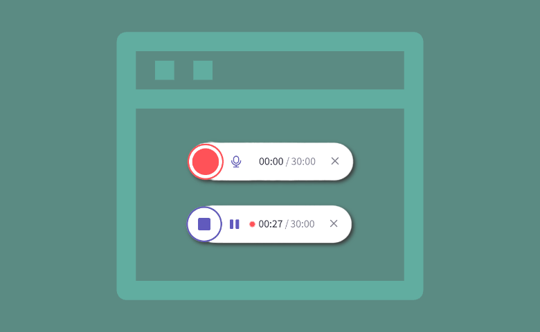

# Video Recorder

Video Recorder is a component of Backendless UI-Builder designer. This allows to record screen and use the recorded file.


<p align="center">
  
</p>

## Properties

| Property                | Type                                                       | Default Value       | Logic           | Data Binding | UI Setting | Description                                                  |
|-------------------------|------------------------------------------------------------|---------------------|-----------------|--------------|------------|--------------------------------------------------------------|
| Width                   | *Text*                                                     | '720px'             | Width Logic     | YES          | YES        | This is a handler to control width of component.             |
| Height                  | *Text*                                                     | '480px'             | Height Logic    | YES          | YES        | This is a handler to control height of component.            |
| Allow Audio             | *Checkbox*                                                 | `true`              |                 | NO           | YES        | Controls allow recording audio from screen, page, etc.       |
| File Name               | *Text*                                                     | "Recorded Video"    | File Name Logic | YES          | YES        | This is a handler to control the name of the downloaded file.|
| File Type               | *Select* <br/>[`webm`, `mp4`, `mov`, `wmv`, `avi`, `mkv` ] | 'webm'              |                 | NO           | YES        | Controls type of recorded file.                              |
| Start Button Content    | *Text*                                                     | 'Start Record'      |                 | NO           | YES        | Controls the Start Button text.                              |
| Stop Button Content     | *Text*                                                     | 'Stop Record'       |                 | NO           | YES        | Controls the Stop Button text.                               |
| Download Button Content | *Text*                                                     | 'Download Recorded' |                 | NO           | YES        | Controls the Download Button text.                           |

## Events

| Name               | Triggers                                  | Context Blocks                                                                                     |
|--------------------|-------------------------------------------|----------------------------------------------------------------------------------------------------|
| On Start Recording | When the recording is started             |                                                                                                    |
| On Stop Recording  | When the recording is stopped             |                                                                                                    |
| On Download file   | When the recorded file starts downloading | [Blob](https://developer.mozilla.org/en-US/docs/Web/API/Blob) File: `{size: Number, type: String}` |

## Actions

| Action                                   | Inputs                     | Returns               |
|------------------------------------------|----------------------------|-----------------------|
| Start record of Video Recorder           |                            |                       |
| Stop record of Video Recorder            |                            |                       |
| Download recorded file of Video Recorder |                            |                       |
| Get Blob of Video Recorder               |                            | `Blob`: recorded blob |

## Styles

**Theme**
````
@bl-customComponent-screenRecorder-button-backgroundColor: @themePrimary;
@bl-customComponent-screenRecorder-button-disabled: @disabledColor;
@bl-customComponent-screenRecorder-button-borderRadius: @appComponentBorderRadius;
@bl-customComponent-screenRecorder-button-color: @appTextColor;
@bl-customComponent-screenRecorder-button-shadowColor: @appComponentShadowColor;
@bl-customComponent-screenRecorder-button-shadowHover: 0px 2px 4px -1px fade(@bl-customComponent-screenRecorder-button-shadowColor, 20%), 0px 4px 5px 0px fade(@bl-customComponent-screenRecorder-button-shadowColor, 14%), 0px 1px 10px 0px fade(@bl-customComponent-screenRecorder-button-shadowColor, 12%);
@bl-customComponent-screenRecorder-button-shadow: 0px 3px 1px -2px fade(@bl-customComponent-screenRecorder-button-shadowColor, 20%), 0px 2px 2px 0px fade(@bl-customComponent-screenRecorder-button-shadowColor, 14%), 0px 1px 5px 0px fade(@bl-customComponent-screenRecorder-button-shadowColor, 12%);
@bl-customComponent-screenRecorder-button-disaled-background: @bl-customComponent-screenRecorder-button-disabled;
@bl-customComponent-screenRecorder-button-disabled-color: contrast(@bl-customComponent-screenRecorder-button-disaled-background);
````

**Other**
````
@bl-customComponent-screenRecorder-button-fontSize: 0.875rem;
@bl-customComponent-screenRecorder-button-borderType: solid;
@bl-customComponent-screenRecorder-button-borderWidth: 0px;
````

**Color**
````
@bl-customComponent-videoRecorder-video-background: black;
````

