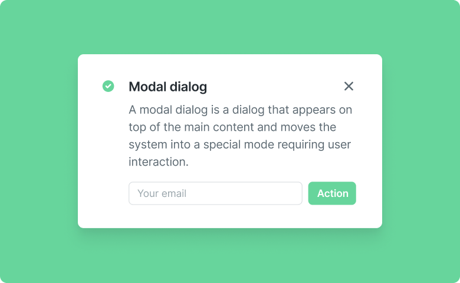

# Simple Modal

Simple Modal is a designer component of Backendless UI-Builder. This allows you to add a modal dialog box. You can add "Alert" to notify you about certain information. You can add "Prompt" to get information from the user. You can add "Confirm" to get confirmation at user for some actions.

The component based on external [Simple Modal](https://mui.com/material-ui/react-dialog/).

<p align="center">
  
</p>

## Properties

| Property          | Type                                  | Default Value | Logic               | Data Binding | UI Setting | Description                                                             |
|-------------------|---------------------------------------|---------------|---------------------|--------------|------------|-------------------------------------------------------------------------|
| title             | Text                                  |               | Title Logic         | YES          | YES        | Allows write title for Simple Modal.                                    |
| content           | Text                                  |               | Content Logic       | YES          | YES        | Allows write content for Simple Modal.                                  |
| closeButtonLabel  | Text                                  | "Close"       | Close Button Label  | YES          | YES        | Allows to write label for close button. Default value "Close".          |
| submitButtonLabel | Text                                  | "Submit"      | Submit Button Label | YES          | YES        | Allows to write label for Submit Button. Default value "Submit".        |
| type              | Select ["alert", "prompt", "confirm"] | "alert"       |                     | NO           | YES        | Allows select type of Simple Modal ("alert", "prompt", "confirm").      |
| placeholder       | Text                                  |               | Placeholder Logic   | YES          | YES        | Allows to write text for input placeholder.                             |
| closingDuration   | Number                                | 100           |                     | NO           | YES        | Allows to specify speed animation opening and closing for Simple Modal. |

## Events

| Name                  | Triggers                             | Context Blocks        |
|-----------------------|--------------------------------------|-----------------------|
| On Close              | when the user click on close button  |                       |
| On Submit             | when the user click on submit button | Input Value: `String` |
| On Input Value Change | when the input value change          | Input Value: `String` |

## Actions

| Action | Inputs | Returns |
|--------|--------|---------|
| Open   |        |         |
| Close  |        |         |

## Styles

**Theme**
```
@bl-customComponent-simple-modal-themeColor: @themePrimary;
@bl-customComponent-simple-modal-backgroundColor: @appBackgroundColor;
@bl-customComponent-simple-modal-textColor: @appTextColor;
```

**General**
```
@bl-customComponent-simple-modal-font-family: inherit;
@bl-customComponent-simple-modal-max-width: 600px;
@bl-customComponent-simple-modal-min-width: 300px;
@bl-customComponent-simple-modal-z-index: 1000;
@bl-customComponent-simple-modal-open-animation: modal-open linear forwards;
@bl-customComponent-simple-modal-close-animation: modal-close linear forwards;
```

**Content**
```
@bl-customComponent-simple-modal-content-padding: 16px 20px 8px;
@bl-customComponent-simple-modal-content-border-radius: 3px;
```

**Title**
```
@bl-customComponent-simple-modal-title-margin: 0;
@bl-customComponent-simple-modal-title-padding: 0 0 16px;
@bl-customComponent-simple-modal-title-font-size: 1.25rem;
@bl-customComponent-simple-modal-title-font-weight: 500;
```

**Text**
```
@bl-customComponent-simple-modal-text-margin: 0;
@bl-customComponent-simple-modal-text-font-size: 1rem;
@bl-customComponent-simple-modal-text-font-weight: 400;
@bl-customComponent-simple-modal-text-opacity: 0.6;
```

**Button**
```
@bl-customComponent-simple-modal-buttonColor: @bl-customComponent-simple-modal-themeColor;
@bl-customComponent-simple-modal-button-backgroundColor: transparent;
@bl-customComponent-simple-modal-button-backgroundColorHover: fade(@bl-customComponent-simple-modal-themeColor, 4%);
@bl-customComponent-simple-modal-button-borderRadius: 4px;
@bl-customComponent-simple-modal-button-margin: 0;
@bl-customComponent-simple-modal-button-border: 0;
@bl-customComponent-simple-modal-button-outline: 0;
@bl-customComponent-simple-modal-button-padding: 6px 8px;
@bl-customComponent-simple-modal-button-font-size: 0.875rem;
@bl-customComponent-simple-modal-button-font-weight: 500;
@bl-customComponent-simple-modal-button-text-transform: uppercase;
@bl-customComponent-simple-modal-button-transition: background-color 250ms cubic-bezier(0.4, 0, 0.2, 1) 0ms;
```

**Input**
```
@bl-customComponent-simple-modal-input-background-color: transparent;
@bl-customComponent-simple-modal-input-border-bottom: 1px solid gray;
@bl-customComponent-simple-modal-input-border-bottom-focus: 2px solid @bl-customComponent-simple-modal-themeColor;
@bl-customComponent-simple-modal-input-border-width-hover: 3px;
@bl-customComponent-simple-modal-input-border-bottom-transition: 0.3s;
@bl-customComponent-simple-modal-input-font-size: 1.25rem;
@bl-customComponent-simple-modal-input-font-weight: 400;
```

**Placeholder**
```
@bl-customComponent-simple-modal-placeholder-color: gray;
@bl-customComponent-simple-modal-placeholder-font-size: 1rem;
@bl-customComponent-simple-modal-placeholder-font-weight: 400;
@bl-customComponent-simple-modal-placeholder-transition: 0.3s;
@bl-customComponent-simple-modal-placeholder-input-focused-font-size: 0.8rem;
```
