# Skeleton

Skeleton is a designer component of Backendless UI-Builder. This allows you to add a skeleton element to display that
data loading.

The component based on external [Skeleton](https://mui.com/material-ui/react-skeleton/).

<p align="center">
 
</p>


## Demo

View an example of how to install this component and how it works in your UI [here](https://app.arcade.software/share/GX051gxf7rUKwE0Bt5SP).

## Properties

| Property               | Type                                                                                        | Default Value      | Logic        | Data Binding | UI Setting | Description                                                                       |
|------------------------|---------------------------------------------------------------------------------------------|--------------------|--------------|--------------|------------|-----------------------------------------------------------------------------------|
| Variant: `variant`     | Select [Text: `text`, Circular: `circular`, Rectangular: `rectangular`, Rounded: `rounded`] | Text: `text`       |              | NO           | YES        | Allows select variant of skeleton ("text", "circular", "rectangular", "rounded"). |
| Width: `width`         | Text                                                                                        |                    | Width Logic  | YES          | YES        | Allows to determinate width for skeleton.                                         |
| Height: `height`       | Text                                                                                        |                    | Height Logic | YES          | YES        | Allows determinate height for skeleton.                                           |
| Margin: `margin`       | Text                                                                                        |                    | Margin Logic | YES          | YES        | Allows to determinate margin for skeleton.                                        |
| Animation: `animation` | Select [Default: `default`, Wave: `wave`, None: `none`]                                     | Default: `default` |              | NO           | YES        | Allows select animation of skeleton ("default", "wave", "none").                  |

## Styles

**Colors**

````
@bl-customComponent-skeleton-background-color: if((luma(@appBackgroundColor) > 50%), rgba(0, 0, 0, 0.11), rgba(255, 255, 255, 0.11));
@bl-customComponent-skeleton-background-color-wave: if((luma(@appBackgroundColor) > 50%), rgba(0, 0, 0, 0.04), rgba(255, 255, 255, 0.04));
````

## Usage Guide

For example, we made a skeleton for a card:

1. We have the card with an image, title, and description. By default, block hidden

   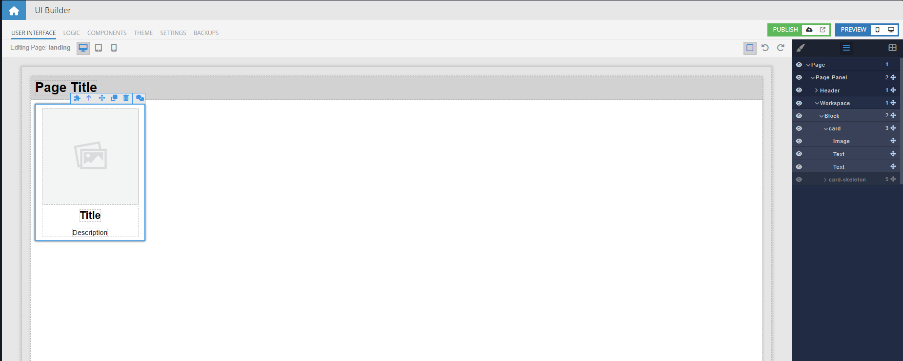
   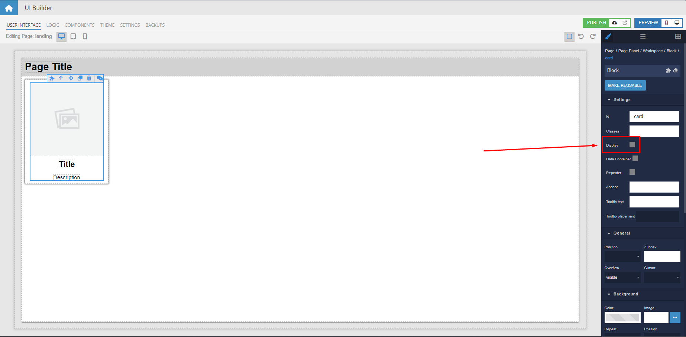

2. We imitate loading data in On Before Page Enter

   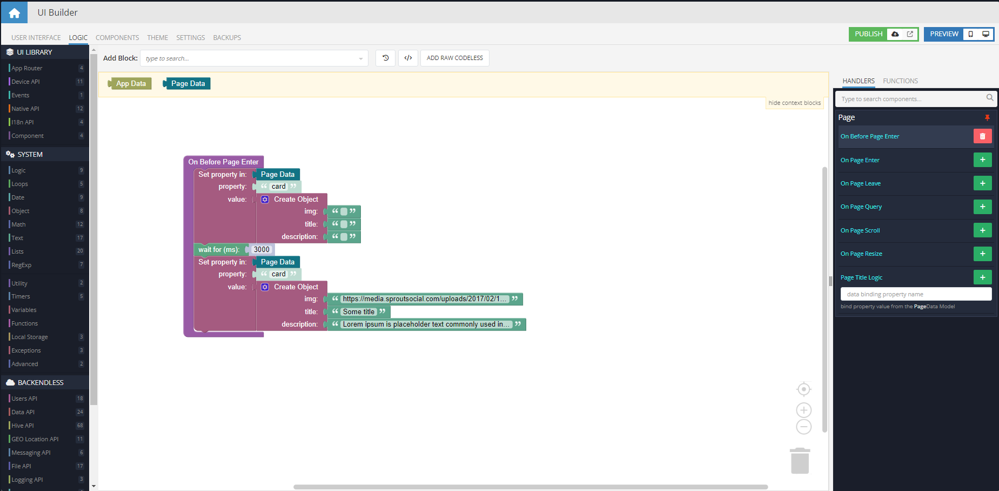

3. Now bind over data with image, title, and description

   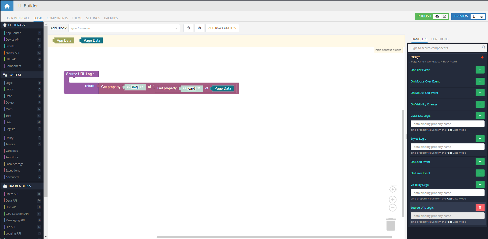

4. Now we build over the skeleton layout like for the card

   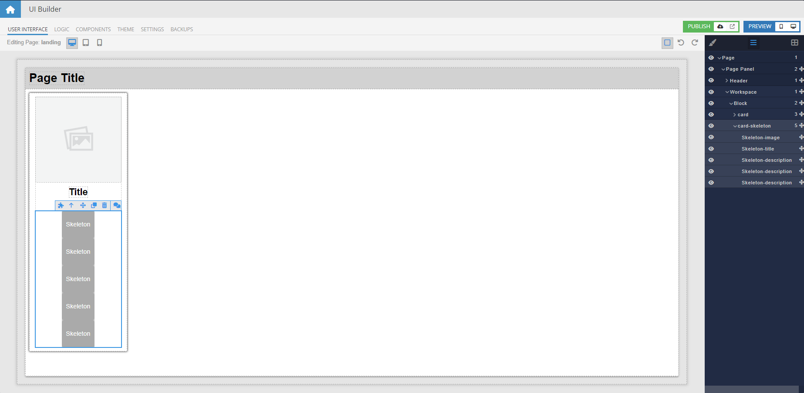
   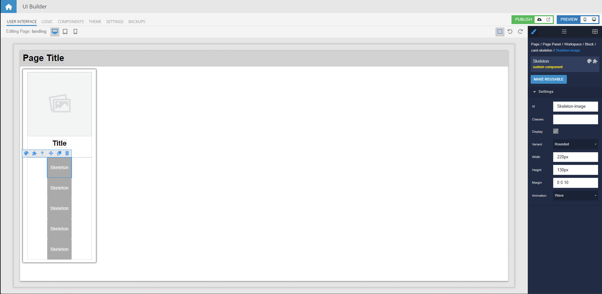
   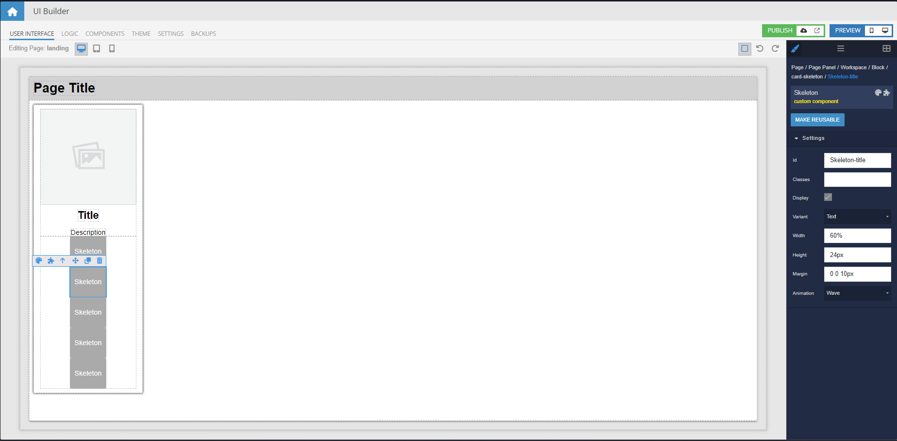
   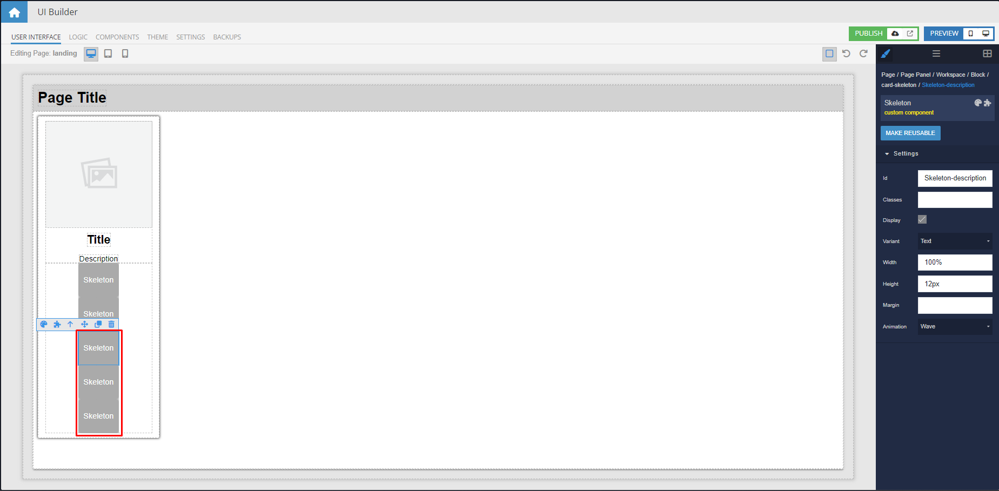

5. After loading our data, we must hide the skeleton and display a card. Can do this in some "loaded" events or check if
   data is loaded in logic

   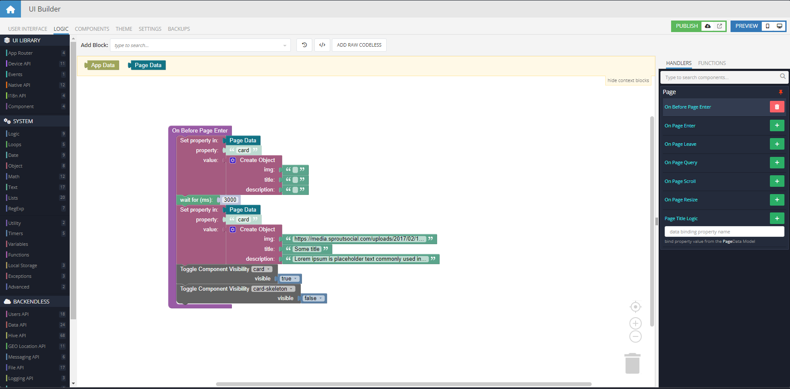

6. Result, data loading/data loaded

   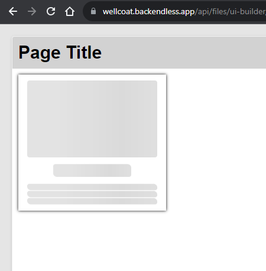
   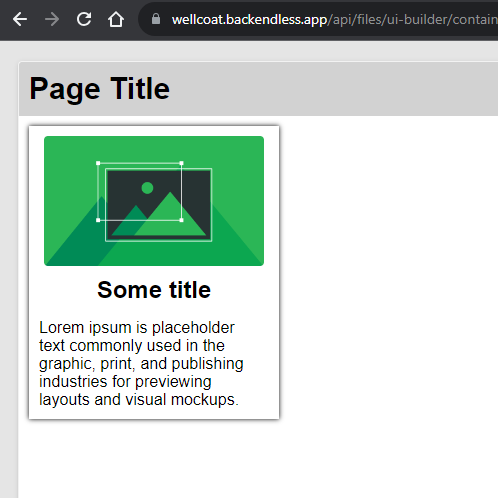
