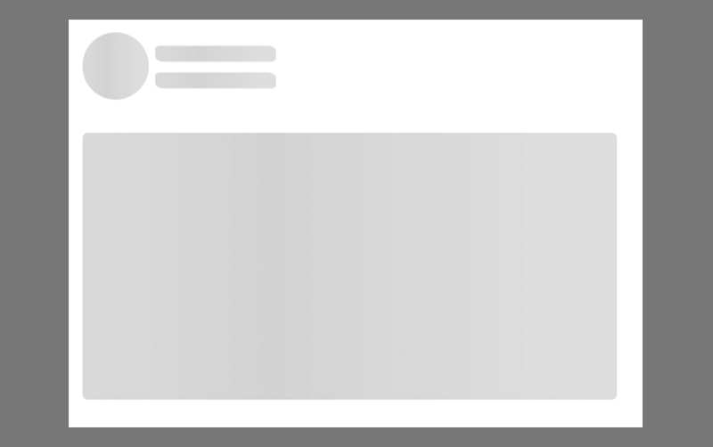

# Skeleton

Skeleton is a designer component of Backendless UI-Builder. This allows you to add a skeleton element to display that data loading.

The component based on external [Skeleton](https://mui.com/material-ui/react-skeleton/).

<p align="center">
 
</p>

## Properties

| Property  | Type   | Default Value | Logic        | Data Binding | UI Setting | Description                                                                       |
|-----------|--------|---------------|--------------|--------------|------------|-----------------------------------------------------------------------------------|
| Variant   | Select | "text"        |              | NO           | YES        | Allows select variant of skeleton ("text", "circular", "rectangular", "rounded"). |
| Height    | String | "0px"         | Height Logic | YES          | YES        | Allows determinate height for skeleton.                                           |
| Width     | String | "0px"         | Width Logic  | YES          | YES        | Allows to determinate width for skeleton.                                         |
| Animation | Select | "default"     |              | NO           | YES        | Allows select animation of skeleton ("default", "wave", "none").                  |


## Styles

**Colors**
````
@bl-customComponent-skeleton-background-color: if((luma(@appBackgroundColor) > 50%), rgba(0, 0, 0, 0.11), rgba(255, 255, 255, 0.11));
@bl-customComponent-skeleton-background-color-wave: if((luma(@appBackgroundColor) > 50%), rgba(0, 0, 0, 0.04), rgba(255, 255, 255, 0.04));
````
