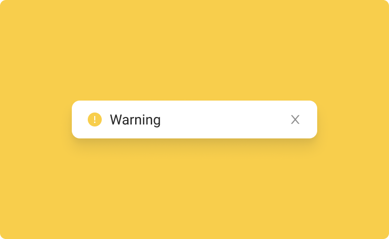

# Snackbar

This is a component for Backendless [UI-Builder](https://backendless.com/developers/#ui-builder) designer based on the [Snackbar](https://mui.com/material-ui/react-snackbar/) component.

Snackbars provide brief notifications. Snackbars inform users of a process that an app has performed or will perform.
They appear temporarily, towards the edge or corner of the screen. They shouldn't interrupt the user experience, and
they don't require user input to disappear.

<p align="center">
  
</p>

## Properties

| Property           | Type                                                              | Default value   | Logic                  | Data Binding | UI Setting | Description                                                        |
|--------------------|-------------------------------------------------------------------|-----------------|------------------------|--------------|------------|--------------------------------------------------------------------|
| showClose          | *checkbox*                                                        | `true`          |                        | NO           | YES        | This is a handler that controls visibility of the close button.    |
| showAction         | *checkbox*                                                        | `false`         |                        | NO           | YES        | This is a handler that controls visibility of the action button.   |
| actionContent      | *text*                                                            | 'Action'        | Action Content Logic   | YES          | YES        | This is a handler to set the text of the action button.            |
| snackContent       | *text*                                                            | 'Snackbar Info' | Snackbar Content Logic | YES          | YES        | This is a handler to set the text of the snackbar.                 |
| autoHide           | *checkbox*                                                        | `false`         |                        | NO           | YES        | This is a handler that controls autohiding.                        |
| autoHideDuration   | *number*                                                          | 5000            |                        | NO           | YES        | This is a handler that sets the time when snackbar will be hidden. |
| verticalPosition   | *select* <br/>[`top`, `center`, `bottom`]                         | 'top'           |                        | NO           | YES        | This is a handler that sets the vertical position of snackbar.     |
| horizontalPosition | *select* <br/>[`right`, `center`, `left`]                         | 'right'         |                        | NO           | YES        | This is a handler that sets the horizontal position of snackbar.   |
| type               | *select* <br/> [`default`, `info`, `success`, `warning`, `error`] | 'default'       | Type Logic             | YES          | YES        | This is a handler to set the type of the snackbar.                 |
| maxSnacks          | *number*                                                          | 3               |                        | NO           | YES        | This is a handler to set the number of maximum visible snackbars.  |

## Events

| Name      | Triggers                                  | Context Blocks |
|-----------|-------------------------------------------|----------------|
| On Close  | when the user clicks on the close button  |                |
| On Action | when the user clicks on the action button |                |

## Actions

| Action | Inputs                                                                                                                                                       | Returns |
|--------|--------------------------------------------------------------------------------------------------------------------------------------------------------------|---------|
| Create | Show Close Button: `Boolean` <br/> Show Action Button: `Boolean` <br/> Action Button Content: `String` <br/> Snackbar Content: `String` <br/> Type: `String` |         |

## Styles

**Theme**
````
@bl-customComponent-snackBar-background-color: @themePrimary;
@bl-customComponent-snackBar-text-color: contrast(@themePrimary);
````

**Dimensions**
````
@bl-customComponent-distance: 15px;
````

**Colors**
````
@bl-customComponent-snackBar-success-background-color: #4e9a51;
@bl-customComponent-snackBar-success-color-text: contrast(@themePrimary);
@bl-customComponent-snackBar-info-background-color: #1e95d6;
@bl-customComponent-snackBar-info-color-text: contrast(@themePrimary);
@bl-customComponent-snackBar-warning-background-color: #f68a1c;
@bl-customComponent-snackBar-warning-color-text: contrast(@themePrimary);
@bl-customComponent-snackBar-error-background-color: #d84646;
@bl-customComponent-snackBar-error-color-text: contrast(@themePrimary);
````
