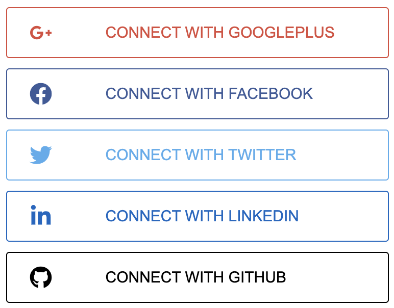

# Social Login Button

Social Login Button is a component of Backendless UI-Builder designer. The component is designed for quick login. For the correct work of the component, you need to configure the social network provider, you can do this by going to Backend => Users => Login Providers. Also, if you want to watch the tutorial, you can [follow the link,](https://www.youtube.com/watch?v=PVmXcQn-FxA&t=842s&ab_channel=Backendless) or go to [the documentation.](https://backendless.com/docs/js/users_oauth2.html)

<p align="center">
  
</p>

## Properties

| Property               | Type       | Default value | Logic                             | Data Binding | UI Setting | Description                                                                              |
|------------------------|------------|---------------|-----------------------------------|--------------|------------|------------------------------------------------------------------------------------------|
| Disabled               | *Checkbox* | `false`       | Disabled logic                    | YES          | YES        | This handler allows you to disable the component.                                        |
| Redirect To Page       | *Text*     |               | Redirect To Page Logic            | YES          | YES        | This handler allows you to specify which page to go to after login.                      |
| Extra Query Params     | *Text*     |               | Extra Query Params Logic          | YES          | YES        | This handler allows you to add extra query params that will be added to the URL address. |
| Icons Visibility       | *Checkbox* | `true`        | Icons Visibility Visibility Logic | YES          | YES        | This handler allows you to select the mode for a button with an icon or without.         |
| Google Plus Visibility | *Checkbox* | `true`        | Google Plus Visibility Logic      | YES          | YES        | This handler allows you to choose whether to show the Google Plus button or not.         |
| Facebook Visibility    | *Checkbox* | `true`        | Facebook Visibility Logic         | YES          | YES        | This handler allows you to choose whether to show the Facebook button or not.            |
| Twitter Visibility     | *Checkbox* | `true`        | Twitter Visibility Logic          | YES          | YES        | This handler allows you to choose whether to show the Twitter button or not.             |
| Linkedin Visibility    | *Checkbox* | `true`        | Linkedin Visibility Logic         | YES          | YES        | This handler allows you to choose whether to show the Linkedin button or not.            |
| Github Visibility      | *Checkbox* | `true`        | Github Visibility Logic           | YES          | YES        | This handler allows you to choose whether to show the Github button or not.              |

## Events

| Name                 | Triggers                                           | Context Blocks                        |
|----------------------|----------------------------------------------------|---------------------------------------|
| On Click Event       | when the user clicks the Social Login Button       | Login Type: `String`                  |
| On Login Fail        | when a login request returns an error              | Error: `String`                       |

## Styles

**Size**
````
@bl-customComponent-socialLoginButton-maxWidth: 375px;
@bl-customComponent-socialLoginButton-minWidth: 300px;
````

**Colors**
````
@bl-customComponent-socialLoginButton-colorOnHover: #FFFFFF;
@bl-customComponent-socialLoginButton-iconGoogle-colorPrimary: #DC4A3D;
@bl-customComponent-socialLoginButton-iconFacebook-colorPrimary: #3C5A9A;
@bl-customComponent-socialLoginButton-iconTwitter-colorPrimary: #55ACEE;
@bl-customComponent-socialLoginButton-iconLinkedin-colorPrimary: #0A66C2;
@bl-customComponent-socialLoginButton-iconGithub-colorPrimary: #000000;
````
