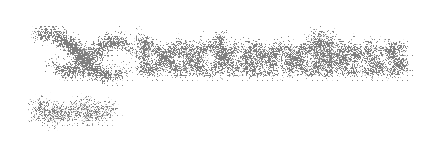

# Spoiler Effect

Spoiler Effect is the component that can be used in Backendless [UI-Builder](https://backendless.com/developers/#ui-builder). It allows you to create different spoiler effects above the content inside.

<p align="center">
  
</p>

## Properties

| Property                           | Type                                                                                                | Default value | Logic | Data Binding | UI Setting | Description                                           |
|------------------------------------|-----------------------------------------------------------------------------------------------------|---------------|-------|--------------|------------|-------------------------------------------------------|
| Effect <br> `effect`               | *Select* <br> [`blur`, `morphology`, `morphose`, `music`, `ripples`, `smoke`, `snow`, `turbulence`] | `blur`        |       | NO           | YES        | Controls the spoiler effect of the component.         |
| Background Color <br> `background` | *Color*                                                                                             | `#a5b3cd`     |       | NO           | YES        | Controls the background color for the spoiler effect. |
| Apply Effect <br> `applyEffect`    | *Checkbox*                                                                                          | `true`        |       | NO           | YES        | Controls whether a spoiler effect has been applied.   |

## Events

| Name           | Triggers                                          | Context Blocks  |
|----------------|---------------------------------------------------|-----------------|
| On Click       | when the user clicks on the component.            | Event: `Object` |
| On Mouse Enter | when the mouse pointer hovers over the component. |                 |
| On Mouse Move  | when the mouse pointer moves over the component.  |                 |
| On Mouse Leave | when the mouse pointer leaves the component.      |                 |

## Actions

| Action                | Inputs | Returns |
|-----------------------|--------|---------|
| Apply Spoiler Effect  |        |         |
| Remove Spoiler Effect |        |         |

## Styles

````
@bl-customComponent-spoiler-effect-width: 100%;
@bl-customComponent-spoiler-effect-align-items: center;
@bl-customComponent-spoiler-effect-justify-content: center;

@bl-customComponent-spoiler-effect-content-width: 100%;
@bl-customComponent-spoiler-effect-content-height: 100%;
@bl-customComponent-spoiler-effect-content-direction: column;
@bl-customComponent-spoiler-effect-content-transition: all 0.3s ease;
@bl-customComponent-spoiler-effect-content-blur: 8px;

@bl-customComponent-spoiler-effect-overlay-width: 100%;
@bl-customComponent-spoiler-effect-overlay-height: 100%;
````

## Usage

Add a component to the page, put the necessary content in it to apply the spoiler effect, select the desired effect, color to apply in the effect or its absence(using full transparency), and you can already look at the result.
Please note that in different effects the selected color will be displayed differently, or not taken into account (for example, the effect of turbulence).
