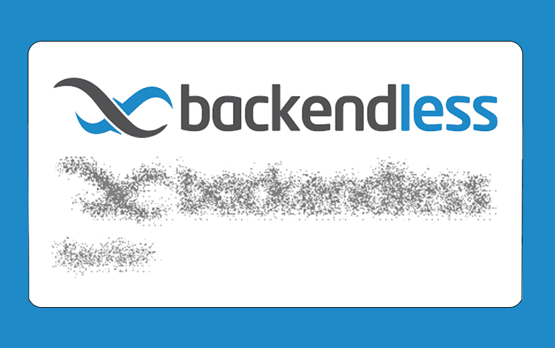

# Spoiler

Spoiler is the component that can be used in Backendless [UI-Builder](https://backendless.com/developers/#ui-builder). It allows you to create different spoiler effects above the content inside.

<p align="center">
  
</p>

## Properties

| Property                           | Type                                                                                                | Default value         | Logic | Data Binding | UI Setting | Description                                           |
|------------------------------------|-----------------------------------------------------------------------------------------------------|-----------------------|-------|--------------|------------|-------------------------------------------------------|
| Effect <br> `effect`               | *Select* <br> [`blur`, `morphology`, `morphose`, `music`, `ripples`, `smoke`, `snow`, `turbulence`] | `blur`                |       | NO           | YES        | Controls the spoiler effect of the component.         |
| Background Color <br> `background` | *Color*                                                                                             | `rgba(255,255,255,0)` |       | NO           | YES        | Controls the background color for the spoiler effect. |
| Enabled <br> `enabled`             | *Checkbox*                                                                                          | `true`                |       | NO           | YES        | Controls whether a spoiler effect is enabled.         |

## Events

| Name           | Triggers                                          | Context Blocks  |
|----------------|---------------------------------------------------|-----------------|
| On Click       | when the user clicks on the component.            | Event: `Object` |
| On Mouse Enter | when the mouse pointer hovers over the component. |                 |
| On Mouse Leave | when the mouse pointer leaves the component.      |                 |

## Actions

| Action          | Inputs           | Returns |
|-----------------|------------------|---------|
| Enable Spoiler  |                  |         |
| Disable Spoiler |                  |         |
| Toggle Spoiler  | State: `Boolean` |         |

## Styles

````
@bl-customComponent-spoiler-width: 100%;
@bl-customComponent-spoiler-align-items: center;
@bl-customComponent-spoiler-justify-content: center;

@bl-customComponent-spoiler-content-width: 100%;
@bl-customComponent-spoiler-content-height: 100%;
@bl-customComponent-spoiler-content-direction: column;

@bl-customComponent-spoiler-svg-cursor: pointer;
````

## Usage

Add a component to the page, put the necessary content in it to apply the spoiler effect, select the desired effect, color to apply in the effect or its absence(using the default value of the `background` property), and you can already look at the result.
Please note that in different effects the selected color will be displayed differently, or not taken into account (for example, the effect of turbulence).

## Examples

To enable/disable the spoiler, for example, when clicking on a component, you can use the following logic:

<p align="center">
  
</p>

The same effect will be achieved if the state parameter is left blank.
Or, according to your desire or situation, pass the desired boolean value.
