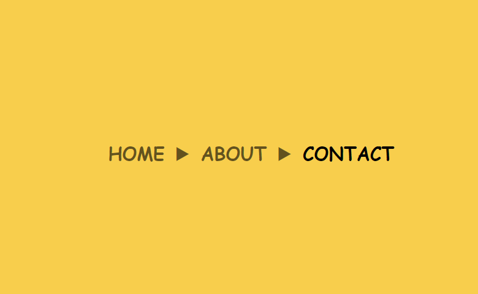
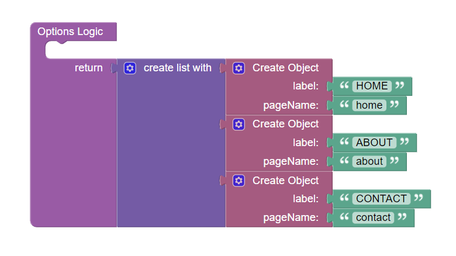

# Static Breadcrumbs

Static Breadcrumbs is a navigational component allows indicating the user's location within the application's
hierarchical structure. It visually represents the path the user has taken to reach the current page. This component is
available in the [UI-Builder](https://backendless.com/developers/#ui-builder).

Customize the appearance of the breadcrumbs according to your preferences using [style variables](#styles).

<p align="center">
  
</p>

## Properties

| Property               | Type    | Default value                                   | Logic         | Data Binding | UI Setting | Description                                                                                                                                                |
|------------------------|---------|-------------------------------------------------|---------------|--------------|------------|------------------------------------------------------------------------------------------------------------------------------------------------------------|
| Options <br> `options` | *JSON*  | `[{"label": "Landing", "pageName": "landing"}]` | Options Logic | NO           | YES        | Specifies an array of breadcrumbs to display. Signature of breadcrumb: `{label: String, pageName: String}`. Watch [Codeless Examples](#codeless-examples). |

## Events

| Name                | Triggers                                                      | Context Blocks                                |
|---------------------|---------------------------------------------------------------|-----------------------------------------------|
| On Item Click Event | when a user click on the breadcrumbs item                     | Page Label: `String` <br> Page Name: `String` |
| On Mouse Over Event | when the mouse pointer hovers over the breadcrumbs item       | Page Label: `String` <br> Page Name: `String` |
| On Mouse Out Event  | when the mouse pointer leaves the breadcrumbs item boundaries | Page Label: `String` <br> Page Name: `String` |

## Styles

**Theme**

````
@bl-customComponent-staticBreadcrumbs-backgroundColor: @appBackgroundColor;
@bl-customComponent-staticBreadcrumbs-textColor: @appTextColor;
````

**General**

````
@bl-customComponent-staticBreadcrumbs-separator-content: "/";
@bl-customComponent-staticBreadcrumbs-separator-color: @bl-customComponent-staticBreadcrumbs-label-color;
@bl-customComponent-staticBreadcrumbs-label-cursor: pointer;
@bl-customComponent-staticBreadcrumbs-label-color: fade(@bl-customComponent-staticBreadcrumbs-textColor, 75%);
@bl-customComponent-staticBreadcrumbs-label-backgroundColor: @bl-customComponent-staticBreadcrumbs-backgroundColor;
@bl-customComponent-staticBreadcrumbs-label-active-color: @bl-customComponent-staticBreadcrumbs-textColor;
@bl-customComponent-staticBreadcrumbs-label-active-backgroundColor: @bl-customComponent-staticBreadcrumbs-label-backgroundColor;
@bl-customComponent-staticBreadcrumbs-label-active-pointerEvents: auto;
@bl-customComponent-staticBreadcrumbs-label-hover-color: @bl-customComponent-staticBreadcrumbs-label-color;
@bl-customComponent-staticBreadcrumbs-label-hover-backgroundColor: @bl-customComponent-staticBreadcrumbs-label-backgroundColor;
@bl-customComponent-staticBreadcrumbs-label-active-hover-color: @bl-customComponent-staticBreadcrumbs-label-active-color;
@bl-customComponent-staticBreadcrumbs-label-active-hover-backgroundColor: @bl-customComponent-staticBreadcrumbs-label-active-backgroundColor;
````

**Dimensions**

````
@bl-customComponent-staticBreadcrumbs-width: 100%;
@bl-customComponent-staticBreadcrumbs-padding: 10px;
@bl-customComponent-staticBreadcrumbs-label-padding: 5px;
@bl-customComponent-staticBreadcrumbs-label-margin: 0;
@bl-customComponent-staticBreadcrumbs-separator-margin: 0 4px;
````

**Typography**

````
@bl-customComponent-staticBreadcrumbs-label-fontFamily: inherit;
@bl-customComponent-staticBreadcrumbs-label-fontSize: 16px;
@bl-customComponent-staticBreadcrumbs-label-fontWeight: normal;
@bl-customComponent-staticBreadcrumbs-label-fontStyle: normal;
@bl-customComponent-staticBreadcrumbs-label-hover-textDecoration: underline;
@bl-customComponent-staticBreadcrumbs-label-active-hover-textDecoration: @bl-customComponent-staticBreadcrumbs-label-hover-textDecoration;
@bl-customComponent-staticBreadcrumbs-separator-fontSize: 16px;
````

**Decoration**

````
@bl-customComponent-staticBreadcrumbs-label-border: none;
@bl-customComponent-staticBreadcrumbs-label-borderRadius: 0;
````

## Codeless Examples

Below is a Codeless Example highlighting how to use the Static Breadcrumbs component:

<p align="center">
  
</p>

<details>
<summary>Try yourself</summary>

```
<block xmlns="http://www.w3.org/1999/xhtml" type="lists_create_with" id="vuM=!g(DA!LK.~As.r[1" x="292.6750030517578" y="185"><mutation items="3"></mutation><value name="ADD0"><block type="create_object" id="eablTEHO{`nHc;E??0x!"><mutation><properties><item id="property" prop-name="label"></item><item id="property" prop-name="pageName"></item></properties></mutation><value name="create_object_mutator_container_properties_stack_property0"><block type="text" id="v%(VU?((9JF^ZA;sqh-J"><field name="TEXT">HOME</field></block></value><value name="create_object_mutator_container_properties_stack_property1"><block type="text" id="iDn~`eo#Rh.pYnwadqvl"><field name="TEXT">home</field></block></value></block></value><value name="ADD1"><block type="create_object" id="/FwYVFShFia9(OXx,Z8!"><mutation><properties><item id="property" prop-name="label"></item><item id="property" prop-name="pageName"></item></properties></mutation><value name="create_object_mutator_container_properties_stack_property0"><block type="text" id="w;i-0Ac=dMKj}o[ubvx`"><field name="TEXT">ABOUT</field></block></value><value name="create_object_mutator_container_properties_stack_property1"><block type="text" id="V6:-sx{*3iBc=LnnDSPs"><field name="TEXT">about</field></block></value></block></value><value name="ADD2"><block type="create_object" id="4ocH%rsSZirT},:gl@JN"><mutation><properties><item id="property" prop-name="label"></item><item id="property" prop-name="pageName"></item></properties></mutation><value name="create_object_mutator_container_properties_stack_property0"><block type="text" id="IBL.TtJ/513.7khx`:q="><field name="TEXT">CONTACT</field></block></value><value name="create_object_mutator_container_properties_stack_property1"><block type="text" id="j*AxnWTA3U!XUwrjnl?V"><field name="TEXT">contact</field></block></value></block></value></block>```
```

</details>

Make your breadcrumbs links to related pages:

<p align="center">
  
</p>

<details>
<summary>Try yourself</summary>

```
<block xmlns="http://www.w3.org/1999/xhtml" type="ui_dynamic_category__app-router__goto_page" id="u[eA{Ssw#jdx$Mb[#1,l" bl_meta="{&quot;label&quot;:&quot;Dynamic Block: Go To Page&quot;}" x="316" y="178"><value name="pageName"><shadow type="text" id=".1gMhIuZ0,]~H8?Hc/;H"><field name="TEXT"></field></shadow><block type="root_block_ui_builder_c_1b2f2897e6984c5c6b22548d9bb18e77_onItemClick_handler_context_blocks_pageName" id="0;0v@!O)C:wv?@!!-^G7" bl_meta="{&quot;label&quot;:&quot;Page Name&quot;}"></block></value></block>
```

</details>
