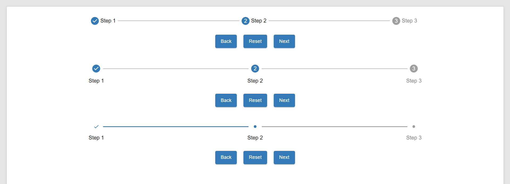

# Stepper

Stepper is a component of Backendless UI-Builder designer. This allows you to show the steps of a process. Go to the next step, return to the previous step and reset all steps.

The component based on external [stepper](https://mui.com/material-ui/react-stepper/).

<p align="center">
  
</p>

## Properties

| Property    | Type                                            | Default Value | Logic             | Data Binding | UI Setting | Description                                   |
|-------------|-------------------------------------------------|---------------|-------------------|--------------|------------|-----------------------------------------------|
| stepList    | Text                                            |               | Step List Logic   | NO           | YES        | Allows to determine the list of steps         |
| countSteps  | Number                                          | 2             | Count Steps Logic | YES          | YES        | Allows to determine the count steps           |
| stepperType | Select [`root`,`alternativeLabel`,`customized`] | root          |                   | NO           | YES        | Allows to determine the type of stepper style |

## Events

| Name           | Triggers                 | Context Blocks |
|----------------|--------------------------|----------------|
| On Step Change | when current step change |                |

## Actions

| Action                         | Inputs        | Returns |
|--------------------------------|---------------|---------|
| Go to Next Step in Stepper     |               |         |
| Go to Previous Step in Stepper |               |         |
| Reset Current Step for Stepper |               |         |
| Set Step for Stepper           | step:`Number` |         |

## Styles

**Theme**
```
@bl-customComponent-stepper-themeColor: @themePrimary;
@bl-customComponent-stepper-backgroundColor: @appBackgroundColor;
@bl-customComponent-stepper-textColor: @appTextColor;
```

**Colors**
```
@bl-customComponent-stepper-lineColor: rgb(117, 117, 117);
```

**Dimensions**
```
@bl-customComponent-stepper-iconSize: 24px;
@bl-customComponent-stepper-iconBorderRadius: 50%;
@bl-customComponent-stepper-itemWidth: 100%;
@bl-customComponent-stepper-lineWidth: 100%;
@bl-customComponent-stepper-lineBorderWidth: 1px;
@bl-customComponent-stepper-alternative-label-titleTextMargin: 16px 5px;
@bl-customComponent-stepper-customized-lineBorderWidth: 3px;
@bl-customComponent-stepper-customized-iconSize: 18px;
@bl-customComponent-stepper-customized-iconMarkSize: 8px;
```

**Others**
```
@bl-customComponent-stepper-transition: 0.3s;
```
