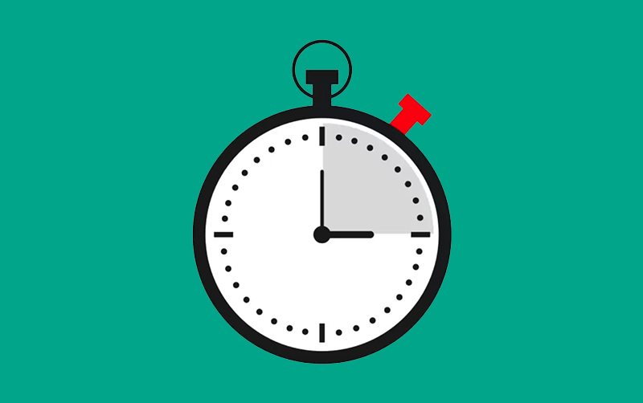

# Stopwatch

This is a component for Backendless [UI-Builder](https://backendless.com/developers/#ui-builder). It allows using stopwatch.

<p align="center">
  
</p>

## Properties

| Property                        | Type                                                 | Default Value      | Logic             | Data Binding | UI Setting | Description                                                                                                  |
|---------------------------------|------------------------------------------------------|--------------------|-------------------|--------------|------------|--------------------------------------------------------------------------------------------------------------|
| Time Format: `timeFormat`       | Select [SS: `ss`, MM:SS: `mmss`, HH:MM:SS: `hhmmss`] | HH:MM:SS: `hhmmss` | Time Format Logic | YES          | YES        | Allows to determine time format of stopwatch.                                                                |
| Decimal Places: `decimalPlaces` | Select [0: `0`, 1: `1`, 2: `2`, 3: `3`]              | 3: `3`             |                   | NO           | YES        | Allows you to determine how precisely to display the seconds (the count of numbers after the decimal point). |

## Actions

| Action          | Inputs | Returns |
|-----------------|--------|---------|
| Start Stopwatch |        |         |
| Stop Stopwatch  |        |         |
| Reset Stopwatch |        |         |

## Styles

**Dimensions**

```
@bl-customComponent-stopwatch-font-size: 16px;
```

**Color**

```
@bl-customComponent-stopwatch-text-color: @appTextColor;
```
