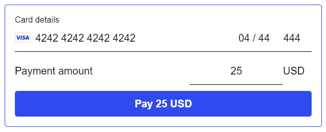

# Stripe Payment

This is a component for Backendless [UI-Builder](https://backendless.com/developers/#ui-builder) designer based
on [stripe-js](https://github.com/stripe/stripe-js) and [react-stripe-js](https://github.com/stripe/react-stripe-js)
libraries.

The component enables secure processing of credit card transactions using Stripe. Customizations include adjustments of
amount, minimal amount and currency label. The payment form is configurable, and thus you can set visibility of separate
fields. Also, you have an option to make the amount field editable by the user.



## Configuration

Before adding the component to the page, open the Marketplace screen and install
the [Stripe Integration Plugin](https://backendless.com/features/marketplace/stripe-integration-plugin/) from the
Backendless marketplace. The plugin product is available under the All Services menu.

Then add the component to the page and specify the Publishable key in UI-Builder Settings.

## Properties

| Property           | Type       | Default value | Logic        | Data Binding   | UI Setting | Description                                                  |
|--------------------|------------|---------------|--------------|----------------|------------|--------------------------------------------------------------|
| Amount             | *Number*   | 0.5           | Amount Logic | YES            | YES        | controls the payment amount                                  |
| Min Amount         | *Number*   | 0.5           |              | NO             | YES        | controls the minimum amount that can be charged              |
| Fixed Amount       | *Checkbox* | true          |              | NO             | YES        | enables to fix the payment amount                            |
| Currency           | *Text*     | USD           |              | NO             | YES        | controls the currency label                                  |
| Name Visibility    | *Checkbox* | false         |              | NO             | YES        | enables the visibility of the cardholder name field          |
| Address Visibility | *Checkbox* | false         |              | NO             | YES        | enables the visibility of the address field                  |
| City Visibility    | *Checkbox* | false         |              | NO             | YES        | enables the visibility of the city name field                |
| State Visibility   | *Checkbox* | false         |              | NO             | YES        | enables the visibility of the state name field               |
| Country Visibility | *Checkbox* | false         |              | NO             | YES        | enables the visibility of the state name field               |
| ZIP Visibility     | *Checkbox* | false         |              | NO             | YES        | enables the visibility of the postal code or ZIP value field |

## Events

| Name                     | Triggers                                   | Context Blocks   |
|--------------------------|--------------------------------------------|------------------|
| On Success Event         | when the payment is complete               | `Transaction`    |
| On Reject Event          | when the payment fails                     | `Error Message`  |
| On Focus Event           | when the Card Element gains focus          |                  |
| On Blur Event            | when the Card Element loses focus          |                  |
| On Change Event          | when a user changed the Card Element value | `Card Condition` |

## Actions

| Action       | Inputs | Returns | Description                             |
|--------------|--------|---------|-----------------------------------------|
| Clear Card   |        |         | clears the value(s) of the Card Element |
| Blur Card    |        |         | blurs the Card Element                  |
| Focus Card   |        |         | focuses the Card Element                |

## Styles

**Theme**

````
@bl-customComponent-stripePayment-themeColor: @themePrimary;
@bl-customComponent-stripePayment-backgroundColor: @appBackgroundColor;
@bl-customComponent-stripePayment-textColor: @appTextColor;
@bl-customComponent-stripePayment-ShadowColor: @appComponentShadowColor;
@bl-customComponent-stripePayment-disabledColor: @disabledColor;
@bl-customComponent-stripePayment-borderRadius: @appComponentBorderRadius;
````

**General**

````
@bl-customComponent-stripePayment-button-backgroundColor: @bl-customComponent-stripePayment-themeColor;
@bl-customComponent-stripePayment-button-color: contrast(@bl-customComponent-stripePayment-button-backgroundColor);
@bl-customComponent-stripePayment-button-disabledBackground: @bl-customComponent-stripePayment-disabledColor;
@bl-customComponent-stripePayment-button-disabledColor: contrast(@bl-customComponent-stripePayment-button-disabledBackground);
@bl-customComponent-stripePayment-label-color: @bl-customComponent-stripePayment-textColor;
@bl-customComponent-stripePayment-input-color: @bl-customComponent-stripePayment-textColor;
@bl-customComponent-stripePayment-input-backgroundColor: transparent;
@bl-customComponent-stripePayment-paymentError-color: #ff0000;
@bl-customComponent-stripePayment-completedPayment-backgroundColor: @bl-customComponent-stripePayment-backgroundColor;
````

**Dimensions**

````
@bl-customComponent-stripePayment-width: 100%;
@bl-customComponent-stripePayment-minWidth: 264px;
@bl-customComponent-stripePayment-padding: 15px;
@bl-customComponent-stripePayment-formField-width: 100%;
@bl-customComponent-stripePayment-button-padding: 6px 16px;
@bl-customComponent-stripePayment-button-width: @bl-customComponent-stripePayment-formField-width;
@bl-customComponent-stripePayment-label-padding: 11px 0;
@bl-customComponent-stripePayment-input-padding: 11px 8px;
@bl-customComponent-stripePayment-input-width: 100%;
@bl-customComponent-stripePayment-cardElement-minHeight: 42.2px;
@bl-customComponent-stripePayment-cardElement-width: @bl-customComponent-stripePayment-formField-width;
@bl-customComponent-stripePayment-cardElement-padding: 11px 0;
@bl-customComponent-stripePayment-paymentAmount-width: @bl-customComponent-stripePayment-formField-width;
@bl-customComponent-stripePayment-paymentAmount-currency-padding: 11px 11px 11px 0;
@bl-customComponent-stripePayment-paymentAmount-input-width: 100%;
@bl-customComponent-stripePayment-paymentAmount-input-maxWidth: 145px;
````

**Typography**

````
@bl-customComponent-stripePayment-fontSize: 16px;
@bl-customComponent-stripePayment-button-lineHeight: 1.75;
@bl-customComponent-stripePayment-button-fontWeight: 600;
@bl-customComponent-stripePayment-button-fontSize: @bl-customComponent-stripePayment-fontSize;
@bl-customComponent-stripePayment-label-fontSize: 13px;
@bl-customComponent-stripePayment-input-fontSize: @bl-customComponent-stripePayment-fontSize;
@bl-customComponent-stripePayment-paymentAmount-fontSize: @bl-customComponent-stripePayment-fontSize;
@bl-customComponent-stripePayment-paymentError-textAlign: center;
@bl-customComponent-stripePayment-completedPayment-fontSize: @bl-customComponent-stripePayment-fontSize;
@bl-customComponent-stripePayment-completedPayment-transactionId-fontSize: 13px;
@bl-customComponent-stripePayment-spinner-fontSize: 10px;
````

**Decoration**

````
@bl-customComponent-stripePayment-border: 1px solid @bl-customComponent-stripePayment-themeColor;
@bl-customComponent-stripePayment-button-borderWidth: 0;
@bl-customComponent-stripePayment-button-borderRadius: @bl-customComponent-stripePayment-borderRadius;
@bl-customComponent-stripePayment-button-shadowColor: @bl-customComponent-stripePayment-ShadowColor;
@bl-customComponent-stripePayment-button-shadowHover: 0px 2px 4px -1px fade(@bl-customComponent-stripePayment-button-shadowColor, 20%), 0px 4px 5px 0px fade(@bl-customComponent-stripePayment-button-shadowColor, 14%), 0px 1px 10px 0px fade(@bl-customComponent-stripePayment-button-shadowColor, 12%);
@bl-customComponent-stripePayment-button-shadowDisabled: none;
@bl-customComponent-stripePayment-input-border: 1px solid @bl-customComponent-stripePayment-textColor;
@bl-customComponent-stripePayment-input-focus-borderColor: @bl-customComponent-stripePayment-themeColor;
@bl-customComponent-stripePayment-spinner-borderRadius: 50%;
@bl-customComponent-stripePayment-spinner-animation: spinner 1.1s infinite ease;
````
